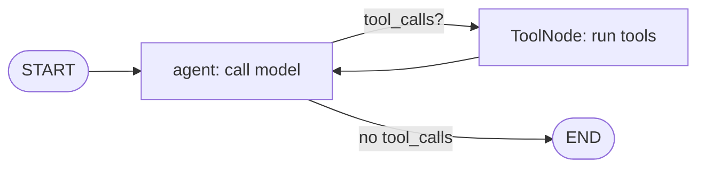

# Appendix A — Cheat Sheets

A dense, copy-paste-oriented quick reference for modern LangChain (v0.3+, the `langchain-core` / partner-package era). Each section links to the module that teaches it in depth. Keep this open in a side pane while you build.

> **Note:** All examples target Python 3.10+, LangChain v0.3+, and LangGraph. The primary model provider is Anthropic Claude; one example shows the OpenAI swap.

---

## Install & Environment

```bash
# Core + the Anthropic partner package (minimum to run most examples)
pip install -U langchain langchain-core langchain-anthropic

# Common extras
pip install -U langchain-openai          # OpenAI models/embeddings
pip install -U langchain-community        # community integrations (loaders, vector stores, ...)
pip install -U langgraph                  # agents, graphs, checkpointers
pip install -U langsmith                  # tracing + evaluation
pip install -U langchain-chroma           # example vector store
pip install -U "langchain[anthropic]"     # alt: provider extras via the meta-package
```

Environment variables you will actually set:

| Variable | Purpose |
|---|---|
| `ANTHROPIC_API_KEY` | Auth for Claude (`langchain_anthropic`, `init_chat_model("anthropic:...")`). |
| `OPENAI_API_KEY` | Auth for OpenAI models/embeddings. |
| `GOOGLE_API_KEY` | Auth for Google Gemini (`langchain_google_genai`). |
| `LANGSMITH_TRACING` | `"true"` to enable LangSmith tracing. |
| `LANGSMITH_API_KEY` | Auth for LangSmith. |
| `LANGSMITH_PROJECT` | Project name traces are grouped under (default: `"default"`). |
| `LANGSMITH_ENDPOINT` | Override for self-hosted / EU LangSmith (`https://eu.api.smith.langchain.com`). |
| `TAVILY_API_KEY` | Example web-search tool key. |

```python
# Load from a .env file at process start
from dotenv import load_dotenv
load_dotenv()  # pip install python-dotenv
```

> **✅ Best practice:** Never hardcode keys. Read them from the environment so the same code runs locally, in CI, and in prod. See [Module 11 — Production & Deployment](../modules/11-production-and-deployment.md).

---

## Import Map — Which Symbol Comes From Where

The single most common source of confusion. Memorize the boundaries: **abstractions live in `langchain_core`; provider implementations live in partner packages; graphs/agents live in `langgraph`.**

| Symbol | Import from | Package role |
|---|---|---|
| `BaseChatModel`, `BaseMessage` | `langchain_core.language_models`, `langchain_core.messages` | Core abstractions |
| `HumanMessage`, `AIMessage`, `SystemMessage`, `ToolMessage` | `langchain_core.messages` | Core message types |
| `ChatPromptTemplate`, `MessagesPlaceholder`, `PromptTemplate` | `langchain_core.prompts` | Core prompt templates |
| `StrOutputParser`, `JsonOutputParser`, `PydanticOutputParser` | `langchain_core.output_parsers` | Core output parsers |
| `Runnable`, `RunnablePassthrough`, `RunnableParallel`, `RunnableLambda`, `RunnableBranch`, `chain` | `langchain_core.runnables` | Core LCEL primitives |
| `tool`, `BaseTool`, `StructuredTool` | `langchain_core.tools` | Core tool abstractions |
| `Document` | `langchain_core.documents` | Core document type |
| `Embeddings` (base) | `langchain_core.embeddings` | Core abstraction |
| `init_chat_model` | `langchain.chat_models` | Provider-agnostic factory |
| `ChatAnthropic` | `langchain_anthropic` | Partner: Claude |
| `ChatOpenAI`, `OpenAIEmbeddings` | `langchain_openai` | Partner: OpenAI |
| `ChatGoogleGenerativeAI` | `langchain_google_genai` | Partner: Gemini |
| `AnthropicEmbeddings` (n/a — use Voyage/OpenAI) | — | Anthropic has no first-party embeddings package |
| `WebBaseLoader`, `PyPDFLoader`, many vector stores | `langchain_community.*` | Community integrations |
| `Chroma` | `langchain_chroma` | Partner vector store (preferred over community) |
| `StateGraph`, `START`, `END`, `MessagesState`, `add_messages` | `langgraph.graph` | Graph construction |
| `ToolNode`, `tools_condition`, `create_react_agent` | `langgraph.prebuilt` | Prebuilt agent components |
| `InMemorySaver`, `MemorySaver` | `langgraph.checkpoint.memory` | Checkpointers |
| `interrupt`, `Command` | `langgraph.types` | HITL / control flow |
| `Client`, `evaluate`, `aevaluate`, `traceable` | `langsmith` | Observability + eval |

> **⚠️ Gotcha:** If you find an import under `langchain.*` (not `langchain_core.*`) for a base abstraction, it is almost certainly a re-export or a deprecated path. Prefer `langchain_core`. Full detail in [Module 0 — Orientation](../modules/00-orientation-and-ecosystem.md) and [Appendix C — Versioning & Migration](C-versioning-and-migration.md).

---

## Chat Models — `init_chat_model` Provider Strings

Provider-agnostic factory. Format is `"<provider>:<model-id>"`. → [Module 1 — Models](../modules/01-models-chat-and-llms.md).

```python
from langchain.chat_models import init_chat_model

model = init_chat_model("anthropic:claude-sonnet-4-6", temperature=0)
model.invoke("Explain LCEL in one sentence.")
```

| Provider string | Partner package | Example model IDs |
|---|---|---|
| `anthropic:` | `langchain-anthropic` | `claude-opus-4-8`, `claude-sonnet-4-6`, `claude-haiku-4-5` |
| `openai:` | `langchain-openai` | `gpt-4.1`, `gpt-4.1-mini`, `o3` |
| `google_genai:` | `langchain-google-genai` | `gemini-2.5-pro`, `gemini-2.5-flash` |
| `groq:` | `langchain-groq` | `llama-3.3-70b-versatile` |
| `bedrock_converse:` | `langchain-aws` | `anthropic.claude-...` (Bedrock-hosted) |
| `ollama:` | `langchain-ollama` | `llama3.1`, `qwen2.5` (local) |

Claude tiers: `claude-opus-4-8` (most capable), `claude-sonnet-4-6` (balanced default), `claude-haiku-4-5` (fast/cheap).

```python
# Direct partner-class equivalent (more explicit, provider-specific kwargs)
from langchain_anthropic import ChatAnthropic
model = ChatAnthropic(model="claude-sonnet-4-6", temperature=0, max_tokens=1024)

# Swap to OpenAI — same Runnable interface, no downstream changes
from langchain_openai import ChatOpenAI
model = ChatOpenAI(model="gpt-4.1", temperature=0)
```

> **🔧 Try it:** Set `configurable_fields` so the model is swappable at call time: `init_chat_model("anthropic:claude-sonnet-4-6", configurable_fields=("model",))` then `.invoke(..., config={"configurable": {"model": "openai:gpt-4.1"}})`.

---

## Messages & Key `AIMessage` Fields

→ [Module 1 — Models](../modules/01-models-chat-and-llms.md), [Module 5 — Tools](../modules/05-tools-and-tool-calling.md).

```python
from langchain_core.messages import (
    SystemMessage, HumanMessage, AIMessage, ToolMessage, AnyMessage,
)

messages = [
    SystemMessage("You are concise."),
    HumanMessage("Hi"),
]
resp = model.invoke(messages)  # -> AIMessage
```

| `AIMessage` field | Type | What it holds |
|---|---|---|
| `.content` | `str \| list[dict]` | Text (or content blocks for multimodal / extended outputs). |
| `.tool_calls` | `list[ToolCall]` | Parsed tool calls: each has `name`, `args` (dict), `id`. |
| `.usage_metadata` | `dict \| None` | `{"input_tokens", "output_tokens", "total_tokens"}`. |
| `.response_metadata` | `dict` | Raw provider metadata: `model_name`, `stop_reason`, etc. |
| `.id` | `str` | Message id. |

```python
resp.content            # "Hello! How can I help?"
resp.usage_metadata     # {'input_tokens': 12, 'output_tokens': 8, 'total_tokens': 20}
resp.tool_calls         # [] when no tool was called
```

> **Note:** `ToolMessage(content=..., tool_call_id=...)` carries a tool's result back to the model; the `tool_call_id` must match the `id` from the originating `AIMessage.tool_calls` entry.

---

## Runnable Methods — Quick Reference

Every LCEL component implements the `Runnable` interface. → [Module 4 — LCEL & Runnables](../modules/04-lcel-and-runnables.md).

| Method | Sync / Async | Use |
|---|---|---|
| `invoke(input, config?)` | sync | Single input → single output. |
| `ainvoke(input, config?)` | async | Awaitable single call. |
| `stream(input, config?)` | sync | Yield output chunks as produced. |
| `astream(input, config?)` | async | Async chunk stream. |
| `batch(inputs, config?)` | sync | Parallel over a list of inputs. |
| `abatch(inputs, config?)` | async | Async batch. |
| `astream_events(input, version="v2")` | async | Fine-grained event stream (token + step events). |
| `with_config(config)` | — | Bind run config (tags, metadata, `run_name`, `max_concurrency`). |
| `bind(**kwargs)` | — | Pin call-time kwargs (e.g. `stop`, `tools`). |
| `with_retry(...)` | — | Auto-retry on exceptions w/ backoff. |
| `with_fallbacks([...])` | — | Try alternates if the primary raises. |
| `with_types(...)` | — | Override declared input/output schema. |

```python
chain.invoke({"q": "hi"})
await chain.ainvoke({"q": "hi"})

for chunk in chain.stream({"q": "hi"}):
    print(chunk, end="", flush=True)

chain.batch([{"q": "a"}, {"q": "b"}], config={"max_concurrency": 4})

# Resilience
robust = model.with_retry(stop_after_attempt=3).with_fallbacks(
    [init_chat_model("openai:gpt-4.1")]
)

# Pin tools / config
model_with_stop = model.bind(stop=["\n\n"])
named = chain.with_config({"run_name": "summarize", "tags": ["prod"]})
```

```python
# astream_events: watch tokens + step boundaries
async for ev in chain.astream_events({"q": "hi"}, version="v2"):
    if ev["event"] == "on_chat_model_stream":
        print(ev["data"]["chunk"].content, end="")
```

### Composition primitives

```python
from langchain_core.runnables import (
    RunnablePassthrough, RunnableParallel, RunnableLambda, RunnableBranch, chain,
)
```

| Primitive | Pattern |
|---|---|
| `a | b | c` | Sequential pipe (LCEL). |
| `RunnableParallel({...})` / `{ "x": r1, "y": r2 }` | Run branches concurrently → dict. |
| `RunnablePassthrough()` | Pass input through unchanged. |
| `RunnablePassthrough.assign(k=runnable)` | Add key `k` while keeping existing keys. |
| `RunnableLambda(fn)` | Wrap a plain function as a Runnable. |
| `RunnableBranch((cond, r), ..., default)` | Conditional routing. |
| `@chain` | Decorate a function into a Runnable (custom logic). |

---

## Canonical LCEL Patterns

→ [Module 4 — LCEL & Runnables](../modules/04-lcel-and-runnables.md).

```python
# 1) prompt | model | parser  — the workhorse
from langchain_core.prompts import ChatPromptTemplate
from langchain_core.output_parsers import StrOutputParser

prompt = ChatPromptTemplate.from_messages([
    ("system", "You are a {persona}."),
    ("human", "{question}"),
])
chain = prompt | model | StrOutputParser()
chain.invoke({"persona": "physicist", "question": "Why is the sky blue?"})
```

```python
# 2) RunnableParallel — fan out, gather a dict
from langchain_core.runnables import RunnableParallel
parallel = RunnableParallel(
    joke=ChatPromptTemplate.from_template("Joke about {t}") | model | StrOutputParser(),
    fact=ChatPromptTemplate.from_template("Fact about {t}") | model | StrOutputParser(),
)
parallel.invoke({"t": "otters"})   # -> {"joke": "...", "fact": "..."}
```

```python
# 3) passthrough.assign — augment the dict flowing through
from langchain_core.runnables import RunnablePassthrough
augment = RunnablePassthrough.assign(
    upper=lambda x: x["text"].upper()
)
augment.invoke({"text": "hi"})    # -> {"text": "hi", "upper": "HI"}
```

```python
# 4) RunnableBranch — route by condition
from langchain_core.runnables import RunnableBranch
router = RunnableBranch(
    (lambda x: "code" in x["q"], code_chain),
    (lambda x: "math" in x["q"], math_chain),
    default_chain,                       # fallback (no condition)
)
```

```python
# 5) @chain — custom multi-step logic as a first-class Runnable
from langchain_core.runnables import chain

@chain
def summarize_then_translate(inp: dict) -> str:
    summary = (summarize_prompt | model | StrOutputParser()).invoke(inp)
    return (translate_prompt | model | StrOutputParser()).invoke(
        {"text": summary, "lang": inp["lang"]}
    )
```

---

## Structured Output — `with_structured_output`

→ [Module 3 — Output Parsers & Structured Output](../modules/03-output-parsers-structured-output.md).

```python
from pydantic import BaseModel, Field

class Person(BaseModel):
    name: str = Field(description="Full name")
    age: int = Field(description="Age in years")

structured = model.with_structured_output(Person)
structured.invoke("Ada Lovelace was 36.")   # -> Person(name='Ada Lovelace', age=36)
```

```python
# include_raw=True to also get the raw AIMessage + any parsing error
s = model.with_structured_output(Person, include_raw=True)
out = s.invoke("...")        # {"raw": AIMessage, "parsed": Person, "parsing_error": None}
```

> **✅ Best practice:** Prefer `with_structured_output` (uses native tool/JSON-mode under the hood) over manual `PydanticOutputParser` parsing of free text. Add `Field(description=...)` — descriptions become part of the schema the model sees.

---

## Tools & the Tool-Calling Loop

→ [Module 5 — Tools & Tool Calling](../modules/05-tools-and-tool-calling.md).

```python
from langchain_core.tools import tool

@tool
def multiply(a: int, b: int) -> int:
    """Multiply two integers."""
    return a * b

model_with_tools = model.bind_tools([multiply])
ai = model_with_tools.invoke("What is 6 times 7?")
ai.tool_calls   # [{'name': 'multiply', 'args': {'a': 6, 'b': 7}, 'id': 'toolu_...'}]
```

```python
# Manual tool-calling loop (LangGraph automates this — see below)
from langchain_core.messages import HumanMessage, ToolMessage

tools_by_name = {"multiply": multiply}
messages = [HumanMessage("What is 6 times 7?")]
ai = model_with_tools.invoke(messages)
messages.append(ai)

for call in ai.tool_calls:
    result = tools_by_name[call["name"]].invoke(call["args"])
    messages.append(ToolMessage(content=str(result), tool_call_id=call["id"]))

final = model_with_tools.invoke(messages)   # model now sees tool results
print(final.content)                        # "6 times 7 is 42."
```

---

## RAG Chain Skeleton (LCEL) — Answer + Sources

→ [Module 6 — Retrieval & RAG](../modules/06-retrieval-and-rag.md).

```python
from langchain_core.prompts import ChatPromptTemplate
from langchain_core.runnables import RunnableParallel, RunnablePassthrough
from langchain_core.output_parsers import StrOutputParser

# retriever: any vector store's .as_retriever(); model: a chat model
prompt = ChatPromptTemplate.from_messages([
    ("system", "Answer ONLY from the context. If unknown, say so.\n\nContext:\n{context}"),
    ("human", "{question}"),
])

def format_docs(docs):
    return "\n\n".join(d.page_content for d in docs)

rag_chain = (
    RunnablePassthrough.assign(
        docs=lambda x: retriever.invoke(x["question"])
    )
    | RunnablePassthrough.assign(
        context=lambda x: format_docs(x["docs"])
    )
    | RunnableParallel(
        answer=prompt | model | StrOutputParser(),
        sources=lambda x: [d.metadata.get("source") for d in x["docs"]],
    )
)

rag_chain.invoke({"question": "What is the refund window?"})
# -> {"answer": "30 days.", "sources": ["policy.pdf#p2", ...]}
```

> **Note:** `retriever.invoke(query)` returns `list[Document]`; cite `doc.metadata["source"]`. Build retrievers from a vector store: `vstore.as_retriever(search_kwargs={"k": 4})`.

---

## LangGraph Skeleton — StateGraph + ToolNode

The modern way to build agents. → [Module 8 — Agents with LangGraph](../modules/08-agents-with-langgraph.md), [Module 9 — LangGraph Deep Dive](../modules/09-langgraph-deep-dive.md).



```python
from langgraph.graph import StateGraph, START, END, MessagesState
from langgraph.prebuilt import ToolNode, tools_condition
from langgraph.checkpoint.memory import InMemorySaver

model_with_tools = model.bind_tools([multiply])

def call_model(state: MessagesState):
    return {"messages": [model_with_tools.invoke(state["messages"])]}

builder = StateGraph(MessagesState)
builder.add_node("agent", call_model)
builder.add_node("tools", ToolNode([multiply]))
builder.add_edge(START, "agent")
builder.add_conditional_edges("agent", tools_condition)  # -> "tools" or END
builder.add_edge("tools", "agent")

graph = builder.compile(checkpointer=InMemorySaver())

cfg = {"configurable": {"thread_id": "conv-1"}}
graph.invoke({"messages": [HumanMessage("6 times 7?")]}, config=cfg)
```

- `MessagesState` is a prebuilt `TypedDict` with a `messages: Annotated[list, add_messages]` field; `add_messages` appends/merges by id rather than overwriting.
- `tools_condition` routes to `"tools"` if the last `AIMessage` has tool calls, else to `END`.
- A `checkpointer` + a `thread_id` give you persistent conversation memory across invocations. → [Module 7 — Memory & State](../modules/07-memory-and-state.md).

---

## `create_react_agent` — Prebuilt Agent

The fastest path to a working tool-using agent. → [Module 8 — Agents with LangGraph](../modules/08-agents-with-langgraph.md).

```python
from langgraph.prebuilt import create_react_agent
from langgraph.checkpoint.memory import InMemorySaver

agent = create_react_agent(
    "anthropic:claude-sonnet-4-6",     # model: string or BaseChatModel
    tools=[multiply],                   # list of tools
    prompt="You are a helpful math assistant.",  # str | SystemMessage | callable
    checkpointer=InMemorySaver(),       # optional persistence
)

cfg = {"configurable": {"thread_id": "t1"}}
result = agent.invoke({"messages": [("user", "What is 6 * 7?")]}, config=cfg)
print(result["messages"][-1].content)   # "42"
```

> **⚠️ Gotcha:** The parameter is `prompt`, not the older `state_modifier`/`messages_modifier` (both deprecated). A string `prompt` is prepended as a `SystemMessage`. See [Appendix C — Versioning & Migration](C-versioning-and-migration.md).
>
> **⚠️ Legacy:** The old `AgentExecutor` / `initialize_agent` API (from `langchain.agents`) is deprecated. Use LangGraph (`create_react_agent` or a hand-built `StateGraph`) instead.

---

## Human-in-the-Loop — `interrupt` / Resume

Pause a graph, surface a value to a human, resume with their input. Requires a checkpointer. → [Module 9 — LangGraph Deep Dive](../modules/09-langgraph-deep-dive.md).

```python
from langgraph.types import interrupt, Command

def approve_node(state: MessagesState):
    decision = interrupt({"question": "Approve sending this email?",
                          "draft": state["messages"][-1].content})
    if decision != "yes":
        return {"messages": [AIMessage("Cancelled by user.")]}
    return {"messages": [AIMessage("Sent.")]}

# ...build & compile graph with checkpointer, then:
cfg = {"configurable": {"thread_id": "t1"}}
graph.invoke({"messages": [HumanMessage("Email the team")]}, config=cfg)
# -> execution pauses at interrupt(); inspect graph.get_state(cfg).next

# Resume by passing a Command(resume=<value>) on the SAME thread_id
graph.invoke(Command(resume="yes"), config=cfg)
```

> **Note:** `interrupt()` raises and persists state; you resume the exact same `thread_id` with `Command(resume=...)`. The resumed value is what `interrupt()` returns.

---

## LangSmith — Tracing & Evaluation

→ [Module 10 — Observability & Evaluation](../modules/10-observability-and-eval-langsmith.md).

```bash
export LANGSMITH_TRACING=true
export LANGSMITH_API_KEY=ls__...
export LANGSMITH_PROJECT=my-app          # optional grouping
```

Once those env vars are set, **all** LangChain/LangGraph runs are traced automatically — no code change. To trace arbitrary functions:

```python
from langsmith import traceable

@traceable
def my_pipeline(q: str) -> str:
    return chain.invoke({"q": q})
```

### `evaluate()` skeleton

```python
from langsmith import Client, evaluate

client = Client()

# 1) (Optional) create a dataset of examples
ds = client.create_dataset("qa-eval")
client.create_examples(
    inputs=[{"question": "2+2?"}, {"question": "capital of France?"}],
    outputs=[{"answer": "4"}, {"answer": "Paris"}],
    dataset_id=ds.id,
)

# 2) Target: maps an example's inputs -> outputs
def target(inputs: dict) -> dict:
    return {"answer": chain.invoke({"q": inputs["question"]})}

# 3) Evaluator: scores (run output vs reference)
def correctness(outputs: dict, reference_outputs: dict) -> bool:
    return outputs["answer"].strip() == reference_outputs["answer"].strip()

# 4) Run
results = evaluate(
    target,
    data="qa-eval",                  # dataset name or UUID, or an iterable of examples
    evaluators=[correctness],
    experiment_prefix="baseline",
    max_concurrency=4,
)
```

> **Note:** For large jobs use the async `aevaluate(...)`. Evaluators may return a `bool`, a number, or a dict like `{"key": "correctness", "score": 1}`.

---

## Recap

- **Package boundaries:** abstractions → `langchain_core`; provider impls → partner packages (`langchain_anthropic`, `langchain_openai`); community integrations → `langchain_community`; graphs/agents → `langgraph`.
- **`init_chat_model("provider:model-id")`** gives provider-agnostic model construction; every model is a `Runnable`.
- **Runnable interface** (`invoke`/`stream`/`batch` + async + `astream_events`) plus composition (`|`, `RunnableParallel`, `RunnablePassthrough.assign`, `RunnableBranch`, `@chain`) is the backbone of LCEL.
- **`AIMessage`** exposes `content`, `tool_calls`, `usage_metadata`, `response_metadata`.
- **`with_structured_output(Schema)`** for typed results; **`bind_tools([...])`** + a tool loop (or LangGraph) for tool calling.
- **LangGraph** (`StateGraph` + `MessagesState` + `ToolNode` + `tools_condition` + checkpointer) is the modern agent runtime; `create_react_agent` is the prebuilt shortcut. Legacy `AgentExecutor` is deprecated.
- **HITL** via `interrupt()` + `Command(resume=...)` on a persisted `thread_id`.
- **LangSmith** auto-traces when env vars are set; `evaluate(target, data=, evaluators=)` runs offline evals.

For deeper reference: [Appendix B — Common Errors & Fixes](B-common-errors.md), [Appendix C — Versioning & Migration](C-versioning-and-migration.md), [Appendix D — Glossary](D-glossary.md).
