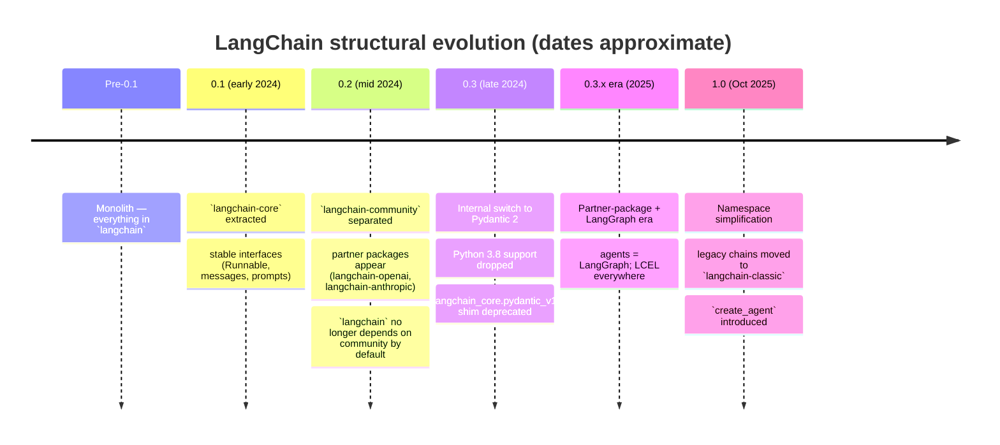
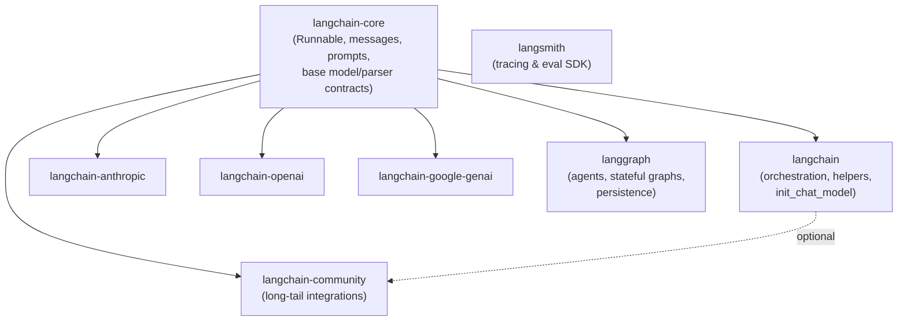
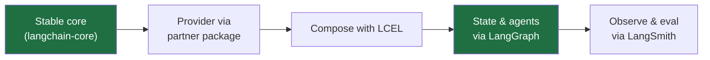

# Appendix C — Versioning & Migration

LangChain moves fast. A tutorial written eighteen months ago can import from packages that no longer exist, call methods that now emit deprecation warnings, and model an architecture (monolithic chains) that the library itself has walked away from. This appendix is your map of *where the library has been*, *where it is now*, and *how to translate any old snippet you find into idiomatic modern code* without guessing.

The goal is not nostalgia. It is **fluency in reading old material safely** — because the majority of LangChain content on the internet predates the structure you actually depend on.

---

## C.1 Why the structure keeps changing

LangChain began as a single `pip install langchain` that bundled everything: core abstractions, dozens of provider integrations, vector stores, document loaders, prebuilt chains, and agent executors. That was great for a 20-line demo and terrible for production:

- A security CVE in one obscure HTML loader forced a version bump for *everyone*.
- The dependency tree was enormous; `pip install langchain` pulled in transitive packages most apps never touched.
- Provider SDKs (OpenAI, Anthropic, …) version independently, but were pinned to LangChain's release cadence.
- "The interface" and "an integration of the interface" were tangled in the same import paths.

The fix, rolled out across several major versions, was **decomposition**: pull the stable abstractions into a tiny core, push integrations into independently-versioned packages, and stop the main package from depending on the long tail by default.



> **Note:** Dates are approximate and the *exact* version a given change landed in matters less than the **structural shift** it represents. When you read a snippet, ask "which era does this assume?" rather than "which patch number?".

---

## C.2 The evolution, era by era

### The monolith (pre-0.1)

Everything imported from `langchain.*`. You'll see this in the oldest tutorials:

```python
# pre-0.1 — DO NOT copy this style
from langchain import OpenAI, PromptTemplate, LLMChain
```

If a snippet imports the *model class itself* from top-level `langchain`, it is ancient. Treat it as a sketch of intent, not runnable code.

### 0.1 — `langchain-core` is extracted

The stable, rarely-changing abstractions were carved out into [`langchain-core`](https://pypi.org/project/langchain-core/): the `Runnable` interface, message types (`HumanMessage`, `AIMessage`, …), prompt templates, output parser base classes, the `BaseChatModel` / `BaseLLM` contracts, and callbacks. **This is the package you should depend on directly** for type hints and base classes — it is small and its interfaces are the most stable surface in the ecosystem. See [Module 4 — LCEL & the Runnable Interface](../modules/04-lcel-and-runnables.md).

### 0.2 — community split + partner packages

Two things happened:

1. **`langchain-community`** was separated out to hold the long tail of third-party integrations (community-maintained loaders, vector stores, tools). The main `langchain` package **stopped depending on it by default**, so installing `langchain` no longer drags in hundreds of optional integrations.
2. **Partner packages** appeared: first-party, independently-versioned integrations like `langchain-openai`, `langchain-anthropic`, `langchain-google-genai`. These track the provider's own SDK and ship fixes without waiting for a `langchain` release.

Also in this era: the **legacy agent API** (`initialize_agent`, `AgentExecutor`) was deprecated in favor of **LangGraph**. See [Module 8 — Agents with LangGraph](../modules/08-agents-with-langgraph.md).

### 0.3 — Pydantic 2 internally; Python 3.8 dropped

LangChain's internals moved to **Pydantic 2**. Two consequences for you:

- The compatibility shim `langchain_core.pydantic_v1` (which existed so the library could straddle Pydantic 1 and 2 internally) is **deprecated** — use plain Pydantic v2 (`from pydantic import BaseModel`).
- **Python 3.8 is no longer supported** (it reached EOL in October 2024). The course assumes Python 3.10+.

Pydantic 1 itself reached end-of-life in mid-2024, so there is no reason to write new code against it.

### 0.3.x era — partner packages + LangGraph (what this course teaches)

This is the baseline the rest of the course targets: depend on `langchain-core` abstractions, pull models from partner packages, compose with **LCEL**, and build agents/stateful apps with **LangGraph**. Memory is handled with `RunnableWithMessageHistory` or, preferably, LangGraph checkpointers — see [Module 7 — Memory & Conversation State](../modules/07-memory-and-state.md).

### 1.0 (October 2025) — namespace simplification

LangChain 1.0 trimmed the main `langchain` package down to a focused agent-building surface and moved the accumulated legacy material into a new package, **`langchain-classic`** (imported as `langchain_classic`). It also introduced `langchain.agents.create_agent` as the v1 successor to LangGraph's `create_react_agent`.

> **Note:** The course examples target the **0.3.x baseline** and use `langgraph.prebuilt.create_react_agent`, because that is the most widely-deployed, well-documented form at time of writing and it remains supported. Section [C.8](#c8-the-10-transition-langchain-classic-and-create_agent) covers the 1.0 transition so you can recognize and adopt it. Everything in this course runs on 0.3.x; the 1.0 changes are *additive knowledge*, not a prerequisite.

---

## C.3 The package layout today

Mental model: **one tiny stable core, one main orchestration package, one community grab-bag, and N independently-versioned partner packages.**



| Package | What lives here | You depend on it directly? |
|---|---|---|
| `langchain-core` | `Runnable`, LCEL plumbing, message types, prompt templates, output-parser & chat-model base classes, callbacks | **Yes** — for base classes and type hints |
| `langchain` | High-level orchestration, `init_chat_model`, some helper constructors | Usually yes |
| `langchain-anthropic` / `langchain-openai` / … | First-party provider integrations (`ChatAnthropic`, `ChatOpenAI`) | **Yes** — install the providers you use |
| `langchain-community` | Community-maintained integrations (many loaders, vector stores, tools) | Only for specific integrations you need |
| `langgraph` | Agents (`create_react_agent`), stateful graphs, checkpointers/persistence | Yes, for agents & stateful apps |
| `langsmith` | Tracing/evaluation SDK | Yes, for observability — see [Module 10](../modules/10-observability-and-eval-langsmith.md) |
| `langchain-classic` (1.0+) | Legacy chains (`LLMChain`, `ConversationChain`, `RetrievalQA`), indexing API, some retrievers | Only as a temporary holding pen |

### Where did the legacy chains go?

In the 0.3.x era they still live under `langchain.chains.*` (emitting deprecation warnings). In **1.0+** they were relocated to **`langchain-classic`**:

```python
# 1.0+: legacy chains now require the classic package
# pip install langchain-classic
from langchain_classic.chains import LLMChain   # still works, still legacy
```

> **⚠️ Gotcha:** `langchain-classic` is a *compatibility holding pen*, not a destination. It ships on a slower cadence and receives fewer fixes. If a tutorial tells you to install it, that's a signal the snippet predates modern patterns — migrate the logic to LCEL/LangGraph rather than building new code on top of it.

### How to read old tutorials safely

A practical checklist when you open any LangChain snippet older than a few months:

1. **Check the imports.** `from langchain import LLMChain` (top-level model/chain imports) = monolith era. `from langchain.chains import RetrievalQA` = legacy chain. `from langchain_anthropic import ChatAnthropic` = modern.
2. **Spot the chain classes.** Anything ending in `Chain` (except `Runnable`-based composition) is probably legacy — see the migration table in [C.5](#c5-the-migration-table-old--modern).
3. **Spot the call style.** `chain.run(...)`, `chain(...)`, `llm.predict(...)`, `retriever.get_relevant_documents(...)` are all legacy invocation styles → all became `.invoke(...)`.
4. **Spot the agent style.** `initialize_agent` / `AgentExecutor` = legacy → LangGraph.
5. **Spot Pydantic.** `from langchain_core.pydantic_v1 import BaseModel` = deprecated shim → use `from pydantic import BaseModel`.

Once you can pattern-match these five signals, you can translate almost any old snippet on sight.

---

## C.4 Pydantic 1 → 2

### The shim history

Before 0.3, LangChain supported environments running either Pydantic 1 or Pydantic 2. To write internal code that worked under both, the library exposed `langchain_core.pydantic_v1` — a namespace that pointed at "whichever Pydantic v1 API is available" (either real Pydantic 1, or Pydantic 2's `pydantic.v1` compatibility module). Tutorials from that era often told you to import your schema models from there:

```python
# Deprecated shim — appears in 0.1/0.2-era tutorials
from langchain_core.pydantic_v1 import BaseModel, Field
```

### What to do now

From 0.3 onward LangChain is built on Pydantic 2, and **you should use Pydantic v2 directly**:

```python
from pydantic import BaseModel, Field

class WeatherQuery(BaseModel):
    """Look up the weather for a city."""
    city: str = Field(description="City name, e.g. 'Paris'")
    units: str = Field(default="celsius", description="'celsius' or 'fahrenheit'")
```

This `BaseModel` works everywhere the modern API expects a schema: `model.with_structured_output(WeatherQuery)`, `@tool`-decorated functions with typed args, and `PydanticOutputParser`. See [Module 3 — Output Parsers & Structured Output](../modules/03-output-parsers-structured-output.md) and [Module 5 — Tools & Tool Calling](../modules/05-tools-and-tool-calling.md).

> **⚠️ Gotcha:** Pydantic 1 and Pydantic 2 model instances are **not interchangeable**, and mixing them (e.g. a v1 model passed where a v2 model is expected) produces confusing validation errors. If you copy a schema from an old tutorial, change the import to `from pydantic import ...` and you're done — the field syntax is largely identical for simple cases. See [Appendix B — Common Errors & Fixes](B-common-errors.md) for the specific error signatures.

> **✅ Best practice:** Never import from `langchain_core.pydantic_v1` in new code. If a dependency forces v1 semantics, isolate it; do not let v1 models leak into your LangChain call sites.

---

## C.5 The migration table (old → modern)

This is the heart of the appendix. Each row is a pattern you *will* encounter in old material, with the idiomatic modern replacement and where it's taught.

| Legacy pattern | Modern replacement | Taught in |
|---|---|---|
| `LLMChain(llm=..., prompt=...)` then `.run()` | `prompt \| model \| parser` (LCEL) | [Module 4](../modules/04-lcel-and-runnables.md) |
| `ConversationChain` + `ConversationBufferMemory` | `RunnableWithMessageHistory` or LangGraph checkpointer | [Module 7](../modules/07-memory-and-state.md) |
| `RetrievalQA.from_chain_type(...)` | `create_retrieval_chain(...)` or hand-built LCEL | [Module 6](../modules/06-retrieval-and-rag.md) |
| `ConversationalRetrievalChain` | `create_history_aware_retriever` + `create_retrieval_chain` (or LCEL) | [Module 6](../modules/06-retrieval-and-rag.md) |
| `initialize_agent(...)` / `AgentExecutor` | `langgraph.prebuilt.create_react_agent` (1.0: `langchain.agents.create_agent`) | [Module 8](../modules/08-agents-with-langgraph.md) |
| `retriever.get_relevant_documents(q)` | `retriever.invoke(q)` | [Module 6](../modules/06-retrieval-and-rag.md) |
| `llm.predict(text)` / `llm.predict_messages(msgs)` | `model.invoke(...)` | [Module 1](../modules/01-models-chat-and-llms.md) |
| `chain(inputs)` (`__call__`) / `chain.run(...)` | `chain.invoke(inputs)` | [Module 4](../modules/04-lcel-and-runnables.md) |
| `from langchain_core.pydantic_v1 import BaseModel` | `from pydantic import BaseModel` | [Module 3](../modules/03-output-parsers-structured-output.md) |

The next subsections show the before/after for the patterns most worth seeing in full.

### LLMChain → LCEL

The single most common legacy pattern. `LLMChain` bundled "a prompt + a model + (optionally) an output key." LCEL replaces it with explicit composition.

```python
# ---- LEGACY (deprecated) ----
from langchain.chains import LLMChain
from langchain.prompts import PromptTemplate
from langchain_anthropic import ChatAnthropic

prompt = PromptTemplate.from_template("Write a haiku about {topic}.")
chain = LLMChain(llm=ChatAnthropic(model="claude-sonnet-4-6"), prompt=prompt)
print(chain.run(topic="autumn"))          # legacy invocation
```

```python
# ---- MODERN (LCEL) ----
from langchain_core.prompts import ChatPromptTemplate
from langchain_core.output_parsers import StrOutputParser
from langchain_anthropic import ChatAnthropic

prompt = ChatPromptTemplate.from_template("Write a haiku about {topic}.")
model = ChatAnthropic(model="claude-sonnet-4-6")
chain = prompt | model | StrOutputParser()

print(chain.invoke({"topic": "autumn"}))
# -> "Crisp leaves drift downward / ..." (a string, thanks to StrOutputParser)
```

The LCEL form is more explicit, streams and batches for free, and you can see exactly what each stage does. See [Module 4](../modules/04-lcel-and-runnables.md).

### ConversationChain + memory → history runnable / checkpointer

```python
# ---- LEGACY (deprecated) ----
from langchain.chains import ConversationChain
from langchain.memory import ConversationBufferMemory
from langchain_anthropic import ChatAnthropic

conv = ConversationChain(
    llm=ChatAnthropic(model="claude-sonnet-4-6"),
    memory=ConversationBufferMemory(),
)
conv.predict(input="Hi, I'm Sam.")
conv.predict(input="What's my name?")     # relies on hidden mutable memory
```

```python
# ---- MODERN (RunnableWithMessageHistory) ----
from langchain_core.chat_history import InMemoryChatMessageHistory
from langchain_core.prompts import ChatPromptTemplate, MessagesPlaceholder
from langchain_core.runnables.history import RunnableWithMessageHistory
from langchain_anthropic import ChatAnthropic

prompt = ChatPromptTemplate.from_messages([
    ("system", "You are a helpful assistant."),
    MessagesPlaceholder("history"),
    ("human", "{input}"),
])
chain = prompt | ChatAnthropic(model="claude-sonnet-4-6")

_store: dict[str, InMemoryChatMessageHistory] = {}
def get_history(session_id: str) -> InMemoryChatMessageHistory:
    return _store.setdefault(session_id, InMemoryChatMessageHistory())

with_history = RunnableWithMessageHistory(
    chain,
    get_history,
    input_messages_key="input",
    history_messages_key="history",
)

cfg = {"configurable": {"session_id": "user-sam"}}
with_history.invoke({"input": "Hi, I'm Sam."}, config=cfg)
print(with_history.invoke({"input": "What's my name?"}, config=cfg).content)
# -> "Your name is Sam."
```

For stateful agents and durable conversations, prefer a **LangGraph checkpointer** (which persists the whole graph state, not just chat messages). See [Module 7](../modules/07-memory-and-state.md) and [Module 9 — LangGraph Deep Dive](../modules/09-langgraph-deep-dive.md).

### RetrievalQA / ConversationalRetrievalChain → retrieval chain or LCEL

```python
# ---- LEGACY (deprecated) ----
from langchain.chains import RetrievalQA
from langchain_anthropic import ChatAnthropic

qa = RetrievalQA.from_chain_type(
    llm=ChatAnthropic(model="claude-sonnet-4-6"),
    retriever=vectorstore.as_retriever(),
)
print(qa.run("What is our refund policy?"))
```

```python
# ---- MODERN (create_retrieval_chain) ----
from langchain.chains import create_retrieval_chain
from langchain.chains.combine_documents import create_stuff_documents_chain
from langchain_core.prompts import ChatPromptTemplate
from langchain_anthropic import ChatAnthropic

prompt = ChatPromptTemplate.from_messages([
    ("system", "Answer using only this context:\n\n{context}"),
    ("human", "{input}"),
])
combine = create_stuff_documents_chain(ChatAnthropic(model="claude-sonnet-4-6"), prompt)
rag_chain = create_retrieval_chain(vectorstore.as_retriever(), combine)

result = rag_chain.invoke({"input": "What is our refund policy?"})
print(result["answer"])
```

Many teams skip the helper entirely and hand-build the RAG flow in LCEL for full control over context formatting, citation, and re-ranking. Both approaches are covered in [Module 6 — Retrieval & RAG](../modules/06-retrieval-and-rag.md).

### initialize_agent / AgentExecutor → LangGraph

```python
# ---- LEGACY (deprecated) ----
from langchain.agents import initialize_agent, AgentType
from langchain_anthropic import ChatAnthropic

agent = initialize_agent(
    tools, ChatAnthropic(model="claude-sonnet-4-6"),
    agent=AgentType.OPENAI_FUNCTIONS, verbose=True,
)
agent.run("What's the weather in Paris, and is that warmer than London?")
```

```python
# ---- MODERN (LangGraph) ----
from langgraph.prebuilt import create_react_agent
from langchain_anthropic import ChatAnthropic

agent = create_react_agent(ChatAnthropic(model="claude-sonnet-4-6"), tools)

result = agent.invoke({"messages": [("user", "What's the weather in Paris, and is that warmer than London?")]})
print(result["messages"][-1].content)
```

The LangGraph agent gives you a real state machine: built-in persistence, streaming of intermediate steps, human-in-the-loop interrupts, and the ability to customize the control flow. See [Module 8](../modules/08-agents-with-langgraph.md). In **1.0+** the recommended factory is `from langchain.agents import create_agent` (note `system_prompt=` instead of `prompt=`, and a middleware system for hooks) — see [C.8](#c8-the-10-transition-langchain-classic-and-create_agent).

### Method renames: the universal `.invoke()`

The Runnable interface unified invocation. Three legacy method families all collapse to `.invoke()`:

```python
# ---- LEGACY ----
llm.predict("Summarize this.")                       # str -> str
llm.predict_messages([HumanMessage(content="Hi")])   # messages -> message
retriever.get_relevant_documents("query")            # str -> List[Document]
chain.run(topic="x")                                 # kwargs -> str
chain({"topic": "x"})                                # __call__ -> dict
```

```python
# ---- MODERN: everything is .invoke() (plus .stream / .batch / async a*) ----
model.invoke("Summarize this.")            # returns an AIMessage
model.invoke([HumanMessage(content="Hi")]) # returns an AIMessage
retriever.invoke("query")                  # returns List[Document]
chain.invoke({"topic": "x"})               # returns the chain's output type
```

> **Note:** `.invoke()` on a chat model returns an `AIMessage` (use `.content` for the text), whereas legacy `.predict()` returned a bare string. If you're translating old code and suddenly see `AIMessage(content=...)` where you expected text, add `.content` or pipe through `StrOutputParser()`.

---

## C.6 Reading deprecation warnings & the migrate tool

### LangChainDeprecationWarning

When you call a deprecated API, LangChain emits a `LangChainDeprecationWarning` that usually names the replacement:

```text
LangChainDeprecationWarning: The class `LLMChain` was deprecated in LangChain 0.1.17
and will be removed in 1.0. Use RunnableSequence, e.g., `prompt | llm` instead.
```

These warnings are precise — they tell you the version it was deprecated in, the removal target, and the modern equivalent. **Read them; don't silence them.** To make sure you see them during development, surface deprecation warnings explicitly:

```python
import warnings
from langchain_core._api.deprecation import LangChainDeprecationWarning

warnings.simplefilter("default", LangChainDeprecationWarning)  # show each one
```

> **🔧 Try it:** Run an old snippet under `python -W default::DeprecationWarning your_script.py` and collect every warning. The set of warnings is essentially a personalized migration to-do list for that file.

### The `langchain-cli migrate` tool

For bulk migrations, LangChain ships a CLI that rewrites import paths automatically (e.g. moving integrations from `langchain.*` to `langchain_community.*` / partner packages, and updating moved symbols):

```bash
pip install langchain-cli
langchain-cli migrate path/to/your/code   # rewrites imports in place
```

> **⚠️ Gotcha:** The migrate tool fixes **import paths and renamed symbols**; it does **not** rearchitect legacy *patterns*. It will not turn an `LLMChain` into an LCEL pipeline or an `AgentExecutor` into a LangGraph graph. Use it to clean up imports, then do the architectural migration by hand using [the table above](#c5-the-migration-table-old--modern). Always run it on a clean git tree and review the diff.

---

## C.7 Pinning & upgrading safely

Because partner packages version independently, "upgrading LangChain" is really "upgrading a small constellation of packages." A disciplined approach:

### Pin the packages you actually use

```text
# requirements.txt — pin a compatible range, not a single patch
langchain-core>=0.3,<0.4
langchain>=0.3,<0.4
langchain-anthropic>=0.3,<0.4
langgraph>=0.2,<0.3
langsmith>=0.1
```

> **✅ Best practice:** Pin to a **minor-version range** (`>=0.3,<0.4`) rather than an exact patch. You want bug fixes within a minor line but no surprise breaking changes across minors. For reproducible deploys, additionally produce a fully-locked file (`pip freeze`, `uv lock`, or Poetry's lockfile) and commit it. See [Module 11 — Production & Deployment](../modules/11-production-and-deployment.md).

### Check version skew when something breaks

A large fraction of "mysterious" LangChain errors are **version skew** — e.g. a `langchain-core` too old for the `langchain-anthropic` you installed. When debugging, print the versions first:

```python
from importlib.metadata import version
for pkg in ["langchain-core", "langchain", "langchain-anthropic", "langgraph", "langsmith"]:
    try:
        print(pkg, version(pkg))
    except Exception:
        print(pkg, "not installed")
```

### Reading release notes & the providers registry

- **Release notes / changelog:** before bumping a minor version, skim the package's release notes on GitHub (`langchain-ai/langchain` releases) and the `python.langchain.com` changelog. Breaking changes and new deprecations are called out there.
- **Integrations / providers registry:** `python.langchain.com` maintains an integrations index (chat models, vector stores, retrievers, tools) that tells you the *current* partner-package name and import path for each provider. When a tutorial uses an old import, the registry is the fastest way to find the modern one.

> **🔧 Try it:** Upgrade in a throwaway branch: bump one minor version, run `pip check` (catches incompatible pins), run your test suite under `-W default::DeprecationWarning`, and read the diff of warnings. Merge only when the warning set is understood.

---

## C.8 The 1.0 transition: `langchain-classic` and `create_agent`

LangChain **1.0** (October 2025) is a namespace simplification rather than a rewrite. Two changes matter for migration:

1. **Legacy material moved to `langchain-classic`.** Chains like `LLMChain`, `ConversationChain`, `RetrievalQA`, the indexing API, and some retrievers were relocated. If 1.0+ code must keep using them, `pip install langchain-classic` and import from `langchain_classic.*`. Treat this as life support, not a foundation.

2. **`create_agent` supersedes `create_react_agent`.** The v1 agent factory lives at `langchain.agents.create_agent`. It is the same core idea (a ReAct-style tool-calling agent on LangGraph) with:
   - `system_prompt=` instead of `prompt=`,
   - a **middleware** system (`before_model` / `after_model` / `wrap_tool_call` hooks) replacing several ad-hoc parameters,
   - custom state via `TypedDict` rather than Pydantic/dataclasses,
   - static runtime context through a dedicated `context=` parameter rather than `config["configurable"]`.

```python
# 1.0+ agent factory (successor to langgraph.prebuilt.create_react_agent)
from langchain.agents import create_agent
from langchain_anthropic import ChatAnthropic

agent = create_agent(
    ChatAnthropic(model="claude-sonnet-4-6"),
    tools=tools,
    system_prompt="You are a concise research assistant.",
)
result = agent.invoke({"messages": [("user", "Summarize the latest sales figures.")]})
```

> **Note:** This course's examples use `langgraph.prebuilt.create_react_agent`, which remains supported and is the most common form in the wild. The migration to `create_agent` is mechanical: rename the import, change `prompt=` to `system_prompt=`, and move any custom hooks into middleware. Learn the LangGraph mental model in [Module 8](../modules/08-agents-with-langgraph.md) and [Module 9](../modules/09-langgraph-deep-dive.md) first — `create_agent` is a thin, friendlier surface over the same graph machinery.

> **⚠️ Verify:** The `create_agent` API surface (middleware hooks, `context=` semantics) is newer than the rest of this course's baseline. Before adopting it, confirm the exact parameter names against the current `langchain.agents` reference on `python.langchain.com`, as the v1 line is still settling.

---

## C.9 A pragmatic, durable strategy

The library will keep evolving. You can insulate most of your codebase from churn by following a few rules that have held across every version transition so far:

- **Depend on `langchain-core` abstractions.** The `Runnable` interface, message types, and prompt templates are the most stable surface in the ecosystem. Type your functions against them.
- **Use partner packages for providers.** `langchain-anthropic`, `langchain-openai`, etc. Prefer `init_chat_model("anthropic:claude-sonnet-4-6")` when you want provider-agnostic wiring — swapping to `init_chat_model("openai:gpt-4.1")` is then a one-string change.
- **Compose with LCEL; build stateful/agentic apps with LangGraph.** These are where the maintainers are investing. Avoid the legacy `*Chain` constructors entirely in new code.
- **Avoid deep `langchain-community` internals.** Use community integrations through their documented public surface; don't reach into private modules. Community internals move the most and break the most.
- **Keep deprecation warnings visible** in dev, and treat each one as a small migration task rather than noise to suppress.
- **Pin minor ranges, lock for deploys, upgrade in a branch.** Read the changelog before every minor bump.



Follow that spine and the next version bump is a chore, not a rewrite.

---

## Recap

- LangChain decomposed from a **monolith** into **`langchain-core`** (stable abstractions), **`langchain`** (orchestration), **`langchain-community`** (long-tail integrations), and **independently-versioned partner packages** (`langchain-anthropic`, `langchain-openai`, …), plus **`langgraph`** for agents/state and **`langsmith`** for observability.
- Key version markers: **0.1** extracted `langchain-core`; **0.2** split community + introduced partner packages and deprecated the legacy agent API; **0.3** moved internals to **Pydantic 2** and dropped Python 3.8; **1.0** simplified the namespace, moved legacy chains to **`langchain-classic`**, and introduced **`create_agent`**.
- Use **Pydantic v2 directly** (`from pydantic import BaseModel`); the `langchain_core.pydantic_v1` shim is deprecated.
- The universal migration moves: `LLMChain` → LCEL; `ConversationChain`/memory → `RunnableWithMessageHistory`/checkpointers; `RetrievalQA`/`ConversationalRetrievalChain` → `create_retrieval_chain` or LCEL; `initialize_agent`/`AgentExecutor` → LangGraph; `get_relevant_documents`/`predict`/`run`/`__call__` → **`.invoke()`**.
- Read **`LangChainDeprecationWarning`** messages (they name the replacement); use **`langchain-cli migrate`** for imports, but rearchitect patterns by hand.
- **Pin minor ranges, lock for deploys, upgrade in a branch**, and check version skew when debugging.
- Durable strategy: depend on **core abstractions**, use **partner packages**, compose with **LCEL + LangGraph**, and avoid deep community internals.

See also: [Appendix A — Cheat Sheets](A-cheatsheets.md), [Appendix B — Common Errors & Fixes](B-common-errors.md), [Appendix D — Glossary](D-glossary.md).
