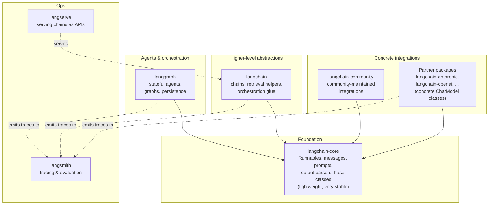
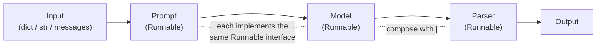

# Module 0 — Orientation & The LangChain Ecosystem

You already write Python for a living. This course will not teach you list comprehensions or `async def`. It will teach you LangChain — what it actually is, where its abstractions live, and how to compose them into reliable LLM applications without drowning in dependency churn or yak-shaving.

This first module is the map. By the end you will know which package every import comes from, why the framework was split into a dozen packages, how the single unifying abstraction (the **Runnable**) ties everything together, and you'll have run a complete program three different ways (invoke, stream, batch) by changing essentially nothing. Every later module drills into one region of this map.

---

## What LangChain is (and is not)

LangChain is a **framework for composing LLM applications**. That is the whole pitch, and it unpacks into four concrete things:

1. **Standard interfaces.** A chat model from Anthropic, OpenAI, Google, or a local Ollama server all implement the *same* `BaseChatModel` interface. A vector store from Chroma, Pinecone, or pgvector all implement the same `VectorStore` interface. You write against the interface; you swap the implementation with a one-line change.
2. **Composition.** Components snap together with the pipe operator (`|`) into pipelines called *chains*. Because every component implements one interface (the Runnable, below), the composed chain *also* implements that interface — so a 5-stage RAG pipeline is itself a Runnable you can stream, batch, or nest inside a larger chain.
3. **A large integration catalog.** Hundreds of model providers, vector stores, document loaders, tools, and retrievers, each wrapped to fit the standard interfaces. You rarely write the boilerplate to talk to a new provider yourself.
4. **An ecosystem.** [LangGraph](08-agents-with-langgraph.md) for stateful agents and graphs, [LangSmith](10-observability-and-eval-langsmith.md) for tracing and evaluation, LangServe for serving — all designed to interoperate with the core abstractions.

What LangChain is **not**:

- **Not a model provider.** It does not host or train models. It is a client-side orchestration layer. Every token still comes from Anthropic, OpenAI, or whoever you point it at — with their API keys, their rate limits, their pricing.
- **Not magic.** A chain is a thin, inspectable composition of function calls. There is no hidden agent secretly rewriting your prompts. If output is wrong, you can trace exactly which component produced it (and Module 10 shows you how).
- **Not required.** You can call the Anthropic SDK directly. The value of LangChain shows up when you want provider portability, want streaming/batching/retries for free, want to drop in retrieval or tools, or want to graduate to agents — without rewriting your call sites each time.

> **Note:** The mental shift for an experienced engineer is this: LangChain is to LLM calls roughly what an ORM-plus-middleware stack is to database calls. It gives you a uniform surface and composition primitives so the interesting logic isn't buried in per-provider HTTP plumbing.

---

## The package layout

Modern LangChain (v0.3+) is not one package. It is a layered set of packages with deliberately different release cadences and dependency footprints.



| Package | What lives here | Stability / weight |
| --- | --- | --- |
| **`langchain-core`** | The base abstractions: `Runnable`, message types (`HumanMessage`, `AIMessage`, ...), prompt templates, output parsers, the base classes every model/store/tool implements. Almost no heavy dependencies. | Most stable, smallest footprint. Pin loosely; breaking changes are rare and well-telegraphed. |
| **`langchain`** | Higher-level building blocks: some chains, retrieval helpers, orchestration glue. Depends on `langchain-core`. | Moderately stable. Legacy chains have moved out (see below). |
| **Partner packages** (`langchain-anthropic`, `langchain-openai`, `langchain-google-genai`, ...) | Concrete `ChatModel` / `Embeddings` / vector-store classes for one provider. Each is versioned and released independently, tracking that provider's SDK. | Track the provider's SDK. Update these most often. |
| **`langchain-community`** | A large catalog of community-maintained integrations that don't (yet) have a dedicated partner package. | Variable quality; heavier optional deps. |
| **`langgraph`** | Stateful agents and graphs, persistence/checkpointing, human-in-the-loop. The modern way to build agents. Depends on `langchain-core`. | Actively developed; its own release line. See [Module 8](08-agents-with-langgraph.md) and [Module 9](09-langgraph-deep-dive.md). |
| **`langsmith`** | Tracing, dataset/eval tooling. Used as a hosted backend; the client ships separately and is also pulled in transitively. | See [Module 10](10-observability-and-eval-langsmith.md). |
| **`langserve`** | Wraps a Runnable as a FastAPI endpoint. See [Module 11](11-production-and-deployment.md). | Optional, for deployment. |

### Why the split happened

Early LangChain was a single monolithic package. That caused three concrete problems, all of which the split solves:

- **Dependency bloat.** A monolith that imports every integration's SDK forces you to install (and resolve version conflicts for) hundreds of transitive dependencies you'll never use. `langchain-core` now has a tiny dependency surface; you add only the partner packages you actually need.
- **Stability.** Provider SDKs change constantly; core abstractions should not. Separating them means a churning `langchain-openai` release can't destabilize the `Runnable` interface your whole codebase is built on.
- **Independent release cadence.** When OpenAI ships a new API, `langchain-openai` can release the same day without waiting on (or risking) a coordinated monolith release.

> **Note:** Many older, deprecated chains (`LLMChain`, `ConversationChain`, `RetrievalQA`, etc.) now live in a package called **`langchain-classic`** (historically they were in `langchain.chains`). You will see them in old tutorials and Stack Overflow answers. Treat them as legacy: this course teaches the modern LCEL/LangGraph equivalents throughout. For the migration details — what moved where and what replaces what — see [Appendix C — Versioning & Migration](../appendix/C-versioning-and-migration.md).

---

## Install matrix & environment variables

Install only what you need. A typical starting point for this course (Anthropic-first, with retrieval and LangGraph):

```bash
# Core is pulled in transitively, but you can pin it explicitly:
pip install langchain-core

# The provider you'll use in examples (brings in langchain-core):
pip install langchain-anthropic

# To show provider-swapping (Module 1 onward):
pip install langchain-openai

# Higher-level helpers (chains, retrieval glue):
pip install langchain

# Agents & graphs (Modules 8-9):
pip install langgraph

# Observability & eval (Module 10):
pip install langsmith
```

> **✅ Best practice:** Install **partner packages**, not `langchain-community`, whenever a dedicated one exists for your provider. Partner packages are better maintained, more tightly tested against the provider SDK, and have a smaller dependency footprint.

Environment variables you'll set:

```bash
# Required for the Anthropic examples in this course:
export ANTHROPIC_API_KEY="sk-ant-..."

# Optional — only if you run the OpenAI-swap examples:
export OPENAI_API_KEY="sk-..."

# Optional — turns on LangSmith tracing (see the teaser at the end of this module):
export LANGSMITH_TRACING="true"
export LANGSMITH_API_KEY="lsv2_..."
# export LANGSMITH_PROJECT="my-project"   # optional; defaults to "default"
```

> **⚠️ Gotcha:** The LangSmith environment variables were historically prefixed `LANGCHAIN_` (e.g. `LANGCHAIN_TRACING_V2`). Current releases use the `LANGSMITH_` prefix. Most SDK versions still read the old names for backward compatibility, but write new code against `LANGSMITH_*`. If tracing silently doesn't appear, a stale `LANGCHAIN_` variable in your shell is a common culprit.

> **✅ Best practice:** Never hardcode keys. The model classes read `ANTHROPIC_API_KEY` / `OPENAI_API_KEY` from the environment by default. For local dev, a `.env` file plus `python-dotenv` (`from dotenv import load_dotenv; load_dotenv()`) keeps keys out of source.

---

## The unifying idea: everything is a Runnable

Here is the single most important concept in modern LangChain. **Almost every component — a chat model, a prompt template, an output parser, a retriever, a whole chain — implements one interface: `Runnable`** (from `langchain_core.runnables`).

A `Runnable` is anything that exposes this contract:

| Method | What it does |
| --- | --- |
| `.invoke(input)` | Run once on a single input, return a single output. |
| `.stream(input)` | Run and yield output incrementally (token-by-token for models). |
| `.batch([inputs])` | Run on a list of inputs, with concurrency, in one call. |
| `.ainvoke` / `.astream` / `.abatch` | The `async` counterparts of all of the above. |

Because the interface is uniform, two Runnables compose with the pipe operator into a new Runnable:

```python
chain = prompt | model | parser   # also a Runnable
```

The output of each stage is fed as the input to the next. The composed `chain` supports `.invoke`, `.stream`, `.batch`, and the async variants — **for free**, with no extra code. This composition language is called **LCEL** (LangChain Expression Language), and it is the subject of [Module 4](04-lcel-and-runnables.md). For now, just internalize: *components share one interface; the pipe composes them; you get streaming/async/batch on the whole thing automatically.*

### `init_chat_model`: the provider-agnostic entry point

Rather than importing a specific class, you can construct a chat model from a string with `init_chat_model` (from `langchain.chat_models`). It picks the right partner-package class for you:

```python
from langchain.chat_models import init_chat_model

# "provider:model-id" — this returns a ChatAnthropic instance under the hood.
model = init_chat_model("anthropic:claude-sonnet-4-6", temperature=0)
```

This is equivalent to constructing the class directly:

```python
from langchain_anthropic import ChatAnthropic

model = ChatAnthropic(model="claude-sonnet-4-6", temperature=0)
```

> **Note:** Current Claude model IDs you'll see in this course: `claude-opus-4-8` (most capable), `claude-sonnet-4-6` (balanced default), `claude-haiku-4-5` (fast/cheap). We use `claude-sonnet-4-6` as the everyday default. `init_chat_model` requires the relevant partner package to be installed — `anthropic:` needs `langchain-anthropic`, `openai:` needs `langchain-openai`.

We'll go deep on models — message types, multimodal input, token usage, tool binding — in [Module 1](01-models-chat-and-llms.md).

---

## Your first program

Twelve lines, three packages, fully runnable. A prompt template, a model, and an output parser, composed into one chain.

```python
from langchain.chat_models import init_chat_model          # provider-agnostic constructor
from langchain_core.prompts import ChatPromptTemplate      # prompt templating
from langchain_core.output_parsers import StrOutputParser  # pull plain text out of the AIMessage

model = init_chat_model("anthropic:claude-sonnet-4-6", temperature=0)

prompt = ChatPromptTemplate.from_messages([
    ("system", "You are a terse assistant. Answer in one sentence."),
    ("human", "Explain {concept} to a senior software engineer."),
])

chain = prompt | model | StrOutputParser()

print(chain.invoke({"concept": "vector embeddings"}))
# => Vector embeddings map text (or other data) into points in a
#    high-dimensional space so that semantic similarity becomes geometric
#    proximity, which you can then search with nearest-neighbor lookups.
```

What just happened, stage by stage:

- `prompt.invoke({"concept": ...})` produces a `ChatPromptValue` (a list of `SystemMessage` + `HumanMessage`).
- That flows into `model`, which calls Anthropic and returns an `AIMessage` (whose `.content` is the text, plus metadata like token usage).
- `StrOutputParser()` extracts `.content` as a plain `str`, so `chain.invoke(...)` returns a string instead of a message object.

Each stage is a Runnable; the pipe makes `chain` a Runnable too. Prompts are [Module 2](02-prompts.md); output parsers and structured output are [Module 3](03-output-parsers-structured-output.md).

### The same chain, streaming

No new chain. Just call `.stream` instead of `.invoke` and iterate the chunks as they arrive:

```python
for chunk in chain.stream({"concept": "backpressure in async systems"}):
    print(chunk, end="", flush=True)
# Tokens print incrementally as Claude generates them:
# Backpressure is a flow-control mechanism where a slow consumer signals...
print()
```

Because `StrOutputParser` is the last stage, each `chunk` is a `str` fragment. (Without it, you'd get `AIMessageChunk` objects.) This works because *every* stage in the chain knows how to stream — the model streams tokens, and the parser streams them through.

### The same chain, batching

Process many inputs concurrently in one call:

```python
results = chain.batch([
    {"concept": "idempotency"},
    {"concept": "eventual consistency"},
    {"concept": "the CAP theorem"},
])
for r in results:
    print("-", r)
# - Idempotency means an operation produces the same result no matter how...
# - Eventual consistency guarantees that, given no new updates, all replicas...
# - The CAP theorem states that a distributed data store can provide at most...
```

`.batch` runs the inputs concurrently (by default it manages a thread pool; pass `config={"max_concurrency": N}` to cap it). You wrote zero concurrency code.

> **🔧 Try it:** Run all three forms above against the same `chain`. Then add `.ainvoke` in an `async def` and `await` it. The point to feel in your hands: **you defined the pipeline once and got six execution modes** (sync/async × invoke/stream/batch) without touching the chain definition.

---

## Swapping providers by changing one string

Provider portability is not a slogan here — it's a one-token edit. Take the first program and change only the `init_chat_model` argument:

```python
from langchain.chat_models import init_chat_model
from langchain_core.prompts import ChatPromptTemplate
from langchain_core.output_parsers import StrOutputParser

# Was: init_chat_model("anthropic:claude-sonnet-4-6")
model = init_chat_model("openai:gpt-4.1", temperature=0)   # only this line changed

prompt = ChatPromptTemplate.from_messages([
    ("system", "You are a terse assistant. Answer in one sentence."),
    ("human", "Explain {concept} to a senior software engineer."),
])

chain = prompt | model | StrOutputParser()
print(chain.invoke({"concept": "vector embeddings"}))
```

The prompt, the parser, the chain wiring, and all three execution modes are identical. The only requirement is that `langchain-openai` is installed and `OPENAI_API_KEY` is set. (The equivalent explicit construction is `from langchain_openai import ChatOpenAI; ChatOpenAI(model="gpt-4.1")`.)

> **⚠️ Gotcha:** Portability is real but not total. Provider-*specific* features — Anthropic's prompt caching, OpenAI's response-format quirks, exact token-usage field names, certain tool-calling edge cases — differ across providers. The *interface* is portable; the *capabilities* are not always identical. The 90% case (prompt → model → parse, tool calling, structured output) swaps cleanly; the long tail may need provider-aware handling. Module 1 covers where the seams are.

---

## The mental model, and how the modules connect

Hold onto this picture for the rest of the course:



- **Each component implements one interface** (`Runnable`). Learn the interface once, and every component — including ones you haven't met yet — behaves predictably.
- **Composition gives you cross-cutting features for free.** Streaming, async, batching, retries (`.with_retry()`), fallbacks (`.with_fallbacks()`), config, and tracing all attach to the composed chain because they're defined on the Runnable interface, not on each component.

Where each region of the map is covered:

| You want to... | Go to |
| --- | --- |
| Understand chat models, messages, multimodal, token usage, tool binding | [Module 1 — Models](01-models-chat-and-llms.md) |
| Build prompts: templates, few-shot, message placeholders | [Module 2 — Prompts](02-prompts.md) |
| Get typed/structured output (Pydantic, JSON) out of a model | [Module 3 — Output Parsers & Structured Output](03-output-parsers-structured-output.md) |
| Master composition: `RunnableParallel`, `RunnablePassthrough`, branching, config | [Module 4 — LCEL & Runnables](04-lcel-and-runnables.md) |
| Define tools and do tool calling | [Module 5 — Tools & Tool Calling](05-tools-and-tool-calling.md) |
| Build retrieval-augmented generation | [Module 6 — Retrieval & RAG](06-retrieval-and-rag.md) |
| Add conversation memory and state | [Module 7 — Memory & State](07-memory-and-state.md) |
| Build agents the modern way | [Module 8 — Agents with LangGraph](08-agents-with-langgraph.md) |
| Go deep on graphs, persistence, human-in-the-loop | [Module 9 — LangGraph Deep Dive](09-langgraph-deep-dive.md) |
| Trace, debug, and evaluate | [Module 10 — Observability & Eval](10-observability-and-eval-langsmith.md) |
| Deploy to production | [Module 11 — Production & Deployment](11-production-and-deployment.md) |
| Put it all together | [Module 12 — Capstone Projects](12-capstone-projects.md) |

---

## Finding integrations & reading the docs

The catalog is large; knowing how to navigate it is a skill in itself.

- **The integrations hub.** `python.langchain.com` has an *Integrations* section with one page per provider/store/loader, each showing the exact `pip install` line, the class to import, and a minimal example. When you need "a vector store for Postgres" or "a loader for PDFs," start there rather than guessing class names.
- **Package-naming conventions.** They're predictable:
  - Partner package for a provider: `langchain-<provider>` → imports from `langchain_<provider>` (hyphen on PyPI, underscore in Python). E.g. `pip install langchain-anthropic` → `from langchain_anthropic import ChatAnthropic`.
  - Class naming: chat models are `Chat<Provider>` (`ChatAnthropic`, `ChatOpenAI`), embeddings are `<Provider>Embeddings` (`OpenAIEmbeddings`), vector stores are usually named after the store (`Chroma`, `PGVector`).
  - Anything without a dedicated partner package typically lives in `langchain_community.<category>` (e.g. `langchain_community.document_loaders`).
- **The API reference.** Every class has generated API docs listing constructor params, methods, and which package it lives in. When a tutorial's import doesn't work, the reference tells you whether the class moved packages (a frequent consequence of the monolith split).

> **🔧 Try it:** Open the integrations page for a vector store you've heard of (Chroma is a good zero-config local one). Note the install line and import path. You'll use exactly this lookup flow in [Module 6](06-retrieval-and-rag.md).

---

## How not to get burned by versioning

LangChain moves fast and refactors aggressively. A few habits keep you out of trouble:

- **Pin your versions.** Use a lockfile (`requirements.txt` with pins, `poetry.lock`, `uv.lock`, ...). An unpinned `pip install langchain` today and next month are not the same software.
- **Prefer core abstractions over high-level helpers.** Code written against `Runnable`, messages, prompts, and output parsers (all in `langchain-core`) ages far better than code built on convenience chains that get deprecated and moved to `langchain-classic`.
- **Use partner packages over community ones** where they exist — they're the maintained path and break less often.
- **Watch deprecation warnings.** LangChain emits `LangChainDeprecationWarning` well before removing things, usually pointing at the replacement. Don't silence them globally; read them. They are your early-warning system for the next migration.
- **Don't copy old tutorials verbatim.** If a snippet imports from `langchain.chains` or uses `LLMChain` / `initialize_agent`, it predates the modern API. Translate it to LCEL or LangGraph (this course shows you how).

For the full picture — version history, what moved where, and step-by-step migration recipes — see [Appendix C — Versioning & Migration](../appendix/C-versioning-and-migration.md). When something breaks, [Appendix B — Common Errors & Fixes](../appendix/B-common-errors.md) is the fastest place to look.

---

## Teaser: turn on tracing with one variable

You will want to *see* what your chains do — the exact prompts sent, tokens used, latency per step, and where a multi-step chain went wrong. [LangSmith](10-observability-and-eval-langsmith.md) gives you that, and switching it on requires **no code changes** — just environment variables:

```bash
export LANGSMITH_TRACING="true"
export LANGSMITH_API_KEY="lsv2_..."
```

With those set, re-run your first program. Every `.invoke` / `.stream` / `.batch` now emits a trace to your LangSmith project — a tree showing the prompt input, the rendered messages, the model call with token counts and latency, and the parser output. Because tracing is wired into the Runnable interface, it captures *any* chain automatically, however deeply nested.

```python
# No code changes needed — the env vars above are enough.
# This same call now appears as a structured trace in LangSmith:
chain.invoke({"concept": "vector embeddings"})
```

> **Note:** Tracing is optional and off by default. It's also the single highest-leverage thing you can turn on while developing — debugging a misbehaving chain by reading a trace beats `print`-debugging the prompt string. Full coverage (datasets, evaluators, regression testing) is in [Module 10](10-observability-and-eval-langsmith.md).

---

## Recap

- **LangChain composes LLM apps**: standard interfaces + composition + a large integration catalog + an ecosystem (LangGraph, LangSmith, LangServe). It is *not* a model provider and *not* magic.
- The framework is **split into layered packages**: `langchain-core` (stable base abstractions), `langchain` (higher-level helpers), **partner packages** like `langchain-anthropic` / `langchain-openai` (concrete classes), `langchain-community` (community integrations), `langgraph` (agents/graphs), `langsmith` (ops), `langserve` (serving).
- The split exists to fight **dependency bloat**, protect **stability**, and enable **independent release cadence**. Legacy chains now live in `langchain-classic`.
- **Everything is a Runnable.** One interface — `invoke` / `stream` / `batch` plus async variants — and the `|` operator composes Runnables into Runnables.
- `init_chat_model("anthropic:claude-sonnet-4-6")` constructs a model provider-agnostically; the same chain runs as `.invoke`, `.stream`, and `.batch` with no extra code.
- **Swapping providers** is a one-string change (`anthropic:...` → `openai:...`); the interface is portable even though provider-specific capabilities are not.
- **Survive versioning** by pinning, preferring core abstractions and partner packages, and heeding deprecation warnings. See [Appendix C](../appendix/C-versioning-and-migration.md).
- **LangSmith tracing** turns on with one environment variable and captures any chain automatically.

---

## Exercises

1. **Install & verify.** Create a fresh virtual environment and install `langchain-core`, `langchain-anthropic`, and `langchain`. Set `ANTHROPIC_API_KEY`. Run the 12-line first program. Confirm you get a one-sentence answer.

2. **Three execution modes.** Take your `chain` and call it three ways: `.invoke` on one input, `.stream` over the same input (print tokens as they arrive), and `.batch` over a list of three concepts. Then write an `async def main()` that `await`s `chain.ainvoke(...)` and run it with `asyncio.run(main())`. Confirm all four work without changing the chain definition.

3. **Provider swap.** Install `langchain-openai`, set `OPENAI_API_KEY`, and change *only* the `init_chat_model` string from `"anthropic:claude-sonnet-4-6"` to `"openai:gpt-4.1"`. Re-run the batch from Exercise 2. Diff the outputs — note where wording differs but the chain code is byte-for-byte identical.

4. **Trace it.** Set `LANGSMITH_TRACING=true` and `LANGSMITH_API_KEY`, then re-run any of the above. Open the trace in LangSmith and identify: the rendered system+human messages, the model invocation, the token counts, and the parser's output. (Forward reference: [Module 10](10-observability-and-eval-langsmith.md).)

5. **Map the imports.** Without running anything, write down which package each of these comes from: `Runnable`, `ChatPromptTemplate`, `StrOutputParser`, `ChatAnthropic`, `init_chat_model`, `HumanMessage`. Then verify against the API reference. (Answers: `langchain_core.runnables`, `langchain_core.prompts`, `langchain_core.output_parsers`, `langchain_anthropic`, `langchain.chat_models`, `langchain_core.messages`.)
