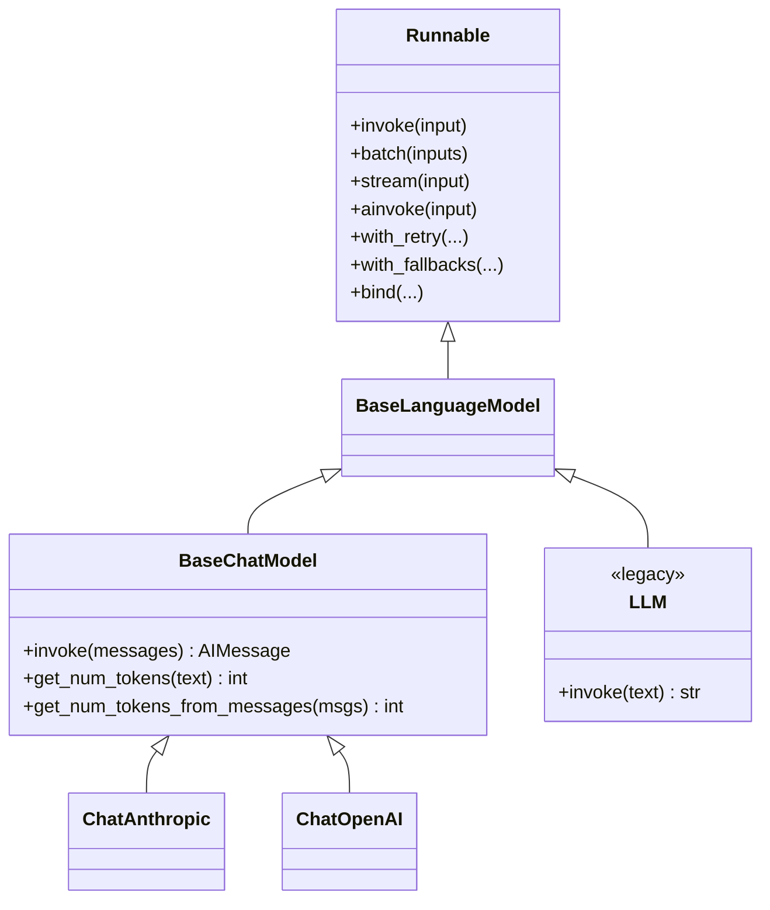
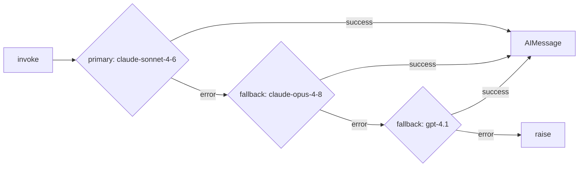

# Module 1 — Models: Chat Models & LLMs

The model is the engine. Everything else in LangChain — prompts, parsers, tools, retrievers, agents — exists to feed a model the right input and do something useful with its output. This module is about that engine: how LangChain wraps it, how to call it, how to configure it, and how to make it reliable in production.

If you've used a provider SDK directly (`anthropic.Anthropic().messages.create(...)`), LangChain's model layer will feel familiar but more uniform: one interface across every provider, composable with the rest of the [LCEL / Runnable](04-lcel-and-runnables.md) ecosystem.

> **Note:** This module targets modern LangChain (v0.3+). The primary provider in examples is Anthropic Claude. Current model IDs: `claude-opus-4-8` (most capable), `claude-sonnet-4-6` (balanced default), `claude-haiku-4-5` (fast/cheap).

---

## 1. Chat models vs. the legacy completion LLM

There were historically two model abstractions in LangChain:

- **`LLM`** — the legacy *text-completion* interface. A plain `str → str` function. This maps to the old `/v1/complete` style API where you sent one blob of text and got one blob back.
- **`BaseChatModel`** — the *chat* interface. Takes a **list of messages** and returns a **single message**. This maps to the modern messages API (`/v1/messages`, chat completions, etc.).

**Today, everything is a chat model.** Every current frontier model — Claude, GPT-4.1, Gemini — is served through a chat/messages API. The legacy `LLM` interface still exists in `langchain_core` for backward compatibility and a handful of genuinely completion-only models, but you should not reach for it. When this course says "model," it means a `BaseChatModel`.



The key takeaway from this diagram: `BaseChatModel` *is a* `Runnable`. Every model you create automatically supports `invoke` / `batch` / `stream` / async variants, and composes into chains with the `|` operator. That's why Module 1 (models) and [Module 4 (LCEL)](04-lcel-and-runnables.md) are joined at the hip.

### The `BaseChatModel` contract

Every chat model, regardless of provider, exposes the same core surface:

| Method | Input | Output |
|---|---|---|
| `invoke` | messages | one `AIMessage` |
| `batch` | list of message-lists | list of `AIMessage` |
| `stream` | messages | iterator of `AIMessageChunk` |
| `ainvoke` / `abatch` / `astream` | (async equivalents) | |
| `bind_tools` | tool definitions | a model that can emit tool calls (see [Module 5](05-tools-and-tool-calling.md)) |
| `with_structured_output` | a schema | a model that returns parsed objects (see [Module 3](03-output-parsers-structured-output.md)) |

Because the contract is uniform, swapping `ChatAnthropic` for `ChatOpenAI` changes one line and nothing downstream.

---

## 2. Two ways to instantiate a model

### 2a. `init_chat_model` — provider-agnostic (preferred)

`init_chat_model` is a factory that returns a configured chat model from a string identifier. It lives in the top-level `langchain` package.

```python
from langchain.chat_models import init_chat_model

# "provider:model" shorthand — the cleanest form
model = init_chat_model("anthropic:claude-sonnet-4-6")

response = model.invoke("In one sentence, what is LangChain?")
print(response.content)
# LangChain is a framework for building applications powered by large language
# models, providing composable abstractions for prompts, models, tools, and retrieval.
```

You can pass the model and provider separately, and set parameters inline:

```python
from langchain.chat_models import init_chat_model

model = init_chat_model(
    "claude-sonnet-4-6",
    model_provider="anthropic",
    temperature=0.2,
    max_tokens=1024,
    timeout=30,
    max_retries=3,
)
```

> **Note:** `init_chat_model` requires the relevant partner package to be installed. For Anthropic that's `pip install langchain-anthropic`; for OpenAI, `pip install langchain-openai`. The provider string (`"anthropic"`, `"openai"`, ...) tells the factory which package to import. If the package isn't installed you'll get an `ImportError` at call time, not import time.

**Why prefer it:** the provider lives in a string, so the model becomes a configuration value. You can read it from an environment variable, a YAML file, or a feature flag without touching code:

```python
import os
from langchain.chat_models import init_chat_model

model = init_chat_model(os.environ.get("LLM_MODEL", "anthropic:claude-sonnet-4-6"))
```

### 2b. Direct provider classes — explicit and fully typed

When you want every provider-specific parameter visible and type-checked, import the class directly.

```python
from langchain_anthropic import ChatAnthropic

model = ChatAnthropic(
    model="claude-sonnet-4-6",
    temperature=0.2,
    max_tokens=1024,
    timeout=30,
    max_retries=3,
)
```

The OpenAI equivalent — note this is the **one swap to OpenAI** you'll see explicitly in this module:

```python
from langchain_openai import ChatOpenAI

model = ChatOpenAI(
    model="gpt-4.1",
    temperature=0.2,
    max_tokens=1024,
    timeout=30,
    max_retries=3,
)
```

Everything downstream of `model` — chains, parsers, agents — is identical regardless of which of these two objects you built.

### When to use which

| Use `init_chat_model` when… | Use a direct class when… |
|---|---|
| The model should be configurable at runtime / deploy time | You want provider-specific params (e.g. Anthropic's `thinking`) with IDE autocomplete |
| You're writing provider-agnostic library code | You're pinning to one provider and want it obvious in the code |
| You want the `configurable_fields` swap trick (§6) | You need a subclass or custom `__init__` behavior |

> **✅ Best practice:** Default to `init_chat_model` in application code. Reach for the direct class only when you need a parameter the factory doesn't surface cleanly, or when explicitness matters more than flexibility.

---

## 3. Messages in depth

A chat model's input is a **list of messages**, and its output is a single message. Messages are typed objects from `langchain_core.messages`.

### The message types

```python
from langchain_core.messages import (
    SystemMessage,   # instructions / persona — sets behavior
    HumanMessage,    # user turns
    AIMessage,       # model (assistant) turns
    ToolMessage,     # results of a tool call, fed back to the model
)

messages = [
    SystemMessage(content="You are a terse assistant. Answer in one sentence."),
    HumanMessage(content="Why is the sky blue?"),
]

response = model.invoke(messages)
print(type(response))     # <class 'langchain_core.messages.ai.AIMessage'>
print(response.content)   # Sunlight scatters off air molecules, and blue light scatters most.
```

| Message | Role | Purpose |
|---|---|---|
| `SystemMessage` | `system` | Top-level instructions, persona, constraints. |
| `HumanMessage` | `user` | What the end user said. |
| `AIMessage` | `assistant` | What the model produced (you append these to maintain conversation history). |
| `ToolMessage` | `tool` | The output of a tool the model asked to call. Carries a `tool_call_id`. See [Module 5](05-tools-and-tool-calling.md). |

### The `(role, content)` tuple shorthand

Constructing message objects for every turn is verbose. LangChain accepts a list of `(role, content)` tuples and converts them for you:

```python
response = model.invoke([
    ("system", "You are a terse assistant. Answer in one sentence."),
    ("human", "Why is the sky blue?"),
])
```

Recognized role strings: `"system"`, `"human"` (alias `"user"`), `"ai"` (alias `"assistant"`). A bare string is treated as a single `HumanMessage`:

```python
model.invoke("Why is the sky blue?")
# Equivalent to model.invoke([HumanMessage(content="Why is the sky blue?")])
```

> **⚠️ Gotcha:** The tuple shorthand is convenient for one-off calls, but [prompt templates](02-prompts.md) are the right tool once you have variables to interpolate. Don't build conversation history by string-concatenating tuples — append real `AIMessage` objects so tool calls and metadata survive the round trip.

### Multimodal content blocks

`content` is not always a string. For vision and other multimodal inputs, `content` is a **list of content blocks** — each a dict with a `type`. This is how you send an image alongside text (see §7 for a full runnable example):

```python
from langchain_core.messages import HumanMessage

message = HumanMessage(content=[
    {"type": "text", "text": "What's in this image?"},
    {
        "type": "image",
        "url": "https://example.com/photo.png",
    },
])
```

### Anatomy of an `AIMessage`

The returned `AIMessage` carries far more than `content`. The fields you'll actually use:

```python
response = model.invoke("Say hello.")

response.content           # str (or list of blocks) — the text the model produced
response.id                # str — unique id for this message
response.tool_calls        # list — structured tool calls (empty unless tools were bound)
response.usage_metadata    # dict — token counts (see §8)
response.response_metadata # dict — raw provider metadata: stop_reason, model id, etc.
```

```python
print(response.response_metadata)
# {'id': 'msg_01...', 'model': 'claude-sonnet-4-6',
#  'stop_reason': 'end_turn', 'stop_sequence': None,
#  'usage': {'input_tokens': 9, 'output_tokens': 5, ...}}

print(response.usage_metadata)
# {'input_tokens': 9, 'output_tokens': 5, 'total_tokens': 14,
#  'input_token_details': {...}, 'output_token_details': {...}}
```

| Field | What it is | When you need it |
|---|---|---|
| `content` | The generated text or content blocks | Always |
| `id` | Unique message id | Logging, dedup, tracing |
| `tool_calls` | Parsed tool invocations | Tool calling — [Module 5](05-tools-and-tool-calling.md) |
| `usage_metadata` | Normalized token counts | Cost/budget tracking — §8 |
| `response_metadata` | Raw, provider-specific metadata | Reading `stop_reason`, provider quirks |

> **Note:** `usage_metadata` is LangChain's *normalized* token accounting — the same keys (`input_tokens`, `output_tokens`, `total_tokens`) across every provider. `response_metadata` is the provider's *raw* payload and differs by provider. Prefer `usage_metadata` for portable code.

---

## 4. The core methods: invoke, batch, stream

Because a chat model is a `Runnable`, it shares the [Runnable interface](04-lcel-and-runnables.md). Here are the four you'll use daily.

### `invoke` — one input, one output

```python
from langchain.chat_models import init_chat_model

model = init_chat_model("anthropic:claude-sonnet-4-6")

response = model.invoke("Name three primary colors.")
print(response.content)
# Red, blue, and yellow.
```

### `batch` — many inputs, concurrently

`batch` takes a **list** of inputs and returns a list of outputs in the same order. It runs them concurrently under the hood.

```python
prompts = [
    "Capital of France?",
    "Capital of Japan?",
    "Capital of Brazil?",
]

responses = model.batch(prompts)
for r in responses:
    print(r.content)
# Paris.
# Tokyo.
# Brasília.
```

Cap concurrency with `max_concurrency` to avoid hammering rate limits:

```python
responses = model.batch(prompts, config={"max_concurrency": 2})
# At most 2 in flight at any time.
```

> **✅ Best practice:** Use `batch` for independent inputs (classifying a list of documents, answering a set of unrelated questions). It's faster than a Python loop of `invoke` calls because LangChain parallelizes them. For *dependent* steps (output of one feeds the next), use a chain, not `batch`.

### `stream` — tokens as they arrive

`stream` yields `AIMessageChunk` objects incrementally. Each chunk's `.content` is the **delta** — the new piece of text, not the cumulative text.

```python
for chunk in model.stream("Write a two-line poem about the sea."):
    print(chunk.content, end="", flush=True)
# The sea breathes slow against the shore,
# a silver hush, then asks for more.
```

**Chunk additivity.** `AIMessageChunk` objects support `+`, so you can reconstruct the full message by accumulating them. This matters because metadata (token usage, the final message id) lands on the *aggregate*, not on individual chunks:

```python
chunks = []
for chunk in model.stream("Count to three."):
    chunks.append(chunk)
    print(chunk.content, end="", flush=True)

full = chunks[0]
for chunk in chunks[1:]:
    full = full + chunk      # AIMessageChunk + AIMessageChunk -> AIMessageChunk

print()
print(full.content)          # "One, two, three." — the full accumulated text
print(full.usage_metadata)   # token counts attached to the aggregate
```

> **⚠️ Gotcha:** Don't confuse `chunk.content` (the delta) with the accumulated content. If you print `chunk.content` you see one piece; if you collect chunks into a string you must concatenate. Adding chunks with `+` does this for you *and* merges metadata correctly — prefer it over manual string-joining when you need the final message.

### Async: `ainvoke`, `abatch`, `astream`

Every method has an `a`-prefixed async twin with the identical signature. Use these inside `async def` code (FastAPI handlers, async agents):

```python
import asyncio
from langchain.chat_models import init_chat_model

model = init_chat_model("anthropic:claude-sonnet-4-6")

async def main():
    # ainvoke
    resp = await model.ainvoke("Hello in French?")
    print(resp.content)  # Bonjour !

    # abatch
    resps = await model.abatch(["Hi in German?", "Hi in Italian?"])
    print([r.content for r in resps])  # ['Hallo!', 'Ciao!']

    # astream
    async for chunk in model.astream("Write one line about rain."):
        print(chunk.content, end="", flush=True)

asyncio.run(main())
```

> **✅ Best practice:** In an async web server, always use `ainvoke`/`astream`. Calling the sync `invoke` inside an event loop blocks it and kills your concurrency. See [Module 11 (Production)](11-production-and-deployment.md).

---

## 5. Model parameters

Parameters split into two groups: **standard** (LangChain normalizes them across providers) and **provider-specific** (passed through untouched).

### Standard parameters

| Parameter | Type | Meaning |
|---|---|---|
| `temperature` | float | Sampling randomness. `0` ≈ deterministic, higher = more varied. |
| `max_tokens` | int | Hard cap on output length. |
| `top_p` | float | Nucleus sampling — alternative to temperature. Set one, not both. |
| `stop` | list[str] | Stop sequences; generation halts when one is produced. |
| `timeout` | float | Seconds to wait for a response before erroring. |
| `max_retries` | int | How many times to retry transient failures (429, 5xx). |

```python
from langchain_anthropic import ChatAnthropic

model = ChatAnthropic(
    model="claude-sonnet-4-6",
    temperature=0,
    max_tokens=512,
    stop=["\n\n"],
    timeout=30,
    max_retries=2,
)
```

### Provider-specific parameters via `model_kwargs`

Anything the standard set doesn't cover goes through, either as a direct constructor kwarg on the partner class or via `model_kwargs`. For example, Claude's extended thinking:

```python
from langchain_anthropic import ChatAnthropic

model = ChatAnthropic(
    model="claude-opus-4-8",
    max_tokens=8000,
    thinking={"type": "enabled", "budget_tokens": 4000},
)
```

> **⚠️ Verify:** Provider-specific parameters like Anthropic's `thinking` map directly onto the underlying SDK's request shape, and that shape evolves with the model. On the newest Claude models (Opus 4.7+/4.8, Fable 5) the older `{"type": "enabled", "budget_tokens": N}` form is rejected in favor of `{"type": "adaptive"}`, and sampling params like `temperature` may be unsupported. Confirm the exact `thinking`/effort shape against the current Anthropic docs for the model ID you're targeting before relying on it in production.

> **Note — reasoning / thinking models.** "Thinking" or "reasoning" models spend extra hidden tokens deliberating before answering. With LangChain you enable this via provider-specific params (Anthropic's `thinking`, OpenAI's reasoning settings). The reasoning tokens are billed and counted in `usage_metadata`, and reasoning content typically appears in dedicated content blocks rather than `content`. Budget `max_tokens` generously when reasoning is on — the visible answer shares the budget with the hidden reasoning.

---

## 6. `bind` and runtime configuration

### `bind` — freeze parameters onto a model

`.bind(**kwargs)` returns a *new* Runnable with those keyword arguments preset on every call. It does not mutate the original. This is how you create a specialized variant without a new constructor call:

```python
from langchain.chat_models import init_chat_model

base = init_chat_model("anthropic:claude-sonnet-4-6")

# A variant that always stops at a divider and never runs long.
terse = base.bind(stop=["---"], max_tokens=128)

terse.invoke("List two fruits, then write --- then list two vegetables.")
# "Apple, banana" — generation stops at the divider.
```

`bind` is also the mechanism behind tool calling: `model.bind_tools([...])` is `bind` specialized for tool schemas (see [Module 5](05-tools-and-tool-calling.md)).

### `configurable_fields` / `configurable_alternatives` — swap at runtime

When you want to choose the model (or a parameter) *per call* rather than at construction, declare configurable fields. This is most ergonomic via `init_chat_model`:

```python
from langchain.chat_models import init_chat_model

# Declare which fields can be overridden per-invocation.
configurable_model = init_chat_model(
    "anthropic:claude-sonnet-4-6",
    configurable_fields=("model", "temperature", "max_tokens"),
    config_prefix="llm",
)

# Default behavior:
configurable_model.invoke("Hi")

# Override per call via config — e.g. escalate to Opus for a hard question:
configurable_model.invoke(
    "Prove that sqrt(2) is irrational.",
    config={"configurable": {
        "llm_model": "claude-opus-4-8",
        "llm_temperature": 0,
    }},
)
```

This is a teaser — the full Runnable configuration story (`configurable_fields` on arbitrary Runnables, `configurable_alternatives` for swapping entire sub-chains) lives in [Module 4 (LCEL & Runnables)](04-lcel-and-runnables.md). The point for now: a single model object can serve cheap-and-fast and slow-and-smart traffic, selected at request time.

> **✅ Best practice:** Expose `model` and `temperature` as configurable fields in a service so you can A/B test models or escalate to a stronger model for hard inputs without redeploying.

---

## 7. Multimodal: sending an image to a vision model

Claude models accept images as content blocks. You can pass an image by URL or as base64-encoded bytes. Build a `HumanMessage` whose `content` is a list mixing text and image blocks.

### By URL

```python
from langchain.chat_models import init_chat_model
from langchain_core.messages import HumanMessage

model = init_chat_model("anthropic:claude-sonnet-4-6")

message = HumanMessage(content=[
    {"type": "text", "text": "Describe this image in one sentence."},
    {
        "type": "image",
        "url": "https://upload.wikimedia.org/wikipedia/commons/thumb/d/dd/Gull_portrait_ca_usa.jpg/320px-Gull_portrait_ca_usa.jpg",
    },
])

response = model.invoke([message])
print(response.content)
# A close-up portrait of a seagull against a soft, out-of-focus background.
```

### By base64 (local file)

When the image is a local file, read and base64-encode it, then send it inline:

```python
import base64
from langchain.chat_models import init_chat_model
from langchain_core.messages import HumanMessage

model = init_chat_model("anthropic:claude-sonnet-4-6")

with open("diagram.png", "rb") as f:
    b64 = base64.b64encode(f.read()).decode("utf-8")

message = HumanMessage(content=[
    {"type": "text", "text": "What does this architecture diagram show?"},
    {
        "type": "image",
        "base64": b64,
        "mime_type": "image/png",
    },
])

response = model.invoke([message])
print(response.content)
```

> **⚠️ Verify:** Modern LangChain uses a standard cross-provider content-block schema with flat keys (`{"type": "image", "url": ...}` and `{"type": "image", "base64": ..., "mime_type": ...}`). An older transitional form used `source_type: "url"` / `"base64"` (with `data` for the bytes), and some providers also still accept the OpenAI-style `{"type": "image_url", "image_url": {"url": ...}}` shape, including `data:` URIs for base64. If a block shape is rejected, check the current `langchain-anthropic` docs for the accepted form for your installed version.

> **Note:** Vision is model-dependent. `claude-sonnet-4-6` and the Opus tier are vision-capable; always confirm the specific model accepts image input before sending one.

---

## 8. Token usage and counting

### Reading usage off a response

After any call, `usage_metadata` gives you normalized counts:

```python
from langchain.chat_models import init_chat_model

model = init_chat_model("anthropic:claude-sonnet-4-6")
response = model.invoke("Explain TCP in two sentences.")

usage = response.usage_metadata
print(usage["input_tokens"])   # e.g. 14
print(usage["output_tokens"])  # e.g. 47
print(usage["total_tokens"])   # e.g. 61
```

For provider-specific accounting (cache reads, reasoning tokens), drop to `response_metadata`:

```python
print(response.response_metadata["usage"])
# {'input_tokens': 14, 'output_tokens': 47,
#  'cache_creation_input_tokens': 0, 'cache_read_input_tokens': 0}
```

> **⚠️ Gotcha:** When **streaming**, individual chunks usually carry no usage. Accumulate chunks with `+` (see §4) and read `usage_metadata` off the final aggregated `AIMessageChunk`. If you read it off the first chunk you'll get `None`.

### Estimating tokens *before* you call

`get_num_tokens` and `get_num_tokens_from_messages` let you size a prompt before sending it — useful for staying under context limits and pre-flighting cost:

```python
text = "How many tokens is this sentence?"
print(model.get_num_tokens(text))  # e.g. 7

from langchain_core.messages import SystemMessage, HumanMessage
msgs = [
    SystemMessage(content="You are helpful."),
    HumanMessage(content="Summarize the French Revolution."),
]
print(model.get_num_tokens_from_messages(msgs))  # e.g. 19
```

> **⚠️ Verify:** Token counting is approximate for some providers (LangChain may fall back to a generic tokenizer when an exact one isn't available). For exact Anthropic counts, the provider's own token-counting endpoint is authoritative; treat `get_num_tokens` as a fast estimate for budgeting, not a billing-grade number.

---

## 9. Caching model responses

LangChain can cache model outputs so that an **identical prompt** returns the stored result instead of hitting the API again. You set a single global cache and it applies to every model call.

### In-memory cache (per-process)

```python
from langchain_core.globals import set_llm_cache
from langchain_core.caches import InMemoryCache
from langchain.chat_models import init_chat_model

set_llm_cache(InMemoryCache())

model = init_chat_model("anthropic:claude-sonnet-4-6", temperature=0)

model.invoke("What is 2 + 2?")  # hits the API, stores the result
model.invoke("What is 2 + 2?")  # returned from cache — no API call, instant
```

### SQLite cache (persists across restarts)

```python
from langchain_core.globals import set_llm_cache
from langchain_community.cache import SQLiteCache

set_llm_cache(SQLiteCache(database_path=".langchain_cache.db"))
# Cached responses now survive process restarts.
```

> **Note:** `InMemoryCache` lives in `langchain_core.caches`; `SQLiteCache` lives in `langchain_community.cache` (`pip install langchain-community`). The cache key is derived from the exact prompt **and** the model parameters — a different `temperature`, `max_tokens`, or model id is a different key.

### When caching helps — and when it silently misleads

| Caching helps | Caching misleads |
|---|---|
| Deterministic prompts (`temperature=0`) repeated often | Anything where a fresh answer matters (live data, timestamps) |
| Test suites that re-run identical prompts | `temperature > 0` outputs — you'll keep getting the *first* sampled answer forever |
| Demos and notebooks where you re-run cells | Conversations — the prompt grows each turn, so cache hits are rare anyway |

> **⚠️ Gotcha:** Caching at `temperature > 0` is the classic foot-gun. You ask for variety, but the cache returns the same stored sample every time — your "random" outputs are frozen. Cache only deterministic (`temperature=0`) calls, or disable caching where you genuinely want fresh sampling. The cache is keyed on the prompt+params, so it has no way to know you *wanted* a new roll of the dice.

---

## 10. Reliability: retries, fallbacks, and rate limiting

Production model calls fail: transient 5xx, 429 rate limits, the occasional timeout. LangChain gives you composable Runnable wrappers to handle all three. Because these return new Runnables, they layer cleanly with the rest of LCEL.

### `.with_retry(...)` — survive transient errors

Wraps the model so failing calls are retried with exponential backoff.

```python
from langchain.chat_models import init_chat_model

model = init_chat_model("anthropic:claude-sonnet-4-6")

robust = model.with_retry(
    stop_after_attempt=3,
    wait_exponential_jitter=True,
)

robust.invoke("Summarize photosynthesis.")
# Retries up to 3 times on transient failures before giving up.
```

You can restrict *which* exceptions trigger a retry:

```python
robust = model.with_retry(
    retry_if_exception_type=(TimeoutError,),
    stop_after_attempt=4,
)
```

> **Note:** This is distinct from the `max_retries` constructor parameter. `max_retries` is the *provider SDK's* internal retry (handles 429/5xx at the HTTP layer). `.with_retry()` is *LangChain's* Runnable-level retry, which can wrap an entire chain, not just a single model. Use `max_retries` for HTTP transience; reach for `.with_retry()` when you want retry semantics across a composed pipeline.

### `.with_fallbacks([...])` — fail over to another model

If the primary model errors (after its own retries), fall back to alternatives in order. This is the standard pattern for provider outages or model-specific failures.

```python
from langchain_anthropic import ChatAnthropic
from langchain_openai import ChatOpenAI

primary = ChatAnthropic(model="claude-sonnet-4-6", max_retries=2)
backup_opus = ChatAnthropic(model="claude-opus-4-8", max_retries=2)
backup_openai = ChatOpenAI(model="gpt-4.1", max_retries=2)

resilient = primary.with_fallbacks([backup_opus, backup_openai])

# If Sonnet fails, try Opus; if that fails too, cross over to GPT-4.1.
response = resilient.invoke("Give me a one-line definition of entropy.")
print(response.content)
```



> **✅ Best practice:** Combine the two. Wrap each model in `.with_retry()` (or set `max_retries`) so transient blips are absorbed locally, then `.with_fallbacks()` across *different providers* so a full provider outage still degrades gracefully. Cross-provider fallback is the real win — if Anthropic is down, OpenAI probably isn't.

### `InMemoryRateLimiter` — throttle outbound requests

Stay under your provider's requests-per-second limit by attaching a rate limiter to the model. It blocks (sleeps) until a request is permitted.

```python
from langchain_core.rate_limiters import InMemoryRateLimiter
from langchain_anthropic import ChatAnthropic

rate_limiter = InMemoryRateLimiter(
    requests_per_second=2,      # allow 2 requests/sec on average
    check_every_n_seconds=0.1,  # how often to re-check the bucket
    max_bucket_size=5,          # allow short bursts up to 5
)

model = ChatAnthropic(
    model="claude-sonnet-4-6",
    rate_limiter=rate_limiter,
)

# Even under model.batch(...), outbound calls are throttled to ~2/sec.
```

| Parameter | Meaning |
|---|---|
| `requests_per_second` | Sustained request rate the limiter allows. |
| `check_every_n_seconds` | Polling interval while waiting for a token. |
| `max_bucket_size` | Burst capacity — how many requests can fire back-to-back before throttling kicks in. |

> **⚠️ Gotcha:** `InMemoryRateLimiter` is **per-process**. If you run multiple workers/replicas, each has its own bucket — three replicas at `requests_per_second=2` hit the API at up to 6/sec combined. It also rate-limits by *request count only*, not tokens, so it won't protect you from tokens-per-minute limits. For multi-process or token-aware limiting you need a shared/distributed limiter (Redis-backed, or your provider's server-side controls).

---

## 11. Best practices

**Temperature.** Use `temperature=0` for anything you want reproducible — extraction, classification, tool-calling, evals. Raise it (0.7–1.0) only for genuinely creative generation. A surprising amount of production LLM work runs at `0`.

**`max_tokens` budgeting.** Don't lowball it — hitting the cap truncates output mid-sentence and you pay for a useless partial response. Set it to comfortably exceed your expected longest answer. When a model "stops early," check `response.response_metadata` for a `stop_reason` of `max_tokens` before assuming the model failed.

**Deterministic testing.** For tests, combine `temperature=0` with an `InMemoryCache` (or record/replay) so suites are fast and stable. A flaky test that re-samples the model is worse than no test. See [Module 10 (Observability & Eval)](10-observability-and-eval-langsmith.md).

**Choosing a model tier.** Match the model to the job:

| Tier | Model | Use for |
|---|---|---|
| Fast / cheap | `claude-haiku-4-5` | High-volume classification, routing, simple extraction, latency-sensitive paths |
| Balanced (default) | `claude-sonnet-4-6` | Most application work — RAG answers, summarization, agents |
| Most capable | `claude-opus-4-8` | Hard reasoning, long-horizon agentic tasks, anything where correctness dominates cost |

> **✅ Best practice:** Start on `claude-sonnet-4-6`. Profile real traffic, then push the cheap, high-volume paths down to Haiku and escalate only the genuinely hard inputs to Opus — ideally via `configurable_fields` (§6) or `.with_fallbacks()` so the routing is data-driven, not hard-coded. Never state or assume pricing in code; check current provider pricing separately.

---

## Recap

- **Everything is a chat model today.** `BaseChatModel` (list-of-messages in, one message out) is the interface; the legacy `LLM` completion interface is effectively retired. A chat model *is a* `Runnable`, so it gets `invoke`/`batch`/`stream` and composes with LCEL for free.
- **Two ways to instantiate:** `init_chat_model("anthropic:claude-sonnet-4-6")` (provider-agnostic, configurable, preferred) or direct classes `ChatAnthropic` / `ChatOpenAI` (explicit, fully typed). Swapping providers is one line.
- **Messages** are typed: `SystemMessage`, `HumanMessage`, `AIMessage`, `ToolMessage`, with `("role", "content")` tuple shorthand. `content` can be a list of blocks for multimodal input. `AIMessage` carries `content`, `tool_calls`, `usage_metadata`, `response_metadata`, and `id`.
- **Core methods:** `invoke` (one), `batch` (many, with `max_concurrency`), `stream` (chunks; `chunk.content` is the delta, chunks are additive with `+`), plus async `ainvoke`/`abatch`/`astream`.
- **Parameters:** standard (`temperature`, `max_tokens`, `top_p`, `stop`, `timeout`, `max_retries`) are normalized across providers; provider-specific ones (Claude's `thinking`) pass through via constructor kwargs or `model_kwargs`.
- **`bind`** presets params onto a model; `configurable_fields`/`configurable_alternatives` let you swap model or params per call at runtime.
- **Tokens:** read `usage_metadata` (normalized) or `response_metadata` (raw) after a call; estimate ahead with `get_num_tokens` / `get_num_tokens_from_messages`.
- **Caching** via `set_llm_cache` with `InMemoryCache` or `SQLiteCache` — great for deterministic prompts, dangerous at `temperature > 0` (it freezes your "random" output).
- **Reliability:** `.with_retry()` (transient errors), `.with_fallbacks()` (fail over to another model/provider), `InMemoryRateLimiter` (per-process throttling). Combine retry + cross-provider fallbacks for graceful degradation.

---

## Exercises

1. **Provider swap.** Write a function `summarize(text, provider)` that uses `init_chat_model` to summarize `text` with either `"anthropic:claude-sonnet-4-6"` or `"openai:gpt-4.1"`, selected by the `provider` argument. Confirm the rest of the code is identical across providers.

2. **Streaming reconstruction.** Stream a response to "Write a haiku about autumn." Print each delta as it arrives, accumulate the chunks with `+`, then print the final `usage_metadata` from the aggregated chunk. Verify the token counts are absent on individual chunks but present on the aggregate.

3. **Batch with throttling.** Classify a list of 20 short product reviews as positive/negative using `batch`. Attach an `InMemoryRateLimiter` capped at `requests_per_second=3` and observe the throttling. Then add `max_concurrency` to the batch call and reason about how the two interact.

4. **Cache foot-gun.** Set an `InMemoryCache`, then call the same prompt twice at `temperature=0.9` asking for "a random color." Observe that the second call returns the identical "random" answer. Explain in a comment why, and what you'd change to get genuine variety.

5. **Resilient model.** Build a model that (a) retries transient errors up to 3 times via `.with_retry()`, and (b) falls back from `claude-sonnet-4-6` to `claude-opus-4-8` to `gpt-4.1`. Force a failure (e.g. a bogus model id on the primary, or an invalid key) and confirm the fallback chain produces an answer.

6. **Token pre-flight.** Before sending a long document for summarization, use `get_num_tokens_from_messages` to estimate the prompt size. If it exceeds a threshold you set (say 100k tokens), print a warning and truncate or chunk the input instead of sending it. Connect this to why context-window awareness matters for [RAG](06-retrieval-and-rag.md).
