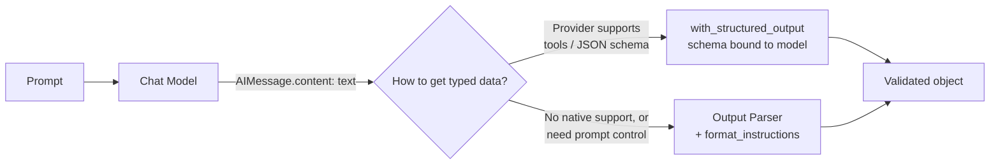
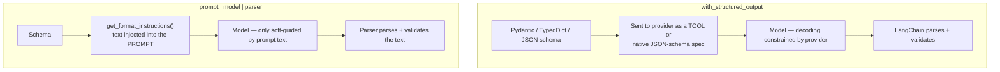

# Module 3 — Output Parsers & Structured Output

A language model is, at its core, a function from text to text. But the applications you build on top of it almost never want text — they want a `Decision`, an `Invoice`, a `list[Citation]`, a routing label, a boolean. The gap between "the model emitted a string that looks like JSON" and "I have a validated Python object I can pass to the next function" is where a surprising amount of LLM engineering effort goes.

This module is about closing that gap correctly. We cover the modern primary path — `model.with_structured_output(Schema)` — in depth, then the classic output-parser family (still useful, sometimes necessary), self-healing parsers, streaming, and a decision framework for choosing between them. We finish with two complete end-to-end programs: a classifier and an extractor.

This builds directly on [Module 1 — Models](01-models-chat-and-llms.md) and [Module 2 — Prompts](02-prompts.md), and everything composes via the Runnable interface from [Module 4 — LCEL & Runnables](04-lcel-and-runnables.md). It is also the foundation for tool calling in [Module 5 — Tools](05-tools-and-tool-calling.md), since structured output and tool calling are the same machinery underneath.

---

## 3.1 The problem: text out, typed data in

When you invoke a chat model you get back an `AIMessage`. Its `.content` is a string (or, for multimodal/blocks, a list). Consider:

```python
from langchain_anthropic import ChatAnthropic

model = ChatAnthropic(model="claude-sonnet-4-6", temperature=0)
resp = model.invoke("Extract the city and country: 'I flew into Lisbon, Portugal last week.'")
print(type(resp))      # <class 'langchain_core.messages.ai.AIMessage'>
print(repr(resp.content))
# 'The city is Lisbon and the country is Portugal.'
```

You asked for two fields; you got a sentence. To use this downstream you'd have to regex it, which breaks the moment the model phrases things differently. What you actually want is:

```python
{"city": "Lisbon", "country": "Portugal"}
```

…validated, with the right types, and an error you can catch when the model fails. There are two families of solutions:

1. **`with_structured_output(Schema)`** — bind a schema to the model itself. The provider's tool/JSON-schema machinery constrains generation, and LangChain parses the result into a validated object. **This is the modern default.**
2. **Output parsers** — append a `Runnable` to the chain that transforms the model's text into structured data, usually paired with format instructions injected into the prompt. **The fallback when the provider can't do (1), or when you want fine control over the prompt.**



Before the structured stuff, the simplest parser of all.

---

## 3.2 `StrOutputParser`: the chain terminator

`StrOutputParser` does one thing: given an `AIMessage`, return its `.content` as a `str` (and given a raw string, pass it through). It is the most common parser in production because most chains end in "give me the text."

```python
from langchain_anthropic import ChatAnthropic
from langchain_core.prompts import ChatPromptTemplate
from langchain_core.output_parsers import StrOutputParser

prompt = ChatPromptTemplate.from_template("Write a one-line tagline for: {product}")
model = ChatAnthropic(model="claude-sonnet-4-6")
chain = prompt | model | StrOutputParser()

print(chain.invoke({"product": "a noise-cancelling mug"}))
# 'Silence your coffee break — literally.'
```

Why bother, instead of reading `.content` yourself? Three reasons:

- **Composition.** The result is now a plain `str`, so the next step in an LCEL pipe receives a string, not an `AIMessage`. This matters when you nest chains.
- **Streaming.** `StrOutputParser` is transparent to streaming — `chain.stream(...)` yields string chunks instead of `AIMessageChunk` objects.
- **Uniformity.** Some upstream runnables can emit either a message or a string; `StrOutputParser` normalizes both.

> **Note:** `StrOutputParser` does **not** parse JSON or extract fields. It is purely "message → its text." For typed data, read on.

---

## 3.3 The modern primary path: `with_structured_output`

`with_structured_output(schema)` returns a **new Runnable** that, when invoked, returns an instance of your schema instead of an `AIMessage`. You define the shape once; LangChain wires up the provider's native mechanism to enforce it and parses the response for you.

### 3.3.1 Minimal example

```python
from langchain_anthropic import ChatAnthropic
from pydantic import BaseModel, Field

class Location(BaseModel):
    """A geographic location mentioned in text."""
    city: str = Field(description="The city name")
    country: str = Field(description="The country name")

model = ChatAnthropic(model="claude-sonnet-4-6", temperature=0)
structured = model.with_structured_output(Location)

result = structured.invoke("I flew into Lisbon, Portugal last week.")
print(result)            # city='Lisbon' country='Portugal'
print(type(result))      # <class '__main__.Location'>
print(result.country)    # Portugal
```

No prompt engineering for formatting, no JSON parsing, no try/except around `json.loads`. You get a validated `Location` instance.

> **✅ Best practice:** Use `init_chat_model` to stay provider-agnostic. `with_structured_output` is part of the standard `BaseChatModel` interface, so the call site is identical across providers:
>
> ```python
> from langchain.chat_models import init_chat_model
> model = init_chat_model("anthropic:claude-sonnet-4-6", temperature=0)
> structured = model.with_structured_output(Location)
> ```
>
> Swapping to OpenAI is a one-line change — `init_chat_model("openai:gpt-4.1")` — and the schema binding works unchanged.

### 3.3.2 How it works under the hood

`with_structured_output` is sugar over **tool/function calling** or **provider-native JSON-schema/JSON modes**. The `method` parameter selects which:

| `method` | Mechanism | Notes |
|---|---|---|
| `"function_calling"` | Model is given your schema as a single tool and forced to "call" it; the tool args are your structured object. | Widely supported (Anthropic, OpenAI, many others). Often the default. |
| `"json_schema"` | Provider's native structured-output / JSON-schema mode constrains decoding to match the schema. | Strongest guarantees where supported (e.g. OpenAI Structured Outputs, Anthropic structured output). |
| `"json_mode"` | Provider guarantees *syntactically valid JSON* but does **not** enforce your specific schema. | You **must** describe the desired fields in the prompt yourself; LangChain still parses+validates. Available on some providers (e.g. OpenAI, Mistral). |

```python
# Explicitly choose the mechanism:
structured = model.with_structured_output(Location, method="json_schema")
```

> **⚠️ Gotcha:** Not every provider supports every `method`. `ChatAnthropic` supports `"function_calling"` (default) and `"json_schema"`. `"json_mode"` is provider-specific (notably OpenAI/Mistral) and requires you to spell out the field names in your prompt — JSON mode guarantees *valid JSON*, not *your* JSON. If you pass an unsupported `method`, you'll get an error at bind/invoke time.

> **⚠️ Verify:** The exact set of supported `method` values is per integration and evolves. Check your provider's `with_structured_output` reference (e.g. the `langchain_anthropic` / `langchain_openai` docs) if you depend on a specific mode.

### 3.3.3 `include_raw=True`: keep the message *and* the parse

By default you only get the parsed object — but if parsing fails, you get an exception and lose the raw response. For production extraction where you want to log raw output, inspect token usage, or handle parse failures gracefully, pass `include_raw=True`. The Runnable then returns a **dict** with three keys instead of raising:

```python
structured = model.with_structured_output(Location, include_raw=True)
out = structured.invoke("I flew into Lisbon, Portugal last week.")

# out == {
#   "raw":     AIMessage(...),       # the original message (tool calls, usage metadata, etc.)
#   "parsed":  Location(city='Lisbon', country='Portugal'),  # or None if parsing failed
#   "parsing_error": None,           # the exception, if any
# }

if out["parsing_error"]:
    log.warning("Parse failed: %s", out["parsing_error"])
    print(out["raw"].content)        # inspect what the model actually said
else:
    use(out["parsed"])
```

> **✅ Best practice:** Use `include_raw=True` whenever a parse failure should be **handled**, not crash the request — i.e. almost all server-side extraction. Use the plain form (raises on failure) in scripts/notebooks where a stack trace is the desired feedback.

### 3.3.4 A rich, real-world schema: nested fields, enums, Optional, lists

Here is a realistic extraction target — parsing a support ticket — exercising every Pydantic feature that matters for extraction quality.

```python
from enum import Enum
from typing import Optional
from pydantic import BaseModel, Field
from langchain.chat_models import init_chat_model


class Priority(str, Enum):
    low = "low"
    medium = "medium"
    high = "high"
    urgent = "urgent"


class Customer(BaseModel):
    """Identifying details about the person who filed the ticket."""
    name: Optional[str] = Field(
        default=None, description="Full name of the customer, if stated"
    )
    email: Optional[str] = Field(
        default=None, description="Email address, if present in the text"
    )


class SupportTicket(BaseModel):
    """A structured representation of an inbound customer support message."""
    summary: str = Field(description="A one-sentence summary of the problem")
    priority: Priority = Field(
        description="Urgency level inferred from tone and impact"
    )
    customer: Customer = Field(description="Who reported the issue")
    affected_products: list[str] = Field(
        default_factory=list,
        description="Product names or SKUs the customer mentions",
    )
    requires_human: bool = Field(
        description="True if the issue needs a human agent rather than an automated reply"
    )


model = init_chat_model("anthropic:claude-sonnet-4-6", temperature=0)
extractor = model.with_structured_output(SupportTicket)

ticket_text = """
From: jordan.lee@example.com
Our entire warehouse fleet of ScanPro X200 handhelds went offline at 2am and
we cannot ship orders. This is costing us thousands an hour. Please help ASAP.
— Jordan Lee
"""

ticket = extractor.invoke(ticket_text)
print(ticket.model_dump())
# {
#   'summary': 'Entire fleet of ScanPro X200 handheld scanners went offline, halting shipping.',
#   'priority': <Priority.urgent: 'urgent'>,
#   'customer': {'name': 'Jordan Lee', 'email': 'jordan.lee@example.com'},
#   'affected_products': ['ScanPro X200'],
#   'requires_human': True
# }
```

Note what you did *not* do: no JSON parsing, no enum coercion, no "if the field is missing set it to None." Pydantic validated the enum membership, coerced the nested `Customer`, and applied the `default_factory` for the empty list path.

---

## 3.4 Pydantic v2 details that matter

LangChain v0.3+ is built on **Pydantic v2**. The way you write your schema directly affects extraction accuracy because the schema (including docstrings and `Field(description=...)`) is serialized into the tool/JSON schema the model sees. The model literally reads your descriptions.

### Descriptions are prompts

```python
class Invoice(BaseModel):
    """An invoice extracted from an email or PDF text."""
    total: float = Field(
        description="The grand total in the invoice's currency, as a number with no symbols"
    )
    currency: str = Field(
        description="ISO 4217 currency code, e.g. 'USD', 'EUR'. Infer from symbols if not explicit."
    )
    due_date: Optional[str] = Field(
        default=None,
        description="Payment due date in ISO 8601 (YYYY-MM-DD). Null if not stated.",
    )
```

The phrases "no symbols," "ISO 4217," "ISO 8601," and "Null if not stated" are instructions to the model. A field named `total: float` with no description will still work, but a well-described field dramatically reduces ambiguity (currency symbols leaking into the number, dates in `MM/DD/YYYY`, hallucinated values for missing data).

> **✅ Best practice:** Write the class docstring and every `Field(description=...)` as if briefing an analyst. Specify formats, units, what to do when data is absent, and disambiguation rules. This is the single highest-leverage thing you can do for extraction quality.

### Defaults, Optional, and "missing vs. null"

- `Optional[str] = None` (or `Field(default=None)`) tells the model the field may legitimately be absent — pair it with a description like "Null if not stated" so the model doesn't invent a value.
- `list[str] = Field(default_factory=list)` gives a safe empty default. Never use a mutable default directly (`= []`) — Pydantic v2 will error; use `default_factory`.
- A required field with no default forces the model to produce *something*. That's good for fields that must exist (`summary`) and bad for fields that are often absent (it pressures hallucination).

### Validators (use sparingly)

You can add Pydantic v2 validators, but remember they run **after** the model responds — a validator that raises turns into a parse error, not a re-prompt (unless you wrap with a retry parser, §3.7).

```python
from pydantic import BaseModel, Field, field_validator

class Rating(BaseModel):
    stars: int = Field(description="Rating from 1 to 5")

    @field_validator("stars")
    @classmethod
    def in_range(cls, v: int) -> int:
        if not 1 <= v <= 5:
            raise ValueError("stars must be between 1 and 5")
        return v
```

> **⚠️ Gotcha:** A validator that rejects valid-but-out-of-policy values will make `with_structured_output` raise (or set `parsing_error` with `include_raw=True`). Prefer encoding constraints the model can *see* (enums, descriptions, `ge`/`le` in `Field`) over validators it can't, so the constraint guides generation rather than only catching it after the fact. `Field(ge=1, le=5)` is reflected in the JSON schema; a `@field_validator` is not.

### TypedDict and JSON schema as alternatives

You don't have to use Pydantic. `with_structured_output` also accepts a `TypedDict` (you get a plain `dict` back) or a raw JSON-schema `dict`.

```python
from typing_extensions import TypedDict, Annotated

class LocationDict(TypedDict):
    """A geographic location."""
    city: Annotated[str, ..., "The city name"]
    country: Annotated[str, ..., "The country name"]

structured = model.with_structured_output(LocationDict)
structured.invoke("Lisbon, Portugal")   # -> {'city': 'Lisbon', 'country': 'Portugal'}  (a plain dict)
```

| Schema type | You get back | Use when |
|---|---|---|
| Pydantic `BaseModel` | A validated model instance | Default. You want validation, methods, IDE types. |
| `TypedDict` | A plain `dict` | You want a dict, or to avoid a Pydantic dependency in the result type. |
| JSON-schema `dict` | A plain `dict` | You already have a JSON schema (e.g. shared with a frontend), or need full control. |

---

## 3.5 The output-parser family (alternative & legacy, still useful)

Before `with_structured_output` existed — and still, when a model lacks tool/JSON-schema support — you get structure by **(a)** telling the model how to format its answer via `get_format_instructions()` injected into the prompt, and **(b)** appending a parser that reads that format back. The pattern is always `prompt | model | parser`.

### 3.5.1 `PydanticOutputParser`

```python
from langchain_anthropic import ChatAnthropic
from langchain_core.prompts import ChatPromptTemplate
from langchain_core.output_parsers import PydanticOutputParser
from pydantic import BaseModel, Field

class Person(BaseModel):
    name: str = Field(description="person's full name")
    age: int = Field(description="age in years")

parser = PydanticOutputParser(pydantic_object=Person)

prompt = ChatPromptTemplate.from_messages([
    ("system", "Extract the person.\n{format_instructions}"),
    ("human", "{text}"),
]).partial(format_instructions=parser.get_format_instructions())

model = ChatAnthropic(model="claude-sonnet-4-6", temperature=0)
chain = prompt | model | parser

print(chain.invoke({"text": "Ada Lovelace was 36."}))
# name='Ada Lovelace' age=36
```

`get_format_instructions()` returns a chunk of text containing the JSON schema and an instruction to "return a JSON object that conforms to it." You inject it into the prompt — typically via `.partial(...)` so the runtime input only needs `{text}`.

> **Note:** `PydanticOutputParser`, `JsonOutputParser`, `StrOutputParser`, `CommaSeparatedListOutputParser`, and `XMLOutputParser` all live in **`langchain_core.output_parsers`**. The self-healing and a few specialty parsers (`OutputFixingParser`, `RetryOutputParser`, `StructuredOutputParser`, `DatetimeOutputParser`, `EnumOutputParser`) live in **`langchain.output_parsers`**.

### 3.5.2 `JsonOutputParser`

Like the Pydantic parser but returns a plain `dict`. Optionally pass a Pydantic model to drive the format instructions while still getting a dict. Its standout feature is **streaming** (§3.8).

```python
from langchain_core.output_parsers import JsonOutputParser

parser = JsonOutputParser(pydantic_object=Person)   # pydantic_object is optional
prompt = ChatPromptTemplate.from_template(
    "Return JSON for the person.\n{format_instructions}\n\n{text}"
).partial(format_instructions=parser.get_format_instructions())

chain = prompt | model | parser
print(chain.invoke({"text": "Ada Lovelace was 36."}))
# {'name': 'Ada Lovelace', 'age': 36}
```

### 3.5.3 `StructuredOutputParser`

A lightweight, schema-less option for flat string fields, defined by `ResponseSchema` objects. No Pydantic required.

```python
from langchain.output_parsers import StructuredOutputParser, ResponseSchema

schemas = [
    ResponseSchema(name="sentiment", description="positive, negative, or neutral"),
    ResponseSchema(name="reason", description="one short sentence explaining why"),
]
parser = StructuredOutputParser.from_response_schemas(schemas)

prompt = ChatPromptTemplate.from_template(
    "Classify the review.\n{format_instructions}\n\nReview: {review}"
).partial(format_instructions=parser.get_format_instructions())

chain = prompt | model | parser
print(chain.invoke({"review": "The battery dies in an hour. Useless."}))
# {'sentiment': 'negative', 'reason': 'The battery life is extremely short.'}
```

> **Note:** `StructuredOutputParser` returns a `dict` of strings and does no type validation. For typed/nested data prefer Pydantic. It's handy when you want zero dependencies and flat string outputs.

### 3.5.4 The specialty parsers

```python
# Comma-separated list -> list[str]
from langchain_core.output_parsers import CommaSeparatedListOutputParser
list_parser = CommaSeparatedListOutputParser()
list_parser.get_format_instructions()
# 'Your response should be a list of comma separated values, eg: `foo, bar, baz`'
# chain output e.g. ['red', 'green', 'blue']

# Datetime -> datetime.datetime
from langchain.output_parsers import DatetimeOutputParser
dt_parser = DatetimeOutputParser()        # parses model output into a datetime

# Enum -> your Enum member
from enum import Enum
from langchain.output_parsers import EnumOutputParser
class Color(Enum):
    RED = "red"; GREEN = "green"; BLUE = "blue"
enum_parser = EnumOutputParser(enum=Color)   # output -> Color.RED, etc.

# XML -> nested dict (useful for models that prefer XML, e.g. Claude with XML prompting)
from langchain_core.output_parsers import XMLOutputParser
xml_parser = XMLOutputParser()
```

`XMLOutputParser` deserves a note for Claude users: Anthropic models are well-trained on XML tags, so for some tasks an XML format with `XMLOutputParser` is more reliable than free-form JSON prompting — though `with_structured_output` is still preferred when available.

---

## 3.6 Why descriptions and format instructions overlap — but aren't the same

Both `with_structured_output` and the parser family ultimately rely on your schema descriptions. The difference is *where the schema goes*:



The practical consequence: `with_structured_output` constrains generation at the provider level (stronger guarantees, fewer malformed outputs), whereas parsers only *ask nicely* in the prompt and clean up afterward. That's the core reason `with_structured_output` is the default when supported.

---

## 3.7 Self-healing: `OutputFixingParser` and `RetryOutputParser`

Even with format instructions, models sometimes emit not-quite-valid output (trailing prose, a missing comma, an out-of-enum value). Two wrappers recover automatically by calling an LLM a second time.

### `OutputFixingParser` — fix malformed output

Wraps any parser. On a parse failure, it sends the *broken output* plus the error to a model and asks it to fix the formatting. It does **not** see the original prompt — it only knows "this string failed to parse like so, fix it."

```python
from langchain.output_parsers import OutputFixingParser
from langchain_core.output_parsers import PydanticOutputParser

base = PydanticOutputParser(pydantic_object=Person)
fixing = OutputFixingParser.from_llm(parser=base, llm=model)

# If the model returned, say, "{'name': 'Ada', age: 36}" (single quotes, unquoted key),
# fixing.parse(bad_text) will round-trip it through the LLM and return Person(name='Ada', age=36).
```

### `RetryOutputParser` — retry *with the original prompt*

Stronger: on failure it re-asks the model using the **original prompt context plus the bad output**, so it can fix *semantic* problems (e.g. a missing field the model could supply from the input), not just syntax.

```python
from langchain.output_parsers import RetryOutputParser

retry = RetryOutputParser.from_llm(parser=base, llm=model)
# retry.parse_with_prompt(completion, prompt_value)  -> re-queries using the original prompt
```

> **⚠️ Gotcha:** Both wrappers cost an extra LLM call (latency + tokens) on every failure. They are a safety net, not a substitute for good schemas and `with_structured_output`. With the modern path, provider-side constraints make malformed output rare enough that you often don't need these at all.

> **✅ Best practice:** Reach for `OutputFixingParser` for occasional syntax noise from weaker/older models; reach for `RetryOutputParser` when missing fields are recoverable from the original input. If you're already on `with_structured_output` with `include_raw=True`, prefer handling `parsing_error` explicitly over auto-retrying.

---

## 3.8 Streaming structured output

### `JsonOutputParser` streams partial dicts

`JsonOutputParser` is **streamable**: as JSON tokens arrive, it yields progressively-more-complete `dict` snapshots. This is great for UIs that render fields as they fill in.

```python
parser = JsonOutputParser()
prompt = ChatPromptTemplate.from_template(
    "List 3 colors as JSON with key 'colors' (an array).\n{fi}"
).partial(fi=parser.get_format_instructions())
chain = prompt | model | parser

for partial in chain.stream({}):
    print(partial)
# {}
# {'colors': []}
# {'colors': ['red']}
# {'colors': ['red', 'green']}
# {'colors': ['red', 'green', 'blue']}
```

Each yield is a valid dict representing the best parse so far — you re-render on each.

### Streaming with `with_structured_output`

Streaming is nuanced here because the output is built from a **tool call**, whose arguments accumulate as a JSON string. Behavior depends on the provider and `method`:

- With tool-calling-based structured output, `.stream()` typically yields **partial objects** as the tool-args JSON fills in (similar to `JsonOutputParser`), with the final yield being the complete validated object.
- Some providers/modes only produce a usable object at the **end** of the stream. You'll still get a single final value rather than smooth incremental updates.

```python
structured = model.with_structured_output(SupportTicket)
final = None
for chunk in structured.stream(ticket_text):
    final = chunk          # may be partial; last value is complete
print(final)
```

> **⚠️ Verify:** Streaming granularity for `with_structured_output` is provider- and `method`-dependent and has changed across versions. If smooth incremental streaming of structured fields is a hard product requirement, test your specific provider/`method`, or use `JsonOutputParser` (with prompt-injected format instructions) where you control the streaming contract. See [Module 4 — LCEL & Runnables](04-lcel-and-runnables.md) for the streaming model in general.

---

## 3.9 Decision guide: which approach?

```mermaid
flowchart TD
    Q1{Do you need typed/structured data<br/>at all, or just text?} -->|Just text| STR[StrOutputParser]
    Q1 -->|Structured| Q2{Does the provider support<br/>tool calling or JSON schema?}
    Q2 -->|Yes 99% of modern chat models| WSO[with_structured_output Schema<br/>+ include_raw=True in prod]
    Q2 -->|No / niche local model| Q3{Need streaming partials<br/>or full prompt control?}
    Q3 -->|Yes| JOP[prompt | model | JsonOutputParser]
    Q3 -->|No, simple flat fields| SOP[prompt | model | PydanticOutputParser<br/>or StructuredOutputParser]
    WSO --> Q4{Still seeing malformed output?}
    JOP --> Q4
    SOP --> Q4
    Q4 -->|Rarely| DONE[Ship it]
    Q4 -->|Syntax noise| OFP[Wrap with OutputFixingParser]
    Q4 -->|Missing recoverable fields| ROP[Wrap with RetryOutputParser]
```

The short version:

- **Default to `with_structured_output(Schema)`.** It's the most reliable, least code, and provider-agnostic.
- **Use a parser + format instructions** only when the model can't do tool/JSON-schema calling, when you need streaming partials with a contract you control, or when you want the schema text in the prompt for transparency.
- **Use `StrOutputParser`** to terminate text chains.
- **Add fixing/retry parsers** only if you observe real failure rates.

---

## 3.10 Complete example #1: a classifier

A robust intent classifier for an inbound message router. Uses an enum for a closed label set and returns a confidence and rationale.

```python
from enum import Enum
from pydantic import BaseModel, Field
from langchain.chat_models import init_chat_model
from langchain_core.prompts import ChatPromptTemplate


class Intent(str, Enum):
    billing = "billing"
    technical_support = "technical_support"
    sales = "sales"
    feedback = "feedback"
    other = "other"


class Classification(BaseModel):
    """Routing decision for an inbound customer message."""
    intent: Intent = Field(description="The single best-matching intent category")
    confidence: float = Field(
        description="Confidence in the classification, between 0.0 and 1.0",
        ge=0.0, le=1.0,
    )
    rationale: str = Field(description="One short sentence justifying the choice")


prompt = ChatPromptTemplate.from_messages([
    ("system",
     "You are a strict message router. Classify the user's message into exactly "
     "one intent. If it doesn't clearly fit, use 'other'."),
    ("human", "{message}"),
])

model = init_chat_model("anthropic:claude-sonnet-4-6", temperature=0)
classifier = prompt | model.with_structured_output(Classification)

for msg in [
    "Why was I charged twice this month?",
    "The app crashes every time I open the reports tab.",
    "Do you offer volume discounts for 500+ seats?",
]:
    result = classifier.invoke({"message": msg})
    print(f"{result.intent.value:18}  {result.confidence:.2f}  {result.rationale}")

# billing             0.98  The user is disputing a duplicate charge.
# technical_support   0.97  The user reports a reproducible app crash.
# sales               0.95  The user is asking about pricing for bulk seats.
```

The enum guarantees the label is always one of five values — no normalization step, no "Billing" vs "billing" mismatches. `ge`/`le` on `confidence` are reflected into the schema the model sees and validated by Pydantic on return.

---

## 3.11 Complete example #2: extraction with graceful failure handling

A document-extraction service that must never crash on a bad parse, logs raw output, and validates the result.

```python
import logging
from typing import Optional
from pydantic import BaseModel, Field
from langchain.chat_models import init_chat_model
from langchain_core.prompts import ChatPromptTemplate

logging.basicConfig(level=logging.INFO)
log = logging.getLogger("extractor")


class LineItem(BaseModel):
    description: str = Field(description="What the line item is for")
    quantity: int = Field(description="Number of units", ge=1)
    unit_price: float = Field(description="Price per unit, number only, no currency symbol")


class Invoice(BaseModel):
    """A structured invoice extracted from raw document text."""
    invoice_number: Optional[str] = Field(default=None, description="Invoice ID; null if absent")
    currency: str = Field(description="ISO 4217 code, e.g. 'USD'. Infer from symbols.")
    line_items: list[LineItem] = Field(default_factory=list, description="All billed line items")
    total: float = Field(description="Grand total, number only")


prompt = ChatPromptTemplate.from_messages([
    ("system", "Extract the invoice. If a field is missing, use null; never invent values."),
    ("human", "{document}"),
])

model = init_chat_model("anthropic:claude-sonnet-4-6", temperature=0)
# include_raw=True so a parse failure is handled, not raised:
extractor = prompt | model.with_structured_output(Invoice, include_raw=True)


def extract_invoice(document: str) -> Optional[Invoice]:
    out = extractor.invoke({"document": document})
    if out["parsing_error"] is not None:
        log.error("Failed to parse invoice: %s", out["parsing_error"])
        log.error("Raw model output: %s", out["raw"].content)
        return None
    invoice = out["parsed"]
    # Cross-field sanity check the model can't be trusted to do:
    computed = round(sum(li.quantity * li.unit_price for li in invoice.line_items), 2)
    if invoice.line_items and abs(computed - invoice.total) > 0.01:
        log.warning("Total mismatch: stated %.2f, computed %.2f", invoice.total, computed)
    return invoice


doc = """
INVOICE #INV-2031
2 x Standard Widget @ $19.99
5 x Premium Widget @ $49.50
Total: $287.48
"""
inv = extract_invoice(doc)
print(inv.model_dump() if inv else "extraction failed")
# {'invoice_number': 'INV-2031', 'currency': 'USD',
#  'line_items': [{'description': 'Standard Widget', 'quantity': 2, 'unit_price': 19.99},
#                 {'description': 'Premium Widget', 'quantity': 5, 'unit_price': 49.5}],
#  'total': 287.48}
```

This shows the full production posture: `include_raw=True` for safe failure, logging of raw output for debugging, Pydantic constraints (`ge=1`) reflected into the schema, and a business-logic check (sum of line items vs. total) that no schema can express.

---

## 3.12 Handling failures: validation errors, retries, inspecting raw output

A checklist for when structure goes wrong:

1. **Inspect what the model actually said.** With `include_raw=True`, log `out["raw"].content` and, for tool-calling, `out["raw"].tool_calls`. Without it, catch the exception:
   ```python
   from pydantic import ValidationError
   try:
       result = structured.invoke(text)
   except ValidationError as e:
       log.error("Schema validation failed: %s", e)
   except Exception as e:               # parsing / provider errors
       log.error("Structured output failed: %s", e)
   ```
2. **Distinguish error types.** A `pydantic.ValidationError` means the model produced data that violates your schema (wrong type, out-of-range, missing required field). A JSON/parse error means malformed text. A provider error means the request itself failed.
3. **Tighten the schema before adding retries.** Most failures trace back to vague descriptions, over-strict validators, or required fields that are genuinely often-absent (make them `Optional`).
4. **Lower temperature.** `temperature=0` makes structured extraction far more deterministic and reliable.
5. **Add a self-healing wrapper only if needed** (§3.7), measuring the failure rate first — it's pure overhead when failures are rare.
6. **Validate business rules in Python**, not in the schema, when they need cross-field logic (the invoice-total check above).

See [Appendix B — Common Errors & Fixes](../appendix/B-common-errors.md) for specific error signatures, and [Module 10 — Observability](10-observability-and-eval-langsmith.md) for tracing parse failures in LangSmith.

---

## Recap

- Models emit **text**; applications need **typed, validated data**. Bridging that gap is the job of this module.
- **`StrOutputParser`** extracts `.content` and terminates text chains; it normalizes message-vs-string and is streaming-transparent.
- **`with_structured_output(Schema)` is the modern default.** Pass a Pydantic v2 model, a `TypedDict`, or a JSON-schema dict and get a validated result. It works via **tool/function calling** or **provider-native JSON-schema/JSON modes**, selected by `method` (`"function_calling"` | `"json_schema"` | `"json_mode"`).
- **`include_raw=True`** returns `{"raw", "parsed", "parsing_error"}` so parse failures are handled, not raised — the production-safe form.
- **Pydantic descriptions are prompts.** Class docstrings and `Field(description=...)` are serialized into the schema the model reads; investing in them is the highest-leverage accuracy lever. Encode constraints the model can see (`enum`, `ge`/`le`) over post-hoc validators.
- The **parser family** (`PydanticOutputParser`, `JsonOutputParser`, `StructuredOutputParser`, plus `CommaSeparatedListOutputParser`, `DatetimeOutputParser`, `EnumOutputParser`, `XMLOutputParser`) injects `get_format_instructions()` into the prompt and parses the text back — the fallback when the provider lacks native support or you need prompt control. Core parsers import from `langchain_core.output_parsers`; specialty/self-healing ones from `langchain.output_parsers`.
- **`OutputFixingParser`** fixes malformed output via a second LLM call; **`RetryOutputParser`** re-asks with the original prompt to recover semantic gaps. Both cost a call — use as a measured safety net.
- **`JsonOutputParser` streams** progressively-completing dicts; streaming with `with_structured_output` is provider/`method`-dependent.
- **Decision rule:** default to `with_structured_output`; fall back to parser + format instructions when unsupported or when you need controlled streaming/prompt transparency.

## Exercises

1. **Schema-as-prompt experiment.** Define a `Person` model with `name`, `age`, and `occupation`. Run extraction over five messy sentences with *no* field descriptions, then add detailed `Field(description=...)` to each and rerun. Diff the results and note which descriptions changed the output.
2. **Method comparison.** Take one schema and run `with_structured_output(Schema, method="function_calling")` vs `method="json_schema")` against `ChatAnthropic`. Compare outputs and any latency differences. Then attempt `method="json_mode"` and observe the error (Anthropic doesn't support it) — confirm which methods your provider actually supports.
3. **Graceful failure.** Rewrite the invoice extractor so it always uses `include_raw=True`, then feed it a deliberately ambiguous document (no totals, mixed currencies). Verify your code never raises and that `parsing_error`/raw output are logged usefully.
4. **Parser fallback.** Build the *same* classifier from §3.10 using `prompt | model | PydanticOutputParser(...)` with `get_format_instructions()` instead of `with_structured_output`. Compare reliability at `temperature=0` over 20 inputs.
5. **Streaming UI.** Use `JsonOutputParser` to stream a JSON object with at least four fields, printing each partial dict. Then try the same with `with_structured_output(...).stream(...)` and document how the streaming granularity differs for your provider.
6. **Self-healing.** Wrap a `PydanticOutputParser` with `OutputFixingParser` and feed it hand-crafted broken JSON (single quotes, trailing comma, unquoted key). Confirm it recovers, then measure the extra latency of the fixing call.

---

Next: with structured output mastered, the same tool-calling machinery powers real **tools** the model can invoke — continue to [Module 5 — Tools & Tool Calling](05-tools-and-tool-calling.md). For how all these `|` pipelines actually work, see [Module 4 — LCEL & Runnables](04-lcel-and-runnables.md). Quick-reference syntax lives in [Appendix A — Cheat Sheets](../appendix/A-cheatsheets.md).
