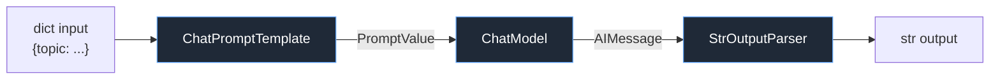
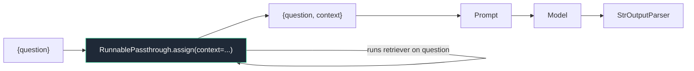
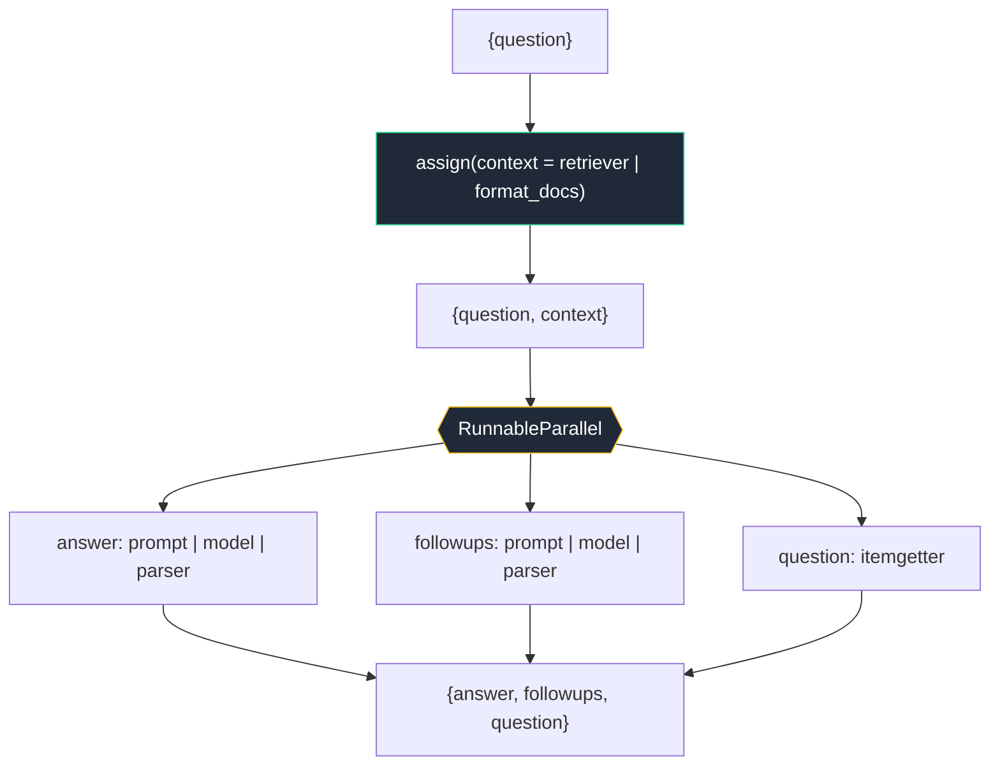

# Module 4 — LCEL & the Runnable Interface

LCEL — the **LangChain Expression Language** — is the composition layer that everything else in modern LangChain is built on. Models, prompts, output parsers, retrievers, and even whole LangGraph agents all implement one interface: **`Runnable`**. Once you internalize this interface and the handful of composition primitives around it, the rest of the framework stops feeling like a grab-bag of classes and starts feeling like one consistent algebra.

This is a cornerstone module. By the end you should be able to read any LCEL chain in the wild, predict its streaming and async behavior, debug why a stream buffered when it shouldn't, and build production chains that get retries, fallbacks, parallelism, and tracing essentially for free.

> **Note:** This module assumes you've met chat models ([Module 1](01-models-chat-and-llms.md)), prompt templates ([Module 2](02-prompts.md)), and output parsers ([Module 3](03-output-parsers-structured-output.md)). LCEL is what *connects* them.

---

## 1. What LCEL is and why it exists

### The problem LCEL solves

Imagine wiring up "prompt → model → parse the output" by hand. You'd write something like:

```python
prompt_value = prompt.invoke({"topic": "otters"})
message = model.invoke(prompt_value)
text = parser.invoke(message)
```

That works for `invoke`. But the moment you want to:

- **stream** tokens to a UI as they arrive,
- run the whole thing **async** inside a web handler,
- process a **batch** of 500 inputs with bounded concurrency,
- add **retries** on a flaky model call,
- fall back to a cheaper model when the primary is rate-limited,
- and get **tracing** of every step in [LangSmith](10-observability-and-eval-langsmith.md),

…you'd have to hand-write all of that orchestration for *every* chain you build. LCEL gives you all of it from a single declarative composition.

LCEL is **declarative composition of `Runnable`s**. You describe *what* the pipeline is — its shape — and the framework provides the *how*: streaming, async, batching, parallelism, retries, fallbacks, and tracing, uniformly, for every chain.

```python
from langchain_core.prompts import ChatPromptTemplate
from langchain_core.output_parsers import StrOutputParser
from langchain.chat_models import init_chat_model

model = init_chat_model("anthropic:claude-sonnet-4-6")
prompt = ChatPromptTemplate.from_template("Tell me a short joke about {topic}.")
parser = StrOutputParser()

chain = prompt | model | parser

# The same object now supports ALL execution modes:
chain.invoke({"topic": "otters"})                 # -> str
await chain.ainvoke({"topic": "otters"})          # async
chain.batch([{"topic": "otters"}, {"topic": "cats"}])  # list[str]
for chunk in chain.stream({"topic": "otters"}):   # streamed tokens
    print(chunk, end="", flush=True)
```

You wrote the pipeline once. You got six execution modes.

> **✅ Best practice:** Reach for LCEL whenever your logic is a *fixed pipeline* — a directed flow of transformations. When you need **cycles**, **conditional branching across many nodes**, **shared mutable state**, or **human-in-the-loop**, that's [LangGraph](09-langgraph-deep-dive.md) territory. LCEL and LangGraph compose: a LangGraph node is itself a `Runnable`, and a `Runnable` can be a LangGraph node.



---

## 2. The `Runnable` interface in full

Everything composable in LangChain is a `Runnable` (defined in `langchain_core.runnables`). The interface is a small set of methods, each with sync and async variants.

| Method | Purpose |
|---|---|
| `invoke(input, config?)` / `ainvoke(...)` | Transform a single input to a single output. |
| `stream(input, config?)` / `astream(...)` | Yield output **chunks** incrementally. |
| `batch(inputs, config?)` / `abatch(...)` | Transform a list of inputs, with bounded concurrency. |
| `batch_as_completed(...)` / `abatch_as_completed(...)` | Like batch, but yields `(index, output)` pairs as each finishes. |
| `astream_events(input, version=..., config?)` | Stream a flat sequence of **lifecycle events** from every step in the chain. |
| `astream_log(...)` | Stream incremental **JSONPatch** updates to a run log (lower-level; rarely needed directly). |

Plus introspection:

| Attribute / method | Purpose |
|---|---|
| `input_schema` / `get_input_schema(config?)` | A Pydantic model describing accepted input. Call `.model_json_schema()` on it. |
| `output_schema` / `get_output_schema(config?)` | A Pydantic model describing the output. |
| `config_schema(...)` | The accepted `RunnableConfig` fields (including configurable ones). |
| `get_graph()` | The computational graph of the chain — printable as ASCII. |
| `get_name()` | The (overridable) run name. |

### Minimal example: every method on one chain

```python
from langchain_core.prompts import ChatPromptTemplate
from langchain_core.output_parsers import StrOutputParser
from langchain.chat_models import init_chat_model

model = init_chat_model("anthropic:claude-sonnet-4-6", temperature=0)
chain = (
    ChatPromptTemplate.from_template("Name one {category}. Reply with only the name.")
    | model
    | StrOutputParser()
)

# invoke — single
print(chain.invoke({"category": "river"}))          # e.g. "Amazon"

# batch — many, concurrently (default max_concurrency is unbounded unless set)
print(chain.batch([{"category": "ocean"}, {"category": "desert"}]))
# -> ['Pacific', 'Sahara']

# stream — chunks
for chunk in chain.stream({"category": "mountain"}):
    print(chunk, end="")                              # "Ev" "ere" "st" ...
print()

# input / output schema
print(chain.input_schema.model_json_schema()["required"])   # ['category']
print(chain.output_schema.model_json_schema()["type"])      # 'string'
```

> **Note:** Async methods (`ainvoke`, `astream`, `abatch`, `astream_events`) require an event loop. In a script, wrap calls in `asyncio.run(main())`. In a Jupyter notebook, `await` works directly because a loop is already running.

> **⚠️ Gotcha:** If a `Runnable` (or a sync function inside a `RunnableLambda`) only implements the sync path, calling its async methods still works — LangChain runs the sync code in a thread-pool executor. It's correct but not truly concurrent for that step. For real async throughput, implement the async path.

---

## 3. The pipe operator and coercion rules

The `|` operator builds a **`RunnableSequence`**: the output of the left side becomes the input of the right side. `a | b | c` is sugar for `RunnableSequence(a, b, c)`.

The magic that makes LCEL ergonomic is **coercion**: when one side of a `|` is a plain `dict` or a plain function, LangChain automatically wraps it.

| You write | LangChain builds |
|---|---|
| `a \| b` | `RunnableSequence(a, b)` |
| `{"x": a, "y": b}` in a pipe | `RunnableParallel({"x": a, "y": b})` |
| a bare function `f` in a pipe | `RunnableLambda(f)` |

### Dict → `RunnableParallel`

```python
from langchain_core.runnables import RunnableParallel, RunnablePassthrough

# These two are equivalent:
explicit = RunnableParallel(joke=joke_chain, fact=fact_chain)
coerced = {"joke": joke_chain, "fact": fact_chain}   # only coerced INSIDE a pipe

# In a sequence, the dict literal is coerced automatically:
chain = RunnablePassthrough() | {"joke": joke_chain, "fact": fact_chain}
```

### Function → `RunnableLambda`

```python
from langchain.chat_models import init_chat_model
from langchain_core.prompts import ChatPromptTemplate

model = init_chat_model("anthropic:claude-sonnet-4-6")

def shout(text: str) -> str:
    return text.upper()

# The bare function is coerced to RunnableLambda(shout) because it sits in a pipe:
chain = ChatPromptTemplate.from_template("Say hi to {name}") | model | (lambda m: m.content) | shout
chain.invoke({"name": "Ada"})  # -> "HELLO ADA!" (model output, uppercased)
```

> **⚠️ Gotcha — coercion only happens *inside* a pipe.** A bare `dict` or function is **not** a `Runnable` on its own. `{"x": a}.invoke(...)` is an `AttributeError`. Coercion is triggered by the `|` operator binding to a real `Runnable` on the other side. If you need a standalone parallel or lambda, construct it explicitly: `RunnableParallel(...)` or `RunnableLambda(...)`. A frequent failure is starting a chain with a dict — `{"x": a} | b` works because `b` is a `Runnable`, but `{"x": a}` alone does not.

---

## 4. RunnableParallel, RunnablePassthrough, and `.assign`

These three are the backbone of RAG and any multi-input chain. Master them.

### `RunnableParallel` — fan out concurrently, return a dict

`RunnableParallel` runs each branch **concurrently** with the *same* input, and returns a dict keyed by branch name.

```python
from langchain_core.runnables import RunnableParallel
from langchain_core.prompts import ChatPromptTemplate
from langchain_core.output_parsers import StrOutputParser
from langchain.chat_models import init_chat_model

model = init_chat_model("anthropic:claude-sonnet-4-6")

joke = ChatPromptTemplate.from_template("Joke about {topic}") | model | StrOutputParser()
poem = ChatPromptTemplate.from_template("2-line poem about {topic}") | model | StrOutputParser()

parallel = RunnableParallel(joke=joke, poem=poem)
parallel.invoke({"topic": "the sea"})
# -> {"joke": "...", "poem": "..."}   (both LLM calls ran concurrently)
```

Concurrency here is real: in the async path the branches `await` together; in the sync path they run in a thread pool. Two independent model calls overlap instead of running back-to-back.

### `RunnablePassthrough` — the identity Runnable

`RunnablePassthrough()` returns its input unchanged. On its own that sounds useless, but inside a `RunnableParallel` it lets you **keep the original input** alongside computed values.

```python
from langchain_core.runnables import RunnablePassthrough, RunnableParallel

RunnableParallel(
    original=RunnablePassthrough(),       # echoes the whole input
    length=lambda x: len(x["text"]),      # coerced to RunnableLambda
).invoke({"text": "hello"})
# -> {"original": {"text": "hello"}, "length": 5}
```

### `RunnablePassthrough.assign(...)` — add keys, keep the rest

This is the single most important LCEL pattern after the pipe. `.assign(**mapping)` takes a **dict input**, runs each value in the mapping (concurrently, like a `RunnableParallel`), and **merges** the results back into the input dict — passing everything else through untouched.

```python
from langchain_core.runnables import RunnablePassthrough

add_meta = RunnablePassthrough.assign(
    word_count=lambda x: len(x["text"].split()),
    upper=lambda x: x["text"].upper(),
)
add_meta.invoke({"text": "the quick brown fox", "id": 42})
# -> {"text": "the quick brown fox", "id": 42,
#     "word_count": 4, "upper": "THE QUICK BROWN FOX"}
```

Note how `id` and `text` survive — `.assign` is *additive*. Contrast with `RunnableParallel`, which **replaces** the input entirely with the dict of branch outputs.

> **✅ Best practice — this is the RAG backbone.** A retrieval chain almost always looks like: take a `{"question": ...}`, *assign* a `context` key by running the retriever, then feed both into the prompt. Because `.assign` keeps `question` while adding `context`, the prompt can reference both:

```python
from langchain_core.runnables import RunnablePassthrough
from langchain_core.prompts import ChatPromptTemplate
from langchain_core.output_parsers import StrOutputParser
from langchain.chat_models import init_chat_model

model = init_chat_model("anthropic:claude-sonnet-4-6")
# `retriever` is any Runnable: input str/question -> list[Document]
# (see Module 6 for building one)

def format_docs(docs):
    return "\n\n".join(d.page_content for d in docs)

prompt = ChatPromptTemplate.from_template(
    "Answer using only this context:\n\n{context}\n\nQuestion: {question}"
)

rag_chain = (
    RunnablePassthrough.assign(
        context=(lambda x: x["question"]) | retriever | format_docs
    )
    | prompt
    | model
    | StrOutputParser()
)
rag_chain.invoke({"question": "What is LCEL?"})
```



> **⚠️ Gotcha — ordering with `.assign`.** Within a single `.assign(...)` call, all keys are computed from the **input as it was before the assign** — they run in parallel and cannot see each other's results. If `key_b` needs `key_a`, you must use **two** `.assign` calls in sequence (`.assign(key_a=...) | RunnablePassthrough.assign(key_b=...)`), or `.assign(key_a=...).assign(...)` chained, so `key_b` can read the now-present `key_a`.

---

## 5. RunnableLambda, the `@chain` decorator, and `itemgetter`

### `RunnableLambda` — wrap any callable

`RunnableLambda` turns any function (sync or async, taking one argument) into a `Runnable`. Inside a pipe a bare function is coerced to this automatically, but you'll construct it explicitly when the function isn't adjacent to a `|`, or when you want to attach config.

```python
from langchain_core.runnables import RunnableLambda

def parse_int(x: str) -> int:
    return int(x.strip())

r = RunnableLambda(parse_int)
r.invoke(" 42 ")          # -> 42
r.batch([" 1 ", " 2 "])   # -> [1, 2]  (batch comes for free)
```

A `RunnableLambda` can wrap an **async** function too:

```python
import asyncio
from langchain_core.runnables import RunnableLambda

async def fetch(url: str) -> str:
    await asyncio.sleep(0.1)
    return f"contents of {url}"

r = RunnableLambda(fetch)
await r.ainvoke("https://example.com")  # -> "contents of https://example.com"
```

> **Note:** A `RunnableLambda`'s function takes exactly **one** positional argument (the input). If your function needs more inputs, pass a dict and unpack inside, or use `functools.partial`/closures to bind the extras. It may *optionally* take a second `config` argument — see [§7](#7-runnableconfig-and-the-config-propagation-gotcha).

### The `@chain` decorator — turn a function into a Runnable

`@chain` (from `langchain_core.runnables`) is sugar: it converts a function into a `RunnableLambda`, but lets you write multi-step logic imperatively while still getting the full `Runnable` interface and tracing.

```python
from langchain_core.runnables import chain
from langchain_core.prompts import ChatPromptTemplate
from langchain.chat_models import init_chat_model

model = init_chat_model("anthropic:claude-sonnet-4-6")
prompt = ChatPromptTemplate.from_template("Summarize in one sentence: {text}")

@chain
def summarize_then_count(text: str) -> dict:
    summary = (prompt | model).invoke({"text": text}).content
    return {"summary": summary, "chars": len(summary)}

summarize_then_count.invoke("LCEL composes Runnables...")  # -> {"summary": ..., "chars": ...}
# Because it's a Runnable, the inner prompt|model call is traced as a child run.
```

> **✅ Best practice:** Use `@chain` when a step is genuinely imperative (loops, conditionals, calling sub-chains) and you'd rather not contort it into pipes. The inner `Runnable` invocations are automatically traced as child runs **as long as you call them with `invoke`/`ainvoke` and the config propagates** (see [§7](#7-runnableconfig-and-the-config-propagation-gotcha)).

### `operator.itemgetter` — the idiomatic key selector

When a branch needs just one key out of a dict input, `operator.itemgetter` is cleaner than `lambda x: x["k"]` and is automatically coerced to a `RunnableLambda`.

```python
from operator import itemgetter
from langchain_core.prompts import ChatPromptTemplate
from langchain_core.output_parsers import StrOutputParser
from langchain.chat_models import init_chat_model

model = init_chat_model("anthropic:claude-sonnet-4-6")
prompt = ChatPromptTemplate.from_template(
    "Translate '{sentence}' into {language}."
)

chain = (
    {
        "sentence": itemgetter("text"),     # pick "text" -> "sentence"
        "language": itemgetter("lang"),     # pick "lang" -> "language"
    }
    | prompt
    | model
    | StrOutputParser()
)
chain.invoke({"text": "good morning", "lang": "French"})  # -> "Bonjour"
```

---

## 6. Routing: `RunnableBranch` and the lambda-returns-a-Runnable pattern

Sometimes you want to choose *which* sub-chain runs based on the input. There are two idiomatic approaches.

### `RunnableBranch` — explicit conditionals

`RunnableBranch` takes `(condition, runnable)` pairs plus a default. Conditions are evaluated top to bottom; the first truthy one wins.

```python
from langchain_core.runnables import RunnableBranch
from langchain_core.prompts import ChatPromptTemplate
from langchain_core.output_parsers import StrOutputParser
from langchain.chat_models import init_chat_model

model = init_chat_model("anthropic:claude-sonnet-4-6")

physics = ChatPromptTemplate.from_template("You are a physicist. Answer: {query}") | model | StrOutputParser()
math = ChatPromptTemplate.from_template("You are a mathematician. Answer: {query}") | model | StrOutputParser()
general = ChatPromptTemplate.from_template("Answer: {query}") | model | StrOutputParser()

router = RunnableBranch(
    (lambda x: "physics" in x["topic"].lower(), physics),
    (lambda x: "math" in x["topic"].lower(), math),
    general,   # default (last arg, no condition)
)
router.invoke({"topic": "physics", "query": "Why is the sky blue?"})
```

### The idiomatic alternative — a lambda that *returns* a Runnable

A `RunnableLambda` may return another `Runnable`. When it does, LCEL **invokes** that returned Runnable with the same input. This is often cleaner than `RunnableBranch` and is the more common pattern in modern code.

```python
from langchain_core.runnables import RunnableLambda

def route(info: dict):
    topic = info["topic"].lower()
    if "physics" in topic:
        return physics
    if "math" in topic:
        return math
    return general

full_chain = RunnableLambda(route)   # returns a Runnable, which LCEL then runs
full_chain.invoke({"topic": "math", "query": "What is a derivative?"})
```

> **Note:** Returning a `Runnable` from a lambda preserves **streaming**: if `physics` streams, `full_chain.stream(...)` streams its tokens. A `RunnableBranch` also streams from the selected branch. Both are stream-safe; pick whichever reads more clearly.

> **✅ Best practice:** For LLM-driven routing (classify the query *with a model*, then dispatch), put the classifier as an upstream step and route on its output. For anything more than a few branches with shared state, prefer a [LangGraph](08-agents-with-langgraph.md) graph — it gives you a visualizable topology and conditional edges.

---

## 7. RunnableConfig and the config-propagation gotcha

`RunnableConfig` (a `TypedDict` in `langchain_core.runnables`) is the second, optional argument to every `Runnable` method. It carries cross-cutting execution context that flows down the entire chain automatically.

| Key | Meaning |
|---|---|
| `callbacks` | Callback handlers (tracing, logging, token counting). This is how LangSmith tracing propagates. |
| `tags` | List of string tags attached to this run and all children. |
| `metadata` | Arbitrary dict attached to the run (great for filtering in LangSmith). |
| `run_name` | Human-readable name for this run in traces. |
| `max_concurrency` | Max parallel calls for `batch`/`RunnableParallel` under this config. |
| `recursion_limit` | Max recursion depth (matters for self-referential chains and LangGraph). |
| `configurable` | Runtime values for configurable fields/alternatives (see [§9](#9-runtime-configurability-configurable_fields-and-configurable_alternatives)). |

```python
result = chain.invoke(
    {"topic": "otters"},
    config={
        "run_name": "joke_generation",
        "tags": ["demo", "module-4"],
        "metadata": {"user_id": "u_123"},
        "max_concurrency": 5,
    },
)
```

Config **propagates automatically** through pipes, `RunnableParallel`, `.assign`, branches — the framework threads it through so that every step appears in the same trace, with the same tags, under the same callbacks.

### The gotcha: custom functions can break propagation

In Python 3.11+, config propagates through `RunnableLambda` functions even if they don't accept it, thanks to `contextvars`. But there's a critical case where you **must** forward config manually: **when your function calls another `Runnable` and you're on Python < 3.11, or when you spawn the inner call in a new thread/executor.** To be safe and explicit, accept a second `config: RunnableConfig` parameter and forward it.

```python
from langchain_core.runnables import RunnableLambda, RunnableConfig
from langchain.chat_models import init_chat_model

model = init_chat_model("anthropic:claude-sonnet-4-6")

# ❌ Risky: inner invoke may not inherit callbacks/tags in all environments.
def bad(text: str) -> str:
    return model.invoke(text).content   # config NOT forwarded

# ✅ Robust: accept config and forward it to every inner Runnable call.
def good(text: str, config: RunnableConfig) -> str:
    return model.invoke(text, config=config).content

chain = RunnableLambda(good)
chain.invoke("Hello", config={"tags": ["greeting"], "run_name": "greet"})
# The model call is now a child run under "greet" with the "greeting" tag.
```

> **⚠️ Gotcha — the #1 cause of "my nested step has no trace / lost its tags."** If you call a `Runnable` inside a custom function and the inner call shows up as a *separate, parentless* run (or not at all), you forgot to forward `config`. Add `config: RunnableConfig` to your function signature and pass `config=config` into every inner `.invoke`/`.ainvoke`. LangChain detects the extra parameter by name and injects the live config.

> **Note:** `RunnableLambda` inspects your function's signature. The second parameter must be named `config` (typed as `RunnableConfig`) for injection to occur. A third optional `run_manager` parameter is also supported for advanced callback work.

---

## 8. Config & decoration methods: `.bind`, `.with_config`, `.with_retry`, `.with_fallbacks`, `.with_types`

These methods return a **new, decorated Runnable** (they don't mutate the original). They're how you attach behavior declaratively.

### `.bind(**kwargs)` — pin arguments to a Runnable

`.bind` pre-sets keyword arguments passed to the underlying Runnable at call time. The classic use is binding model parameters or tools to a chat model.

```python
from langchain.chat_models import init_chat_model

model = init_chat_model("anthropic:claude-sonnet-4-6")

# Pin stop sequences and max tokens for this particular use:
terse = model.bind(stop=["\n\n"], max_tokens=64)
terse.invoke("List three fruits.")

# Binding tools is just .bind_tools (a specialized bind) — see Module 5.
```

### `.with_config(...)` — attach config that travels with the Runnable

Whereas passing `config=` at call time is per-invocation, `.with_config(...)` *bakes* config into the Runnable so every call carries it.

```python
named = chain.with_config(run_name="MyPipeline", tags=["prod"], metadata={"team": "search"})
named.invoke({"topic": "otters"})   # always tagged "prod" in traces
```

### `.with_retry(...)` — automatic retries with backoff

```python
flaky_step = model.with_retry(
    retry_if_exception_type=(Exception,),  # narrow this in real code
    wait_exponential_jitter=True,
    stop_after_attempt=3,
)
```

> **✅ Best practice:** Scope `retry_if_exception_type` to *transient* errors (rate limits, timeouts) so you don't burn attempts retrying a deterministic `ValueError`. Provider SDKs expose typed exceptions (e.g. rate-limit errors) you can target.

### `.with_fallbacks([...])` — try alternatives on failure

If the primary Runnable raises, the next fallback is tried with the same input. Perfect for provider failover or model downgrades.

```python
from langchain_anthropic import ChatAnthropic
from langchain_openai import ChatOpenAI

primary = ChatAnthropic(model="claude-sonnet-4-6")
backup = ChatOpenAI(model="gpt-4.1")               # swap providers on failure

resilient = primary.with_fallbacks([backup])
resilient.invoke("Summarize the theory of relativity in one line.")
# If the Anthropic call errors, the OpenAI call runs with the same input.
```

> **Note:** You can restrict which exceptions trigger fallback via `exceptions_to_handle=(...)`, and pass `exception_key=` to inject the caught exception into the fallback's input.

### `.with_types(...)` — override declared input/output schemas

Custom Runnables (and lambdas) sometimes can't have their I/O types inferred. `.with_types(input_type=..., output_type=...)` sets them explicitly, which improves the generated schemas and LangServe playground.

```python
from typing import TypedDict

class In(TypedDict):
    question: str

chain.with_types(input_type=In)   # better input_schema for docs/playground
```

---

## 9. Runtime configurability: `configurable_fields` and `configurable_alternatives`

Sometimes you want to expose knobs that callers flip **at invoke time** via `config={"configurable": {...}}` — without rebuilding the chain. Two methods enable this.

### `configurable_fields` — make a parameter tunable at call time

```python
from langchain_core.runnables import ConfigurableField
from langchain_anthropic import ChatAnthropic

model = ChatAnthropic(model="claude-sonnet-4-6", temperature=0).configurable_fields(
    temperature=ConfigurableField(
        id="llm_temperature",
        name="LLM Temperature",
        description="Sampling temperature",
    )
)

# Default temperature (0):
model.invoke("Pick a number 1-10.")

# Override at call time — no rebuild:
model.invoke(
    "Pick a number 1-10.",
    config={"configurable": {"llm_temperature": 0.9}},
)
```

### `configurable_alternatives` — swap whole sub-Runnables

This swaps one Runnable for an entirely different one — e.g. switch the model provider, or switch prompt templates, at call time.

```python
from langchain_core.runnables import ConfigurableField
from langchain_anthropic import ChatAnthropic
from langchain_openai import ChatOpenAI

model = ChatAnthropic(model="claude-sonnet-4-6").configurable_alternatives(
    ConfigurableField(id="provider"),
    default_key="anthropic",                       # used when not overridden
    openai=ChatOpenAI(model="gpt-4.1"),            # alternative under key "openai"
    fast=ChatAnthropic(model="claude-haiku-4-5"),  # another alternative
)

model.invoke("Hi")                                                   # Claude Sonnet (default)
model.invoke("Hi", config={"configurable": {"provider": "openai"}})  # GPT-4.1
model.invoke("Hi", config={"configurable": {"provider": "fast"}})    # Claude Haiku
```

You can combine both, and configurable fields propagate through a whole chain. This is the idiomatic way to build **one chain, many runtime variants** (e.g. a `/playground` that lets users pick the model and temperature).

```python
from langchain_core.prompts import PromptTemplate
from langchain_core.runnables import ConfigurableField

prompt = PromptTemplate.from_template("Tell me a joke about {topic}").configurable_alternatives(
    ConfigurableField(id="prompt"),
    default_key="joke",
    poem=PromptTemplate.from_template("Write a short poem about {topic}"),
)

chain = prompt | model   # both prompt AND model are now configurable
chain.invoke(
    {"topic": "bears"},
    config={"configurable": {"prompt": "poem", "provider": "fast"}},
)  # -> a poem about bears, from Claude Haiku
```

> **✅ Best practice:** Use `configurable_alternatives` for A/B testing models or prompts in production without code changes, and `configurable_fields` to expose safe tuning knobs (temperature, top-p) to callers. Both are visible in the LangServe playground.

---

## 10. Streaming in depth

Streaming is where LCEL's design pays off most — and where the subtlest gotchas live.

### `.stream()` vs `.astream()`

`.stream(input)` returns a **sync generator** of output chunks; `.astream(input)` returns an **async generator**. For chat-model-terminated chains the chunks are message/string fragments as tokens arrive.

```python
for chunk in chain.stream({"topic": "otters"}):
    print(chunk, end="", flush=True)

# async:
async for chunk in chain.astream({"topic": "otters"}):
    print(chunk, end="", flush=True)
```

### How chunks flow — and what buffers a stream

For tokens to stream end-to-end, **every step in the chain must support streaming** (i.e. transform an input *stream* into an output *stream*). The streaming-friendly steps are:

- chat models / LLMs (they yield token chunks natively),
- `StrOutputParser` and other transform-style parsers,
- prompts (they emit one chunk, but pass through),
- `RunnablePassthrough`, `.assign`, `RunnableParallel` (stream per branch).

A step **breaks streaming** if it must consume the *entire* upstream output before producing anything — for example a function that does `lambda full_text: full_text.upper()`. LangChain will **buffer** at that boundary: it collects all upstream chunks, runs your function once on the assembled value, then emits a single chunk.

> **⚠️ Gotcha — a single non-streaming step silently disables streaming.** If you wrap the model's output in a plain `RunnableLambda` that takes the whole string (e.g. JSON-parse the full response), everything *after* that point can no longer stream, and the user sees the whole answer appear at once. Symptoms: `.stream()` "works" but emits one giant chunk at the end. To preserve streaming through transforms, write a **generator** function (see custom Runnables below) that yields incrementally, or move non-streamable work to the very end / a separate non-streamed path.

```python
# This buffers — upper() needs the full string:
buffering = model | StrOutputParser() | (lambda s: s.upper())

# This streams — a generator transform consumes a chunk-stream and yields chunks:
def upper_stream(chunks):
    for chunk in chunks:
        yield chunk.upper()

streaming = model | StrOutputParser() | upper_stream   # stays incremental
```

### `.astream_events(version="v2")` — observe every step

`.stream()` only gives you the *final* output chunks. When you need to see what's happening **inside** the chain — a tool starting, a retriever finishing, a specific model streaming — use `astream_events`. It emits a flat async stream of typed events from every step.

```python
async for event in chain.astream_events({"topic": "otters"}, version="v2"):
    kind = event["event"]
    if kind == "on_chat_model_stream":
        print(event["data"]["chunk"].content, end="", flush=True)
```

> **⚠️ Verify:** Pass `version="v2"`. `v1` is retained for backward compatibility and is slated for deprecation in 0.4.0; a typed, content-block-centric `v3` exists in beta (only on chat models and compiled LangGraph graphs). Use `v2` unless you specifically need `v3`'s typed protocol.

Each event is a dict with these keys: `event` (the type), `name` (the Runnable's name), `run_id`, `parent_ids`, `tags`, `metadata`, and `data`. Common event types:

| Event | Fires when | Useful `data` |
|---|---|---|
| `on_chain_start` / `on_chain_end` | a chain step begins / ends | `data["input"]`, `data["output"]` |
| `on_chat_model_start` / `on_chat_model_stream` / `on_chat_model_end` | model lifecycle + each token | `data["chunk"]` (an `AIMessageChunk`) |
| `on_llm_start/stream/end` | text-LLM equivalents | `data["chunk"]` |
| `on_tool_start` / `on_tool_end` | a tool runs (in agents) | `data["input"]`, `data["output"]` |
| `on_parser_start` / `on_parser_stream` / `on_parser_end` | output parser lifecycle | `data["chunk"]` |
| `on_retriever_start` / `on_retriever_end` | a retriever runs | `data["output"]` (documents) |

### Filtering events

Listening to *everything* is noisy. Filter by `include_names`, `include_tags`, or `include_types` (and `exclude_*` counterparts). Tag the steps you care about with `.with_config(tags=[...])`, then filter on the tag.

```python
# Only stream tokens from the step tagged "answer":
answer_model = model.with_config(tags=["answer"])
chain = prompt | answer_model | StrOutputParser()

async for event in chain.astream_events(
    {"topic": "otters"}, version="v2", include_tags=["answer"]
):
    if event["event"] == "on_chat_model_stream":
        print(event["data"]["chunk"].content, end="", flush=True)
```

### Building a UI token stream

A realistic server endpoint that streams only the assistant's tokens (e.g. for Server-Sent Events):

```python
async def token_stream(chain, payload):
    async for event in chain.astream_events(payload, version="v2"):
        if event["event"] == "on_chat_model_stream":
            token = event["data"]["chunk"].content
            if token:
                yield token          # push to SSE / WebSocket
```

> **Note:** `astream_log` is a lower-level cousin that streams **JSONPatch** ops describing incremental changes to a run-state object. `astream_events` was built on top of it and is what you should reach for; you rarely need `astream_log` directly.

---

## 11. Async & batch semantics; `max_concurrency`

- `batch(inputs)` processes a list and returns results **in input order**. Internally it parallelizes (thread pool for sync, gathered coroutines for async).
- `max_concurrency` (set on the config) caps how many run at once — essential to avoid hammering provider rate limits.
- `batch_as_completed` yields `(index, result)` as each finishes, so you can start processing early results without waiting for the slowest.

```python
inputs = [{"topic": t} for t in ["otters", "cats", "dogs", "ducks", "frogs"]]

# Cap at 2 concurrent model calls:
results = chain.batch(inputs, config={"max_concurrency": 2})

# Stream results as they complete (order not guaranteed):
async for idx, out in chain.abatch_as_completed(inputs, config={"max_concurrency": 2}):
    print(idx, out)
```

> **✅ Best practice:** Always set `max_concurrency` for large batches against a hosted model. Unbounded batches are the fastest way to trip a rate limit and get 429s mid-job. Pair with `.with_retry(...)` for resilience.

---

## 12. Writing a custom Runnable by subclassing

For most needs, `RunnableLambda`, `@chain`, and the primitives suffice. But when you want full control — custom streaming, typed schemas, reusable component — subclass `Runnable` and implement at least `invoke`. Implement `stream`/`astream` if you want true streaming; otherwise the base class derives them from `invoke` (which buffers).

```python
from typing import Any, Iterator, Optional
from langchain_core.runnables import Runnable, RunnableConfig
from langchain_core.runnables.utils import Input, Output

class TitleCase(Runnable[str, str]):
    """A custom Runnable that title-cases text, with real streaming."""

    def invoke(self, input: str, config: Optional[RunnableConfig] = None, **kwargs: Any) -> str:
        # _call_with_config wires up callbacks/tracing for you.
        return self._call_with_config(
            lambda x: x.title(), input, config, **kwargs
        )

    def stream(
        self, input: str, config: Optional[RunnableConfig] = None, **kwargs: Any
    ) -> Iterator[str]:
        # Yield word-by-word so downstream sees incremental output.
        for word in input.split(" "):
            yield word.title() + " "

tc = TitleCase()
tc.invoke("hello there general kenobi")   # -> "Hello There General Kenobi"
list(tc.stream("hello there"))            # -> ['Hello ', 'There ']
```

> **Note:** `_call_with_config` (and its async sibling `_acall_with_config`) is the helper that makes your custom `invoke` participate in tracing and config propagation. Use it rather than calling your function bare. For streaming transforms inside a chain, prefer implementing `transform`/`atransform` (input *stream* → output *stream*) — that's what lets your Runnable stream when placed mid-chain rather than only at the end.

---

## 13. Inspecting and debugging chains

LCEL chains are introspectable. This is invaluable when a chain doesn't behave and you need to *see* its shape.

```python
chain = prompt | model | StrOutputParser()

# 1) Print the computational graph as ASCII:
chain.get_graph().print_ascii()
# +-------------+
# | PromptInput |
# +-------------+
#        *
#        v
# ... (nodes for each step) ...

# 2) Inspect what input the chain accepts:
chain.input_schema.model_json_schema()
# {'title': 'PromptInput', 'type': 'object',
#  'properties': {'topic': {'title': 'Topic', 'type': 'string'}}, ...}

# 3) Inspect the output type:
chain.output_schema.model_json_schema()    # {'title': 'StrOutputParserOutput', 'type': 'string'}

# 4) Names of the steps:
[step.get_name() for step in chain.steps]
```

> **🔧 Try it:** Build a chain with a `RunnableParallel` and a `.assign`, then call `chain.get_graph().print_ascii()`. Seeing the branch fan-out and merge visually is the fastest way to internalize how data flows.

For step-by-step value inspection during development, drop in a quick debug lambda — but remember it must pass its input through unchanged:

```python
def debug(x):
    print("DEBUG:", x)
    return x          # MUST return input so the chain continues

chain = prompt | debug | model | StrOutputParser()
```

> **✅ Best practice:** For real debugging, prefer [LangSmith](10-observability-and-eval-langsmith.md) tracing (set `LANGSMITH_TRACING=true`) over print-lambdas — you get every step's input/output/timing/token-counts in a UI, with zero code changes.

---

## 14. A realistic worked example

Let's combine everything: pipe, `RunnableParallel`, `RunnablePassthrough.assign`, a `RunnableLambda`, `.with_config`, and streaming. The scenario: answer a question from retrieved context **and** simultaneously produce a list of follow-up questions, then stream the answer.

```python
from operator import itemgetter
from langchain_core.prompts import ChatPromptTemplate
from langchain_core.output_parsers import StrOutputParser
from langchain_core.runnables import RunnablePassthrough, RunnableParallel, RunnableLambda
from langchain.chat_models import init_chat_model

model = init_chat_model("anthropic:claude-sonnet-4-6", temperature=0)
# `retriever` is any Runnable[str, list[Document]] — see Module 6.

def format_docs(docs) -> str:
    return "\n\n".join(f"[{i}] {d.page_content}" for i, d in enumerate(docs))

answer_prompt = ChatPromptTemplate.from_template(
    "Use the context to answer.\n\nContext:\n{context}\n\nQuestion: {question}"
)
followups_prompt = ChatPromptTemplate.from_template(
    "Given this question, list 3 follow-up questions, one per line:\n{question}"
)

# Step 1: assign retrieved + formatted context, keeping `question`.
retrieve = RunnablePassthrough.assign(
    context=itemgetter("question") | RunnableLambda(lambda q: retriever.invoke(q)) | format_docs
)

# Step 2: fan out — stream the answer, and (concurrently) generate follow-ups.
answer = answer_prompt | model | StrOutputParser()
followups = followups_prompt | model | StrOutputParser()

chain = (
    retrieve
    | RunnableParallel(
        answer=answer,
        followups=followups,
        question=itemgetter("question"),   # pass the question through to the output
    )
).with_config(run_name="qa_with_followups", tags=["rag", "module-4"])

# Non-streamed (gets both branches as a dict):
result = chain.invoke({"question": "What does RunnablePassthrough.assign do?"})
print(result["answer"])
print(result["followups"])

# Streamed answer tokens only, via astream_events filtered to the answer's model:
answer_streamed = answer.with_config(tags=["answer-stream"])
chain2 = retrieve | RunnableParallel(answer=answer_streamed, followups=followups)

import asyncio
async def main():
    async for event in chain2.astream_events(
        {"question": "What does RunnablePassthrough.assign do?"},
        version="v2",
        include_tags=["answer-stream"],
    ):
        if event["event"] == "on_chat_model_stream":
            print(event["data"]["chunk"].content, end="", flush=True)

asyncio.run(main())
```



This single chain gets, for free: concurrent execution of the two model calls, automatic tracing under `qa_with_followups`, tag-based stream filtering, and (because `retrieve` and the parsers stream) token-level streaming of the answer.

---

## 15. Gotchas roundup

A consolidated checklist of the traps covered above — keep this near your editor.

> **⚠️ Gotcha: Dict/function coercion only works inside a pipe.** `{"x": a}` and `lambda x: ...` become Runnables *only* when `|`-ed with a real Runnable. Standalone, construct `RunnableParallel`/`RunnableLambda` explicitly.

> **⚠️ Gotcha: `.assign` keys can't see each other.** All keys in one `.assign(...)` are computed from the pre-assign input, in parallel. Chain two `.assign` calls if `key_b` depends on `key_a`.

> **⚠️ Gotcha: `RunnableParallel` replaces input; `.assign` merges.** Use `RunnableParallel` when you want *only* the branch outputs; use `RunnablePassthrough.assign` when you must keep the original keys (the usual RAG case).

> **⚠️ Gotcha: Losing callbacks/config in nested lambdas.** A custom function that calls an inner Runnable should accept `config: RunnableConfig` and forward it (`inner.invoke(x, config=config)`) so tracing and tags propagate. Otherwise nested runs may detach from the trace.

> **⚠️ Gotcha: A non-streaming step silently disables streaming.** Any step that needs the *whole* upstream value (a plain `lambda full: ...`) buffers everything after it into one chunk. Use generator transforms to stay incremental, or push non-streamable work to the end.

> **⚠️ Gotcha: `astream_events` version.** Always pass `version="v2"` (v1 is deprecated-bound; v3 is beta/limited).

> **⚠️ Gotcha: Debug lambdas must return their input.** `def debug(x): print(x); return x`. Forgetting the `return` turns the next step's input into `None`.

---

## Recap

- **LCEL** is declarative composition of **`Runnable`s**; from one pipeline definition you get `invoke`/`ainvoke`, `stream`/`astream`, `batch`/`abatch`, `astream_events`, retries, fallbacks, parallelism, and tracing.
- The **`Runnable` interface** is uniform across models, prompts, parsers, retrievers, and LangGraph graphs. Introspect with `input_schema`, `output_schema`, and `get_graph().print_ascii()`.
- The **pipe** `a | b` builds a `RunnableSequence`. **Coercion** turns a dict into `RunnableParallel` and a function into `RunnableLambda` — but only *inside* a pipe.
- **`RunnableParallel`** fans out concurrently and replaces the input with a dict; **`RunnablePassthrough`** is identity; **`RunnablePassthrough.assign`** adds computed keys while passing the input through — the backbone of RAG and multi-input chains.
- **`RunnableLambda`**, the **`@chain`** decorator, and **`operator.itemgetter`** wrap and select; route with **`RunnableBranch`** or a lambda that returns a Runnable.
- **`RunnableConfig`** carries callbacks, tags, metadata, run name, concurrency, and `configurable` values, and propagates automatically — but custom functions must accept and forward `config` to keep nested runs traced.
- Decorate with **`.bind`**, **`.with_config`**, **`.with_retry`**, **`.with_fallbacks`**, **`.with_types`**; expose runtime knobs with **`configurable_fields`** and **`configurable_alternatives`**.
- **Streaming** requires every step to be stream-friendly; one buffering step disables it. Use **`astream_events(version="v2")`** to observe and filter internal events and build UI token streams.
- Subclass **`Runnable`** (using `_call_with_config` / `transform`) for full control.

## Exercises

1. **Coercion forensics.** Build `chain = {"a": RunnablePassthrough(), "b": lambda x: x["n"] * 2} | RunnableLambda(lambda d: d)`. Predict the output of `chain.invoke({"n": 3})`, then verify. Now try invoking the bare dict `{"a": ...}` without a pipe and explain the error.

2. **RAG-shaped `.assign`.** Without a real vector store, fake a retriever with `RunnableLambda(lambda q: [type("D", (), {"page_content": f"doc about {q}"})()])`. Build `RunnablePassthrough.assign(context=...)` that formats those docs into a string, feed both `question` and `context` into a prompt, and confirm both keys reach the prompt.

3. **Two-stage assign.** Build a chain where `.assign(summary=...)` runs a model, then a *second* `.assign(word_count=lambda x: len(x["summary"].split()))` reads the summary. Show why collapsing both into one `.assign` fails.

4. **Streaming vs buffering.** Build `model | StrOutputParser() | (lambda s: s.upper())` and `.stream()` it — observe one big chunk. Rewrite the upper-casing as a generator transform and observe incremental chunks. Explain the difference.

5. **Runtime model swap.** Use `configurable_alternatives` on a chat model to expose `claude-sonnet-4-6` (default), `claude-haiku-4-5`, and `gpt-4.1`. Invoke the same chain three times via `config={"configurable": {...}}` and confirm the model changes without rebuilding the chain.

6. **Event-filtered UI stream.** Tag a model step `["answer"]`, wrap it in a chain with another (un-tagged) model call, and write an `astream_events(version="v2", include_tags=["answer"])` loop that prints *only* the tagged step's tokens. Confirm the other model's tokens don't appear.

---

> **Next:** With composition mastered, you're ready to give chains *capabilities*. Continue to [Module 5 — Tools & Tool Calling](05-tools-and-tool-calling.md), then put retrieval into a chain in [Module 6 — Retrieval & RAG](06-retrieval-and-rag.md). For the full method list at a glance, see the [Cheat Sheets](../appendix/A-cheatsheets.md); for tracing setup, [Observability & Evaluation](10-observability-and-eval-langsmith.md). [↑ Course home](../README.md)
