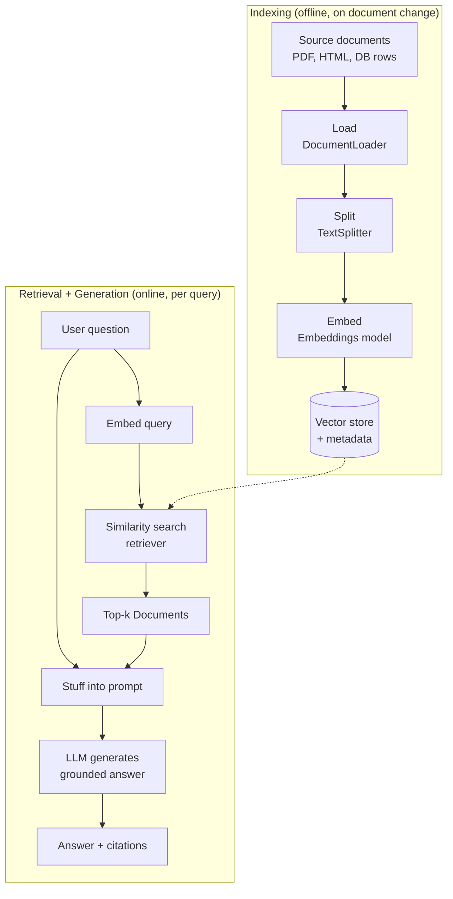
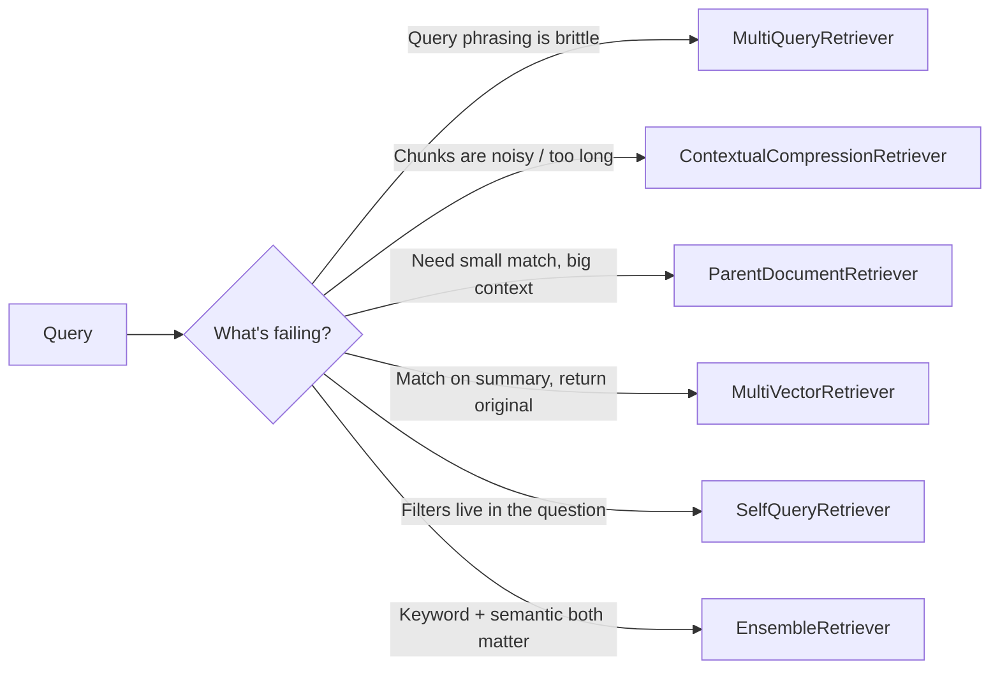
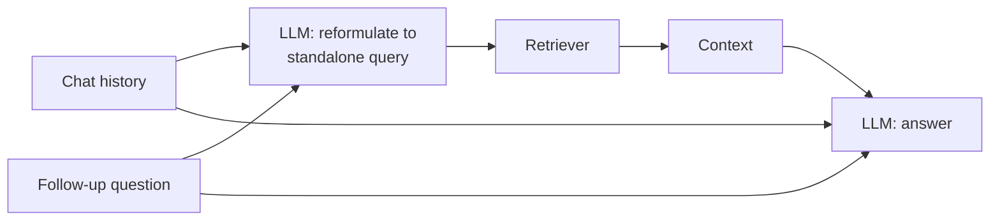

# Module 6 — Retrieval & RAG

Large language models are frozen at training time and bounded by their context window. They do not know your company wiki, last night's support tickets, or the PDF a user just uploaded. **Retrieval-Augmented Generation (RAG)** is the dominant pattern for closing that gap: fetch the relevant slices of an external knowledge source at query time, paste them into the prompt, and let the model reason over *grounded* facts instead of its parametric memory.

This module is the most code-dense in the course. By the end you will be able to build a production-shaped RAG pipeline by hand with [LCEL](04-lcel-and-runnables.md), understand every component well enough to swap or tune it, and know which of the half-dozen advanced retrievers to reach for when naive top-k search disappoints.

> **Note:** RAG is not the only way to give a model fresh knowledge. The alternatives are fine-tuning (bakes knowledge into weights — expensive, stale, hard to cite) and long-context stuffing (paste the whole corpus — costly, hits the lost-in-the-middle problem). RAG wins when your knowledge is large, changes often, and you need citations. Increasingly, RAG and [tool calling](05-tools-and-tool-calling.md) blur together: an [agent](08-agents-with-langgraph.md) may *decide* to call a retrieval tool rather than always retrieving up front.

---

## 6.1 Why RAG, and the Canonical Pipeline

The core idea is a two-phase split: an **offline indexing** phase that you run when documents change, and an **online retrieval + generation** phase that runs on every query.



Read the pipeline as a sentence: **load** raw sources into `Document`s, **split** them into chunks small enough to embed and stuff, **embed** each chunk into a vector, **store** the vectors with their text and metadata, then per query **retrieve** the nearest chunks, **stuff** them into a prompt alongside the question, and **generate** an answer.

Every stage is a tuning knob. A bad answer is almost never "the LLM is dumb" — it is usually a retrieval failure (wrong chunks came back) or a chunking failure (the right fact got split across two chunks). Most of this module is about controlling those failure modes.

---

## 6.2 The `Document` Object

Everything in retrieval flows through one tiny data structure. A `Document` is just text plus a metadata dictionary.

```python
from langchain_core.documents import Document

doc = Document(
    page_content="LangChain Expression Language composes Runnables with the pipe operator.",
    metadata={
        "source": "docs/lcel.md",
        "page": 3,
        "section": "Composition",
        "last_updated": "2026-06-01",
    },
)

print(doc.page_content[:40])   # 'LangChain Expression Language composes R'
print(doc.metadata["source"])  # 'docs/lcel.md'
```

`page_content` is the string that gets embedded and stuffed into the prompt. `metadata` is a free-form dict that rides along with the text everywhere it goes.

**Metadata is not decoration — it is load-bearing.** It powers three things you will need in production:

1. **Filtering.** "Only search documents where `team == 'billing'` and `year >= 2025`." Filters run *before or alongside* the vector search, so they make retrieval both more accurate and faster.
2. **Citations.** When you return an answer, you cite `metadata["source"]` and `metadata["page"]` so users can verify it. Ungrounded answers users cannot check are a trust killer.
3. **Lifecycle.** Fields like `last_updated` or a content hash let you re-sync only what changed (see the [Indexing API](#6123-incremental-sync-the-indexing-api)).

> **✅ Best practice:** Decide your metadata schema *before* you index a large corpus. Re-indexing millions of chunks to add a `team` field later is painful. At minimum, always carry `source`.

---

## 6.3 Document Loaders

A **document loader** turns some external source (a file, a URL, a database table) into a list of `Document`s. The base abstraction is `BaseLoader`, and every loader exposes two methods:

- `.load()` — eager: returns `list[Document]` all at once.
- `.lazy_load()` — generator: yields `Document`s one at a time, so you can stream a 10 GB corpus without holding it all in memory.

> **⚠️ Gotcha:** Loaders live in different packages depending on their dependencies. The trivial ones (`TextLoader`, `DirectoryLoader`) are in `langchain_community.document_loaders`. So are most others (`PyPDFLoader`, `WebBaseLoader`, `CSVLoader`) — but each pulls in third-party libs (`pypdf`, `beautifulsoup4`, etc.) you must `pip install` yourself. Some heavily-used loaders have graduated into partner packages over time. When in doubt, check the integration page.

### A tour of common loaders

| Loader | Package | Loads | Extra deps |
|---|---|---|---|
| `TextLoader` | `langchain_community.document_loaders` | A single `.txt` file | none |
| `DirectoryLoader` | `langchain_community.document_loaders` | A folder via a glob, delegating to another loader | depends on inner loader |
| `PyPDFLoader` | `langchain_community.document_loaders` | A PDF, **one `Document` per page** | `pypdf` |
| `WebBaseLoader` | `langchain_community.document_loaders` | HTML page(s) → cleaned text | `beautifulsoup4` |
| `CSVLoader` | `langchain_community.document_loaders` | A CSV, **one `Document` per row** | none |

```python
# pip install langchain-community pypdf
from langchain_community.document_loaders import PyPDFLoader

loader = PyPDFLoader("handbook.pdf")

# Eager: everything at once.
docs = loader.load()
print(len(docs))                      # e.g. 42  (one Document per page)
print(docs[0].metadata)               # {'source': 'handbook.pdf', 'page': 0}

# Lazy: stream pages, e.g. to split each as it arrives without holding all in RAM.
for page in loader.lazy_load():
    process(page)  # your function
```

A `DirectoryLoader` is the workhorse for ingesting a whole knowledge base:

```python
from langchain_community.document_loaders import DirectoryLoader, TextLoader

loader = DirectoryLoader(
    "docs/",
    glob="**/*.md",            # recurse, markdown only
    loader_cls=TextLoader,     # delegate each file to TextLoader
    loader_kwargs={"encoding": "utf-8"},
    show_progress=True,
)
docs = loader.load()
```

> **🔧 Try it:** Load a folder of your own notes with `DirectoryLoader`, then print `{d.metadata['source'] for d in docs}` to confirm every file is represented and the `source` field is populated.

> **Note:** Loaders only *load*. They do not split. A `PyPDFLoader` gives you whole pages, which are usually far too big to embed well. Splitting is the next, separately tunable stage.

---

## 6.4 Text Splitters

Why split at all? Two reasons. First, embedding models compress an entire chunk into one fixed-length vector — cram a whole chapter in and the vector becomes a blurry average that matches nothing precisely. Second, you will stuff multiple chunks into a finite context window, so each must be small. Good chunking is the single highest-leverage tuning decision in RAG.

### `RecursiveCharacterTextSplitter` — the workhorse

This is the default you should reach for first. It tries to split on a *prioritized list of separators* and only falls back to a coarser one when a piece is still too big — so it keeps semantically related text together (paragraphs before sentences before words).

```python
from langchain_text_splitters import RecursiveCharacterTextSplitter

splitter = RecursiveCharacterTextSplitter(
    chunk_size=1000,        # target max size, measured by length_function
    chunk_overlap=150,      # chars repeated between adjacent chunks
    separators=["\n\n", "\n", ". ", " ", ""],  # try paragraphs, then lines, ...
    length_function=len,    # default: count characters
    add_start_index=True,   # record each chunk's offset in metadata
)

text = open("essay.txt", encoding="utf-8").read()
chunks = splitter.split_text(text)          # -> list[str]
print(len(chunks), len(chunks[0]))
```

Key parameters:

- **`chunk_size`** — the target ceiling per chunk, in whatever unit `length_function` counts. Too big → blurry embeddings, fewer chunks fit in context. Too small → facts get severed from their context.
- **`chunk_overlap`** — characters shared between neighbours so a sentence spanning a boundary survives in at least one chunk. Typically 10–20% of `chunk_size`.
- **`separators`** — the priority list. The recursion tries `separators[0]` first; any resulting piece still over `chunk_size` is re-split on `separators[1]`, and so on.
- **`length_function`** — how size is measured. `len` counts characters; pass a token counter to measure tokens.

> **✅ Best practice:** LLM context budgets are in *tokens*, not characters. Use `from_tiktoken_encoder` so `chunk_size` means tokens and your chunks never silently blow past the budget:

```python
from langchain_text_splitters import RecursiveCharacterTextSplitter

# pip install tiktoken
splitter = RecursiveCharacterTextSplitter.from_tiktoken_encoder(
    chunk_size=400,        # now 400 TOKENS, not characters
    chunk_overlap=50,
)
```

### `split_documents` vs `create_documents` — preserve your metadata

`split_text` returns bare strings and **throws away metadata**. In a real pipeline you almost always have `Document`s already (from a loader) and want chunks that *inherit* the parent's metadata. Use `split_documents`:

```python
from langchain_community.document_loaders import PyPDFLoader
from langchain_text_splitters import RecursiveCharacterTextSplitter

docs = PyPDFLoader("handbook.pdf").load()         # one Document per page
splitter = RecursiveCharacterTextSplitter(chunk_size=1000, chunk_overlap=150,
                                          add_start_index=True)

chunks = splitter.split_documents(docs)           # list[Document], metadata preserved
print(chunks[0].metadata)
# {'source': 'handbook.pdf', 'page': 0, 'start_index': 0}
```

If you have raw strings *plus* metadata you want to attach, use `create_documents`:

```python
texts = ["First doc body...", "Second doc body..."]
metadatas = [{"source": "a.txt"}, {"source": "b.txt"}]
chunks = splitter.create_documents(texts, metadatas=metadatas)
```

### Specialized splitters

The recursive splitter is content-agnostic. When you know the structure, a structure-aware splitter does better:

- **`MarkdownHeaderTextSplitter`** splits on `#`/`##`/`###` and *promotes the headers into metadata* — so a chunk knows which section it came from. Pair it with the recursive splitter for size control:

  ```python
  from langchain_text_splitters import (
      MarkdownHeaderTextSplitter, RecursiveCharacterTextSplitter,
  )

  md_splitter = MarkdownHeaderTextSplitter(
      headers_to_split_on=[("#", "h1"), ("##", "h2"), ("###", "h3")]
  )
  header_chunks = md_splitter.split_text(markdown_text)   # metadata: {'h1': ..., 'h2': ...}

  # Then enforce size within each section:
  final_chunks = RecursiveCharacterTextSplitter(
      chunk_size=800, chunk_overlap=100
  ).split_documents(header_chunks)
  ```

- **Code splitting.** `RecursiveCharacterTextSplitter.from_language(language=Language.PYTHON, ...)` uses separators tuned to a language's syntax (class/def boundaries for Python) so functions are not sliced mid-body:

  ```python
  from langchain_text_splitters import RecursiveCharacterTextSplitter, Language

  py_splitter = RecursiveCharacterTextSplitter.from_language(
      language=Language.PYTHON, chunk_size=600, chunk_overlap=0,
  )
  ```

- **`SemanticChunker`** (in `langchain_experimental.text_splitter`) splits where the *embedding* of consecutive sentences shifts sharply — i.e. at topic boundaries rather than fixed character counts. It costs embedding calls up front and is slower, but produces topically coherent chunks.

  ```python
  # pip install langchain-experimental
  from langchain_experimental.text_splitter import SemanticChunker
  from langchain_openai import OpenAIEmbeddings

  semantic = SemanticChunker(OpenAIEmbeddings())
  chunks = semantic.create_documents([long_text])
  ```

  > **⚠️ Verify:** `SemanticChunker` lives in `langchain_experimental` and its API is less stable than the core splitters. Treat it as a candidate to A/B test, not a default.

### Practical chunking guidance

| Content type | Starting `chunk_size` | Overlap | Splitter |
|---|---|---|---|
| Prose / articles | 800–1200 chars (~250–400 tok) | 10–15% | `RecursiveCharacterTextSplitter` |
| Dense technical / legal | 500–800 chars | 15–20% | recursive, smaller chunks |
| Markdown docs | per-section, then size-cap | 10% | `MarkdownHeaderTextSplitter` → recursive |
| Source code | by function/class | 0 | `from_language` |
| FAQ / Q&A pairs | one chunk per pair | 0 | custom: don't split a pair |

> **✅ Best practice:** There is no universal chunk size. Start at ~1000 chars / 150 overlap, then *measure* on real queries (Module 10). If retrieval returns chunks that are technically relevant but miss the key sentence, your chunks are probably too big; if answers are fragmented, too small.

---

## 6.5 Embeddings

An **embedding model** maps text to a fixed-length vector of floats such that semantically similar texts land near each other. This is what makes "find me text *about* X" work without exact keyword matches.

The `Embeddings` interface has exactly two methods:

- `embed_documents(texts: list[str]) -> list[list[float]]` — embed a batch of chunks (indexing time).
- `embed_query(text: str) -> list[float]` — embed a single query (query time).

> **⚠️ Gotcha:** Some models embed queries and documents *differently* (asymmetric retrieval models prepend different instructions). That is precisely why the interface has two methods. You usually never call them directly — the vector store does — but you **must** embed your query with the *same model* you embedded the documents with. Mixing models, or even versions of the same model, produces vectors in incompatible spaces and retrieval returns garbage.

```python
# pip install langchain-openai   (or langchain-anthropic-compatible provider)
from langchain_openai import OpenAIEmbeddings

embeddings = OpenAIEmbeddings(model="text-embedding-3-small")  # 1536 dims

vec = embeddings.embed_query("How do I compose Runnables?")
print(len(vec))            # 1536
batch = embeddings.embed_documents(["chunk one", "chunk two"])
print(len(batch), len(batch[0]))   # 2 1536
```

> **Note:** Embedding models are a *separate* choice from your chat model. You might generate with Claude (`langchain_anthropic`) but embed with an OpenAI, Cohere, Voyage, or open-source model — pick whichever embedder scores best on *your* retrieval evals. Anthropic does not currently ship a first-party embeddings endpoint, so RAG on Claude almost always pairs Claude generation with a third-party embedder.

**Dimensionality** is the vector length (e.g. 384, 768, 1536, 3072). Higher dims can capture more nuance but cost more storage and compute and are not automatically "better." Match the model to the job: multilingual content needs a multilingual embedder; code search needs a code-trained one; latency-sensitive paths favour smaller, faster models.

### `CacheBackedEmbeddings` — never re-embed the same chunk twice

Embedding is the slow, costly part of indexing. `CacheBackedEmbeddings` wraps any embedder and memoizes results in a key-value `ByteStore`, keyed by a hash of the text. Re-running your pipeline only embeds *new* chunks.

```python
from langchain.embeddings import CacheBackedEmbeddings
from langchain.storage import LocalFileStore
from langchain_openai import OpenAIEmbeddings

underlying = OpenAIEmbeddings(model="text-embedding-3-small")
store = LocalFileStore("./.embedding_cache/")

cached = CacheBackedEmbeddings.from_bytes_store(
    underlying,
    store,
    namespace=underlying.model,   # avoid collisions across models — IMPORTANT
)

# First call embeds + caches; second call is a cache hit (no API call).
_ = cached.embed_documents(["repeated chunk"])
_ = cached.embed_documents(["repeated chunk"])
```

> **⚠️ Gotcha:** Always set `namespace` to the model name. Without it, switching embedding models silently serves stale vectors from the wrong model out of the cache.

---

## 6.6 Vector Stores

A **vector store** persists your `(text, metadata, vector)` triples and answers nearest-neighbour queries. The common interface:

- `add_documents(docs, ids=...)` / `add_texts(...)` — index chunks.
- `similarity_search(query, k=4, filter=...)` — top-k `Document`s by vector distance.
- `similarity_search_with_score(query, k=4)` — same, but `list[tuple[Document, float]]`.
- `max_marginal_relevance_search(query, k=4, fetch_k=20, lambda_mult=0.5)` — MMR: top results that are relevant *and* diverse.
- `delete(ids=...)` — remove chunks.
- Classmethod `from_documents(docs, embedding)` — build a populated store in one call.

For runnable examples in this module we use `InMemoryVectorStore` (in `langchain_core` — zero dependencies, perfect for tutorials and tests). In production you would swap in a persistent store.

```python
from langchain_core.vectorstores import InMemoryVectorStore
from langchain_core.documents import Document
from langchain_openai import OpenAIEmbeddings

docs = [
    Document(page_content="LCEL pipes Runnables together with |.",
             metadata={"topic": "lcel", "level": "intro"}),
    Document(page_content="A retriever returns Documents for a query string.",
             metadata={"topic": "retrieval", "level": "intro"}),
    Document(page_content="MMR balances relevance against diversity.",
             metadata={"topic": "retrieval", "level": "advanced"}),
]

store = InMemoryVectorStore.from_documents(docs, embedding=OpenAIEmbeddings())

# Plain similarity
hits = store.similarity_search("how do I chain components?", k=2)
print(hits[0].page_content)   # the LCEL chunk

# With scores (note: score semantics — distance vs similarity — vary by backend!)
scored = store.similarity_search_with_score("diversity in results", k=2)
for d, s in scored:
    print(round(s, 3), d.page_content)

# Metadata filtering: only advanced retrieval chunks
filtered = store.similarity_search(
    "tell me about retrieval",
    k=2,
    filter=lambda d: d.metadata.get("level") == "advanced",
)
```

> **⚠️ Gotcha:** `similarity_search_with_score` returns a *score whose meaning depends on the backend*. Some return cosine **distance** (lower = closer), others cosine **similarity** (higher = closer). Never hard-code a threshold without checking your store's convention. The `filter` syntax also differs per backend — `InMemoryVectorStore` takes a Python callable; Chroma/PGVector take a structured dict like `{"level": "advanced"}`.

### Persistence and production backends

`InMemoryVectorStore` evaporates when the process exits. Real stores persist:

```python
# Chroma — local/embedded, great for dev and small apps
# pip install langchain-chroma
from langchain_chroma import Chroma
store = Chroma.from_documents(docs, OpenAIEmbeddings(),
                              persist_directory="./chroma_db")

# FAISS — fast in-process ANN index, save/load to disk
# pip install langchain-community faiss-cpu
from langchain_community.vectorstores import FAISS
store = FAISS.from_documents(docs, OpenAIEmbeddings())
store.save_local("faiss_index")
store = FAISS.load_local("faiss_index", OpenAIEmbeddings(),
                         allow_dangerous_deserialization=True)

# PGVector — Postgres extension; reuse your existing DB, transactional, scalable
# pip install langchain-postgres
from langchain_postgres import PGVector
store = PGVector(embeddings=OpenAIEmbeddings(),
                 collection_name="docs",
                 connection="postgresql+psycopg://user:pw@localhost/db")
```

| Store | When to use |
|---|---|
| `InMemoryVectorStore` | Tutorials, tests, tiny ephemeral corpora |
| Chroma | Local dev, prototypes, small single-node apps |
| FAISS | Max in-process speed, you manage persistence yourself |
| PGVector | You already run Postgres; want SQL filtering + transactions |
| Pinecone / Weaviate / Qdrant / Milvus | Managed or self-hosted scale, hybrid search, multi-tenant |

> **✅ Best practice:** Provide stable `ids` to `add_documents` (e.g. derived from `source` + chunk index). Then re-indexing *upserts* instead of duplicating, and you can `delete` precisely.

---

## 6.7 From Store to Retriever

A `VectorStore` is storage. A **retriever** is the query-time interface: a `Runnable` that takes a query string and returns `list[Document]`. Because it is a Runnable, it drops straight into an [LCEL](04-lcel-and-runnables.md) chain with `.invoke`, `.batch`, `.stream`, and async for free.

Call `.as_retriever()` to adapt any store:

```python
retriever = store.as_retriever(
    search_type="similarity",     # "similarity" | "mmr" | "similarity_score_threshold"
    search_kwargs={"k": 4},
)

docs = retriever.invoke("how do I chain components?")   # -> list[Document]
print([d.metadata["topic"] for d in docs])
```

The three `search_type`s and their relevant `search_kwargs`:

| `search_type` | Key `search_kwargs` | Behaviour |
|---|---|---|
| `"similarity"` | `k`, `filter` | Plain top-k nearest neighbours |
| `"mmr"` | `k`, `fetch_k`, `lambda_mult`, `filter` | Fetch `fetch_k`, then pick `k` that are relevant **and** diverse |
| `"similarity_score_threshold"` | `score_threshold`, `k`, `filter` | Only return hits above a similarity threshold (may return fewer than `k`, or none) |

```python
# MMR: reduce near-duplicate chunks in the results
diverse = store.as_retriever(
    search_type="mmr",
    search_kwargs={"k": 4, "fetch_k": 20, "lambda_mult": 0.5},
)

# Threshold: only confidently-relevant chunks (great for "I don't know" behaviour)
strict = store.as_retriever(
    search_type="similarity_score_threshold",
    search_kwargs={"score_threshold": 0.5, "k": 6},
)

# Metadata filter pushed into retrieval
billing = store.as_retriever(
    search_kwargs={"k": 4, "filter": lambda d: d.metadata.get("topic") == "retrieval"},
)
```

- **`fetch_k`** — how many candidates MMR pulls before diversifying down to `k`.
- **`lambda_mult`** — MMR's relevance/diversity dial: `1.0` = pure relevance, `0.0` = pure diversity. `0.5` is a sensible start.
- **`score_threshold`** — the floor for `similarity_score_threshold`. Tune against your backend's score convention.

> **✅ Best practice:** Use `similarity_score_threshold` when you would rather return *nothing* than irrelevant chunks. Feeding the LLM weakly-related context is how you get confident hallucinations. Returning zero docs lets you answer "I don't have information on that."

---

## 6.8 Advanced Retrievers — and When to Reach for Each

Naive top-k vector search fails in predictable ways. Each advanced retriever targets a specific failure. All of them are Runnables returning `list[Document]`, so they are drop-in replacements in your RAG chain.



**`MultiQueryRetriever`** — uses an LLM to rewrite the user's question into several paraphrases, retrieves for each, and unions the results. Fixes brittle phrasing (the user says "car," your docs say "vehicle").

```python
from langchain.retrievers.multi_query import MultiQueryRetriever
from langchain.chat_models import init_chat_model

llm = init_chat_model("anthropic:claude-sonnet-4-6")
mq = MultiQueryRetriever.from_llm(retriever=retriever, llm=llm)
docs = mq.invoke("how do I wire pieces together?")
```

**`ContextualCompressionRetriever`** — wraps a base retriever and *post-processes* its results to keep only the relevant parts. The wrapped `base_compressor` can be:
- `LLMChainExtractor` — an LLM extracts only the sentences relevant to the query from each chunk;
- `EmbeddingsFilter` — cheaply drops chunks whose embedding similarity to the query is below a threshold (no LLM call);
- a reranker (see [§6.11](#6111-reranking)).

```python
from langchain.retrievers import ContextualCompressionRetriever
from langchain.retrievers.document_compressors import LLMChainExtractor

compressor = LLMChainExtractor.from_llm(llm)
compressed = ContextualCompressionRetriever(
    base_compressor=compressor, base_retriever=retriever,
)
docs = compressed.invoke("what does lambda_mult control?")  # trimmed, on-point chunks
```

**`ParentDocumentRetriever`** — embeds *small* chunks (precise matching) but returns their *larger parent* chunk (full context). Solves the tension between "small chunks match better" and "the LLM needs surrounding context."

```python
from langchain.retrievers import ParentDocumentRetriever
from langchain.storage import InMemoryStore
from langchain_text_splitters import RecursiveCharacterTextSplitter

parent_splitter = RecursiveCharacterTextSplitter(chunk_size=2000)
child_splitter  = RecursiveCharacterTextSplitter(chunk_size=400)

pdr = ParentDocumentRetriever(
    vectorstore=store,              # holds child embeddings
    docstore=InMemoryStore(),       # holds parent documents
    child_splitter=child_splitter,
    parent_splitter=parent_splitter,
)
pdr.add_documents(docs)             # it does the splitting for you
results = pdr.invoke("a precise phrase")   # returns the parents
```

**`MultiVectorRetriever`** — the general form: index *multiple vectors per document* (e.g. a summary, hypothetical questions, the raw chunk) but return the original document. Great when matching on a derived representation beats matching on the raw text.

**`SelfQueryRetriever`** — uses an LLM to translate a natural-language query into *both* a semantic search string *and* a structured metadata filter. "papers on RAG **published after 2024**" becomes `search("RAG") + filter(year > 2024)`. Requires you to describe your metadata schema up front; the backend must support structured filters.

**`EnsembleRetriever`** — runs several retrievers and fuses their rankings with Reciprocal Rank Fusion. The classic use is **hybrid search**: combine a dense (embedding) retriever with a sparse **BM25** keyword retriever, so you catch both semantic matches *and* exact terms like error codes, SKUs, and proper nouns that embeddings often miss.

```python
# pip install rank_bm25
from langchain_community.retrievers import BM25Retriever
from langchain.retrievers import EnsembleRetriever

bm25 = BM25Retriever.from_documents(docs); bm25.k = 4
dense = store.as_retriever(search_kwargs={"k": 4})

hybrid = EnsembleRetriever(retrievers=[bm25, dense], weights=[0.4, 0.6])
docs = hybrid.invoke("error code E-4012 in the billing module")
```

> **✅ Best practice:** Hybrid (BM25 + dense) is the highest-ROI upgrade over naive vector search for most real corpora — it directly fixes the "embeddings ignored my exact keyword" failure. Reach for it before the fancier LLM-driven retrievers.

---

## 6.9 Building a RAG Chain with LCEL — by Hand

Now we assemble the pieces. Building the chain by hand (rather than with a helper constructor) is worth doing once: it demystifies RAG and gives you total control. The shape is: retrieve docs, format them into a string, drop that string and the question into a prompt, then `prompt | model | parser`.

### The `format_docs` helper

Retrievers return `list[Document]`, but a prompt template wants a string. This one-liner bridges them — and is the right place to inject citations:

```python
def format_docs(docs):
    return "\n\n".join(
        f"[source: {d.metadata.get('source', '?')}]\n{d.page_content}"
        for d in docs
    )
```

### The chain

```python
from langchain_core.prompts import ChatPromptTemplate
from langchain_core.runnables import RunnablePassthrough
from langchain_core.output_parsers import StrOutputParser
from langchain.chat_models import init_chat_model

llm = init_chat_model("anthropic:claude-sonnet-4-6")

prompt = ChatPromptTemplate.from_messages([
    ("system",
     "You are a precise assistant. Answer ONLY from the context below. "
     "If the answer is not in the context, say you don't know.\n\n"
     "Context:\n{context}"),
    ("human", "{question}"),
])

rag_chain = (
    {"context": retriever | format_docs, "question": RunnablePassthrough()}
    | prompt
    | llm
    | StrOutputParser()
)

answer = rag_chain.invoke("What does lambda_mult control in MMR?")
print(answer)
```

Read the dict at the top as: build the prompt inputs in parallel. `"context"` is produced by piping the question into `retriever`, then into `format_docs`; `"question"` is the raw input passed through unchanged. Because the whole thing is LCEL, `rag_chain.stream(...)` streams tokens and `rag_chain.batch([...])` runs many questions concurrently — free. See [LCEL & Runnables](04-lcel-and-runnables.md) for the mechanics.

### Returning source documents (for citations)

The chain above returns only a string — you have lost the documents you would cite. Use `RunnablePassthrough.assign` to *thread the retrieved docs through* so the final output includes both the answer and its sources:

```python
from langchain_core.runnables import RunnableParallel, RunnablePassthrough

rag_with_sources = RunnableParallel(
    {"context": retriever, "question": RunnablePassthrough()}
).assign(
    answer=(
        lambda x: {"context": format_docs(x["context"]), "question": x["question"]}
    )
    | prompt | llm | StrOutputParser()
)

out = rag_with_sources.invoke("What does lambda_mult control?")
print(out["answer"])
for d in out["context"]:
    print("•", d.metadata.get("source"))
# out = {"context": [Document, ...], "question": "...", "answer": "lambda_mult ..."}
```

`.assign` adds a new key (`answer`) to a dict *without dropping the existing keys* (`context`, `question`). That is the idiomatic LCEL way to "also return the sources."

---

## 6.10 Helper Constructors (the shortcut)

LangChain ships convenience constructors that build the stuffing chain for you. They are fine for standard cases, but the hand-built version above is more transparent and flexible — know both.

```python
from langchain.chains import create_retrieval_chain
from langchain.chains.combine_documents import create_stuff_documents_chain
from langchain_core.prompts import ChatPromptTemplate

prompt = ChatPromptTemplate.from_messages([
    ("system", "Answer from the context only.\n\n{context}"),
    ("human", "{input}"),
])

# Stuffs retrieved docs into {context}, runs the LLM.
combine_docs = create_stuff_documents_chain(llm, prompt)

# Wires a retriever in front of it. Output dict has keys: input, context, answer.
rag = create_retrieval_chain(retriever, combine_docs)

result = rag.invoke({"input": "What does lambda_mult control?"})
print(result["answer"])
print([d.metadata.get("source") for d in result["context"]])
```

> **⚠️ Verify:** These constructors are importable from `langchain.chains` / `langchain.chains.combine_documents` in the v0.3 line. In the ongoing repackaging toward `langchain-classic`, some of these helpers are being relocated; if an import error mentions `langchain_classic`, install/import from there. The hand-built LCEL chain in §6.9 has no such churn — another reason to prefer it.

> **Note:** `create_stuff_documents_chain` uses the **"stuff"** strategy: put *all* retrieved docs in one prompt. Legacy "map-reduce" and "refine" strategies (loop the LLM over docs) exist for corpora that exceed the context window, but with modern large context windows, stuff + good retrieval is almost always the right answer.

---

## 6.11 Conversational RAG

Real chat is multi-turn, and follow-ups are full of pronouns: "What about its overlap parameter?" Embedding that verbatim retrieves nothing useful — "its" carries no meaning. The fix is a **history-aware retriever**: an LLM step that *reformulates* the follow-up into a standalone query using the chat history, then retrieves with that.



```python
from langchain.chains import create_history_aware_retriever, create_retrieval_chain
from langchain.chains.combine_documents import create_stuff_documents_chain
from langchain_core.prompts import ChatPromptTemplate, MessagesPlaceholder

# 1) Reformulate the question given the history.
contextualize_prompt = ChatPromptTemplate.from_messages([
    ("system", "Given the chat history and the latest question, rewrite the "
               "question to be standalone. Do NOT answer it, just reformulate."),
    MessagesPlaceholder("chat_history"),
    ("human", "{input}"),
])
history_aware_retriever = create_history_aware_retriever(
    llm, retriever, contextualize_prompt,
)

# 2) Answer using the (reformulated) retrieved context.
qa_prompt = ChatPromptTemplate.from_messages([
    ("system", "Answer from the context only.\n\n{context}"),
    MessagesPlaceholder("chat_history"),
    ("human", "{input}"),
])
qa_chain = create_stuff_documents_chain(llm, qa_prompt)

conversational_rag = create_retrieval_chain(history_aware_retriever, qa_chain)

result = conversational_rag.invoke({
    "input": "What about its overlap parameter?",
    "chat_history": [
        ("human", "Tell me about RecursiveCharacterTextSplitter."),
        ("ai", "It splits text on a prioritized list of separators..."),
    ],
})
print(result["answer"])
```

> **Note:** `create_history_aware_retriever` is smart enough to *skip* reformulation when `chat_history` is empty (the first turn), passing the raw input straight through. Managing the history itself — appending turns, trimming, persistence across sessions — is the subject of [Module 7 — Memory & State](07-memory-and-state.md). For new builds, wiring this into a [LangGraph](08-agents-with-langgraph.md) graph with a checkpointer is the modern, more robust approach.

---

## 6.12 Advanced RAG Patterns

Reach for these once you have a baseline and evals (Module 10) to prove they help. Each is a few extra moving parts; do not adopt them speculatively.

### 6.12.1 Reranking

Bi-encoder embeddings (used for the initial search) are fast but coarse. A **cross-encoder reranker** reads the query and each candidate *together* and scores relevance far more precisely — but is too slow to run over your whole corpus. The pattern: retrieve a generous `k` (say 25) with cheap vector search, then rerank down to the best 4. Plug a reranker in as a `ContextualCompressionRetriever` compressor.

```python
# pip install langchain-cohere
from langchain_cohere import CohereRerank
from langchain.retrievers import ContextualCompressionRetriever

reranked = ContextualCompressionRetriever(
    base_compressor=CohereRerank(model="rerank-english-v3.0", top_n=4),
    base_retriever=store.as_retriever(search_kwargs={"k": 25}),
)
docs = reranked.invoke("precise question")   # 4 best, re-scored by the cross-encoder
```

> **✅ Best practice:** Retrieve-then-rerank is the second-highest-ROI upgrade after hybrid search. Open-source cross-encoders (BGE, MiniLM) run locally if you prefer not to call a reranking API.

### 6.12.2 Other patterns (brief)

- **HyDE (Hypothetical Document Embeddings)** — ask the LLM to *draft a hypothetical answer* to the query, then embed *that* (an answer looks more like your documents than a question does) and retrieve with it. Helps when queries and documents are stylistically very different.
- **Query decomposition** — break a complex multi-part question into sub-questions, retrieve and answer each, then synthesize. Naturally expressed as a [LangGraph](09-langgraph-deep-dive.md) graph.
- **RAG-fusion** — `MultiQueryRetriever`'s idea plus Reciprocal Rank Fusion to merge the per-paraphrase rankings into one robust ordering.
- **Hybrid search** — dense + BM25 via `EnsembleRetriever` (§6.8). Listed again because it belongs in your default toolkit, not the exotic shelf.

### 6.12.3 Incremental sync: the Indexing API

Re-embedding an entire corpus on every change is wasteful. LangChain's **Indexing API** (`langchain.indexes.index` with a `RecordManager`) tracks content hashes and only inserts new chunks, skips unchanged ones, and deletes removed ones from the vector store — keeping your index in sync with the source without duplicates.

```python
from langchain.indexes import index, SQLRecordManager

record_manager = SQLRecordManager("my_namespace",
                                  db_url="sqlite:///record_manager.db")
record_manager.create_schema()

result = index(
    chunks, record_manager, store,
    cleanup="incremental",      # delete chunks whose source changed
    source_id_key="source",     # group chunks by their origin document
)
print(result)   # {'num_added': ..., 'num_skipped': ..., 'num_deleted': ...}
```

> **✅ Best practice:** For any corpus that changes over time, use the Indexing API instead of `from_documents` re-runs. It is the antidote to the "stale index" and "duplicate chunks" gotchas below.

---

## 6.13 Evaluating RAG

You cannot tune what you cannot measure, and RAG has *two* places to fail (retrieval and generation), so a single end-to-end accuracy number hides the cause. Track these dimensions separately:

- **Context relevance / recall** — did retrieval return the chunks that actually contain the answer? (A retrieval problem → fix chunking, embeddings, or the retriever.)
- **Faithfulness / groundedness** — is the answer supported by the retrieved context, or did the model invent details? (A generation problem → fix the prompt or model.)
- **Answer correctness** — does the final answer match a reference answer? (End-to-end.)

Building an eval set and scoring these (often with an LLM-as-judge) is the job of [Module 10 — Observability & Evaluation (LangSmith)](10-observability-and-eval-langsmith.md). The key mindset: when an answer is wrong, *first inspect the retrieved context*. Nine times out of ten the right chunk never came back.

---

## 6.14 Gotchas Checklist

> **⚠️ Gotcha:** The most common RAG failures, and where each bites.

- **Chunk too big** → blurry embeddings, the matching sentence drowned out by surrounding text; fewer chunks fit in context.
- **Chunk too small** → the answer is split across chunks and the retriever returns only half of it; lost context.
- **Missing / poor metadata** → can't filter, can't cite, can't incrementally re-sync. Design the schema before indexing.
- **Embedding-model mismatch** → query embedded with a different model (or version) than the documents. Vectors live in different spaces; retrieval returns noise. Use one embedder, pin its version, set the cache `namespace`.
- **Stale index** → source changed but vectors didn't. The model confidently answers from outdated context. Use the Indexing API.
- **Context-window overflow** → too many or too-large chunks stuffed in; the call errors or silently truncates. Measure chunk size in *tokens* and cap total context.
- **Lost in the middle** → LLMs attend most to the *start* and *end* of a long context and skim the middle. Don't over-stuff; rerank so the best chunks sit at the edges; keep `k` modest.
- **Score-threshold guessing** → thresholds depend on the backend's distance-vs-similarity convention. Calibrate on real data, don't hard-code.
- **No "I don't know" path** → without a threshold or a strict prompt, the model answers even when retrieval found nothing relevant. Instruct it to refuse, and consider `similarity_score_threshold`.

---

## Recap

- **RAG** grounds an LLM in external knowledge: index offline (**load → split → embed → store**), then per query **retrieve → stuff → generate**.
- A **`Document`** is `page_content` + `metadata`; metadata drives filtering, citations, and incremental sync — design it early.
- **Loaders** (mostly `langchain_community.document_loaders`) turn sources into Documents; `.load()` is eager, `.lazy_load()` streams.
- **`RecursiveCharacterTextSplitter`** is the default splitter; use `from_tiktoken_encoder` to size in tokens, `split_documents` to preserve metadata, and structure-aware splitters (Markdown, code, semantic) when you know the shape.
- **Embeddings** expose `embed_documents`/`embed_query`; query and docs must use the *same* model. `CacheBackedEmbeddings` avoids re-embedding (set `namespace`).
- **Vector stores** share `add_documents` / `similarity_search` / `..._with_score` / `max_marginal_relevance_search` / `delete`; `InMemoryVectorStore` for demos, Chroma/FAISS/PGVector for real use. Mind per-backend score and filter conventions.
- **`.as_retriever(search_type=..., search_kwargs=...)`** yields a Runnable returning `list[Document]`; choose `similarity`, `mmr`, or `similarity_score_threshold`.
- **Advanced retrievers** each fix a specific failure: MultiQuery (phrasing), ContextualCompression (noise), ParentDocument/MultiVector (match-small-return-big), SelfQuery (filters in the query), Ensemble (hybrid keyword + dense).
- Build the **RAG chain by hand** with `format_docs` + `RunnablePassthrough.assign`; use `create_retrieval_chain` as a shortcut. Add a **history-aware retriever** for conversational RAG.
- **Reranking** and **hybrid search** are the two highest-ROI upgrades; the **Indexing API** keeps your index fresh.
- Evaluate **context relevance**, **faithfulness**, and **answer correctness** separately — when answers are wrong, suspect retrieval first.

## Exercises

1. **Ingest and chunk.** Load a real PDF with `PyPDFLoader`, split it with `RecursiveCharacterTextSplitter.from_tiktoken_encoder(chunk_size=300)`, and print how many chunks you get plus the `metadata` of the first three. Confirm `source` and `page` survived the split.

2. **Build a RAG chain from scratch.** Using `InMemoryVectorStore` over your chunks, write the hand-built LCEL chain from §6.9. Then convert it to the §6.9 "with sources" version and print the answer followed by the deduplicated list of source pages it used.

3. **Compare retrieval strategies.** For one query, retrieve with `search_type="similarity"`, `"mmr"`, and `"similarity_score_threshold"`. Print the returned chunks for each and write two sentences on how the result sets differ and why.

4. **Add hybrid search.** Combine a `BM25Retriever` and your dense retriever in an `EnsembleRetriever`. Construct a query containing an exact token (an error code, a proper noun) that pure vector search misses, and show that the hybrid retriever surfaces the right chunk.

5. **Go conversational.** Wrap your chain with `create_history_aware_retriever` so that a follow-up like "what about *its* overlap parameter?" retrieves correctly. Verify by passing a two-message `chat_history` and confirming the reformulated query is standalone.

6. **Tune chunk size with measurement.** Index the same document at `chunk_size` 300, 800, and 1500. For a fixed set of 5 questions, eyeball whether the gold sentence appears in the retrieved context for each setting, and note where small-vs-large chunking helps or hurts. (Formalize this in [Module 10](10-observability-and-eval-langsmith.md).)

---

**Next:** [Module 7 — Memory & Conversation State](07-memory-and-state.md) shows how to manage the chat history that conversational RAG depends on. See also [Appendix A — Cheat Sheets](../appendix/A-cheatsheets.md) for a one-page RAG reference and [Appendix B — Common Errors & Fixes](../appendix/B-common-errors.md) for retrieval-specific tracebacks. ← [course home](../README.md)
