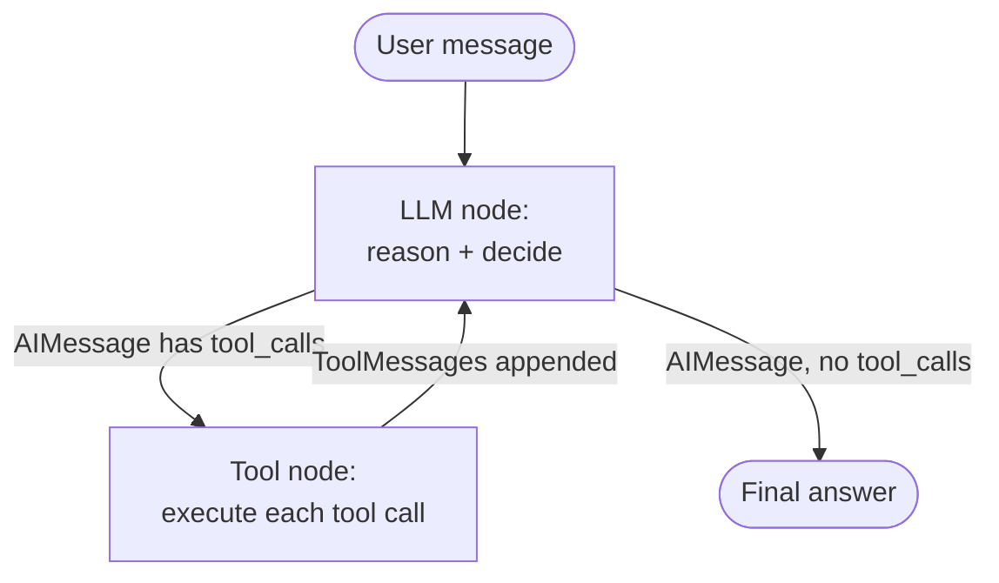
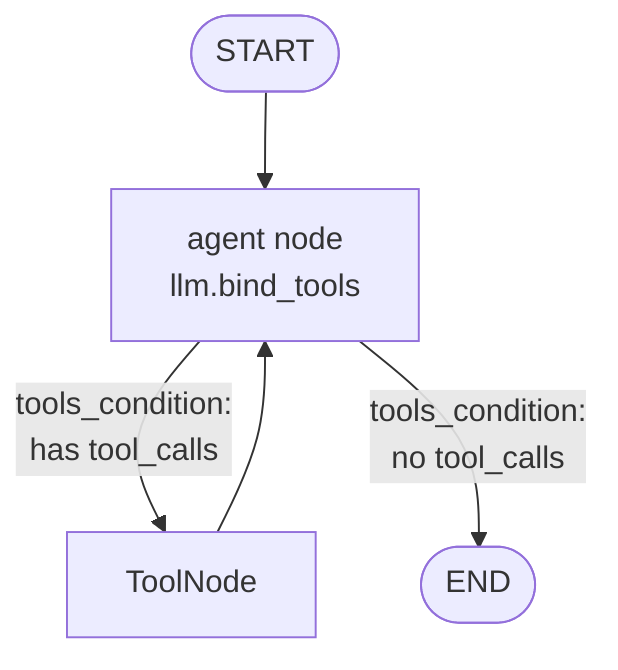
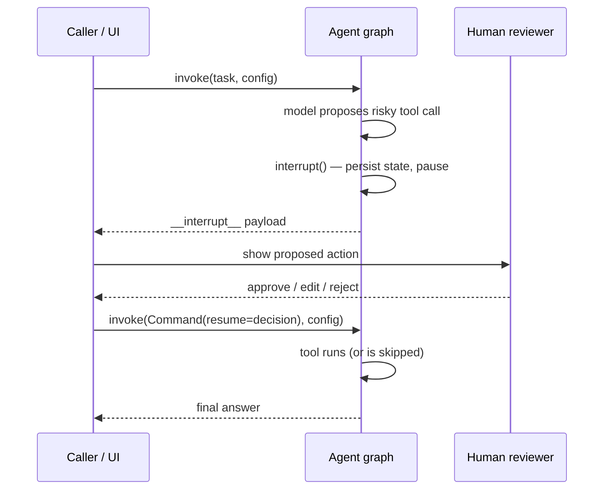
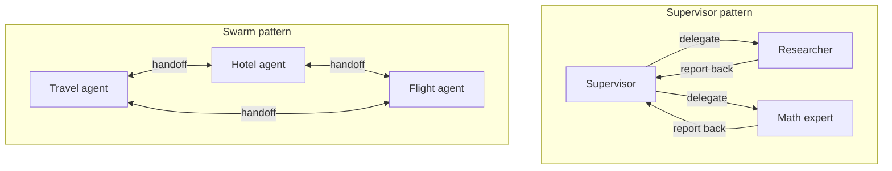

# Module 8 — Agents with LangGraph

So far you have composed *fixed* pipelines: a prompt feeds a model, the model feeds a parser, the parser feeds the next step. The control flow is decided by **you**, at authoring time. An **agent** flips that: the LLM decides the control flow at *runtime*. Given a goal and a set of tools, the model chooses which tool to call, looks at the result, and decides whether to call another tool or to answer. The loop is driven by the model, not by your code.

This module teaches the modern, production-grade way to build agents: **[LangGraph](09-langgraph-deep-dive.md)**. We start from the conceptual loop, use the fastest prebuilt path, then peel back the abstraction so it is not magic, then layer on persistence, human-in-the-loop, runtime context, control knobs, and a first taste of multi-agent.

> **Note:** This module assumes you have read [Module 5 — Tools & Tool Calling](05-tools-and-tool-calling.md). Agents *are* tool-calling models in a loop; if `@tool`, `.bind_tools()`, and `ToolMessage` are not yet second nature, read that module first.

---

## 8.1 What is an agent?

An agent is an LLM that, given a task, repeatedly:

1. **Reasons** about what to do next given the conversation so far.
2. **Acts** by emitting one or more **tool calls** (or decides it is done and emits a final answer).
3. **Observes** the tool results, which are appended to the conversation as `ToolMessage`s.
4. Loops back to step 1 with the enriched context.

This is the **ReAct** pattern (*Reason + Act*). In modern LangChain the "reasoning" is not a special scratchpad format — it is just the model's native **tool calling** capability. Claude (and other tool-calling models) emit structured `tool_calls` on an `AIMessage`; the runtime executes them and feeds back `ToolMessage`s. The loop terminates when the model returns an `AIMessage` with **no** tool calls — that is the final answer.



The entire state that flows around this loop is, in the simplest case, just **a list of messages**. Each turn appends to it: `HumanMessage` → `AIMessage(tool_calls=...)` → `ToolMessage(...)` → `AIMessage(...)` → done.

> **Note:** "Agent" is a spectrum, not a binary. A single tool-calling round-trip is barely an agent; a 20-step research loop that spawns sub-agents is firmly one. The same primitives scale across that whole range.

---

## 8.2 Why LangGraph (and not the legacy `AgentExecutor`)?

LangChain's *original* agent API was `AgentExecutor` / `initialize_agent`. It worked, but it was a closed box: the loop lived inside the executor, and customizing it (persistence, streaming intermediate steps, pausing for human approval, branching to a second agent) meant fighting the abstraction.

> **Note (legacy):** `AgentExecutor`, `initialize_agent`, and the various `create_*_agent` *prompt-format* helpers are **deprecated**. You may still encounter them in older code and tutorials. Do not build new systems on them. See [Appendix C — Versioning & Migration](../appendix/C-versioning-and-migration.md) for a migration map.

LangGraph replaced this with a **graph** model: nodes (units of work) connected by edges (control flow), driving a shared **state** object. An agent is just a small graph with a loop in it. This buys you, *for free*, the things production agents need:

| Capability | Why it matters |
|---|---|
| **Explicit control** | The loop is a graph you can inspect, edit, and extend — add nodes, reroute edges. |
| **Durable persistence** | A *checkpointer* snapshots state after every step. Crash, resume, or pause for hours. |
| **Streaming** | Stream state updates, individual node outputs, or token-by-token model output. |
| **Human-in-the-loop** | `interrupt()` pauses mid-graph, waits for a human decision, then resumes exactly where it left off. |
| **Multi-agent** | Nodes can *be* whole agents; supervisors route between them. |

> **⚠️ Gotcha — the 2026 API shift.** As of LangGraph v1 / LangChain v1, the prebuilt **`langgraph.prebuilt.create_react_agent` is deprecated in favor of `langchain.agents.create_agent`**, which runs on LangGraph under the hood and adds a *middleware* system. Both still work, and the mental model is identical. This module teaches `create_react_agent` first (it is the most widely documented form and the clearest illustration of the loop), then shows the `create_agent` equivalent so your new code is current. When you start a greenfield project in 2026+, reach for `create_agent`.

The full graph-building API (`StateGraph`, custom nodes, channels, subgraphs) is the subject of [Module 9 — LangGraph Deep Dive](09-langgraph-deep-dive.md). Here we stay focused on the *agent* shape.

---

## 8.3 The fastest path — the prebuilt agent

You rarely need to assemble the graph by hand. The prebuilt factory wires up the model node, the tool node, and the loop edge for you.

### Minimal example

```python
from langgraph.prebuilt import create_react_agent
from langchain_core.tools import tool

# 1. Define tools (see Module 5). Type hints + docstring = the schema the model sees.
@tool
def get_weather(city: str) -> str:
    """Get the current weather for a given city."""
    # In real life: call a weather API. Here, a stub.
    return f"It is 18°C and sunny in {city}."

@tool
def multiply(a: float, b: float) -> float:
    """Multiply two numbers."""
    return a * b

# 2. Create the agent. The model can be a string id or a model instance.
agent = create_react_agent(
    model="anthropic:claude-sonnet-4-6",          # provider:model string
    tools=[get_weather, multiply],
    prompt="You are a concise, helpful assistant.",  # becomes the SystemMessage
)

# 3. Invoke. Input is a dict with a "messages" key.
result = agent.invoke(
    {"messages": [("user", "What's the weather in Paris, and what is 23 * 19?")]}
)

# 4. The final answer is the last message.
print(result["messages"][-1].content)
# -> "It's 18°C and sunny in Paris. And 23 * 19 = 437."
```

A few things to internalize:

- **`model`** accepts a `provider:model` string (resolved via `init_chat_model` — see [Module 1](01-models-chat-and-llms.md)) **or** a pre-built model instance, e.g. `ChatAnthropic(model="claude-sonnet-4-6")`. Use an instance when you need to set `temperature`, `max_tokens`, etc.
- **`prompt`** can be a string (wrapped into a `SystemMessage`), a `SystemMessage`, or a **callable** `state -> list[messages]` for dynamic prompts.
- **Input** is always `{"messages": [...]}`. Each entry can be a `(role, content)` tuple or a `BaseMessage`.
- **Output** is the *full* message list. `result["messages"]` contains the whole trajectory — user turn, every `AIMessage` with tool calls, every `ToolMessage`, and the final answer. `result["messages"][-1]` is the answer.

### Inspecting the trajectory

To debug or audit, walk the message list:

```python
for m in result["messages"]:
    m.pretty_print()
# ================================ Human Message =================================
# What's the weather in Paris, and what is 23 * 19?
# ================================== Ai Message ==================================
# [tool_calls: get_weather(city="Paris"), multiply(a=23, b=19)]
# ================================= Tool Message =================================
# It is 18°C and sunny in Paris.
# ================================= Tool Message =================================
# 437.0
# ================================== Ai Message ==================================
# It's 18°C and sunny in Paris. And 23 * 19 = 437.
```

> **🔧 Try it:** Add a third tool, `def search_web(query: str) -> str`, that returns a canned string, then ask a question that needs all three. Watch the model fan out parallel tool calls in a single `AIMessage`.

### The same thing with `create_agent` (current API)

```python
from langchain.agents import create_agent

agent = create_agent(
    model="anthropic:claude-sonnet-4-6",
    tools=[get_weather, multiply],
    system_prompt="You are a concise, helpful assistant.",   # note: system_prompt, not prompt
)

result = agent.invoke(
    {"messages": [{"role": "user", "content": "Weather in Paris? And 23*19?"}]}
)
print(result["messages"][-1].content)
```

The only surface differences: import path, and `prompt=` is renamed `system_prompt=`. Everything else in this module (invoke/stream shapes, checkpointers, `thread_id`, structured output) is identical.

> **🔧 Try it — swap the provider.** Change `model="anthropic:claude-sonnet-4-6"` to `model="openai:gpt-4.1"` (with `langchain-openai` installed and `OPENAI_API_KEY` set). No other code changes. The provider-agnostic string is the whole point — see [Module 1](01-models-chat-and-llms.md).

---

## 8.4 Streaming agent execution

`invoke` blocks until the agent is done — fine for batch, terrible for UX, because the user stares at nothing for several tool calls. LangGraph streams at three granularities via `stream_mode`:

| `stream_mode` | What each chunk contains | Use for |
|---|---|---|
| `"values"` | The **entire state** after each step | Debugging; "show me the full state now" |
| `"updates"` | Only the **delta** each node produced | Progress UI: "called get_weather", "model thinking" |
| `"messages"` | **Token-by-token** model output (+ metadata) | Streaming the final answer to a chat UI |

### `updates` — step-by-step progress

```python
for chunk in agent.stream(
    {"messages": [("user", "Weather in Paris, and 23 * 19?")]},
    stream_mode="updates",
):
    for node_name, node_update in chunk.items():
        msgs = node_update["messages"]
        print(f"[{node_name}] produced {len(msgs)} message(s)")
        for m in msgs:
            m.pretty_print()
# [agent]  produced 1 message(s)   <- AIMessage with tool_calls
# [tools]  produced 2 message(s)   <- two ToolMessages
# [agent]  produced 1 message(s)   <- final AIMessage
```

### `messages` — stream the final answer token by token

```python
for token, metadata in agent.stream(
    {"messages": [("user", "Write a two-sentence summary of the weather in Paris.")]},
    stream_mode="messages",
):
    # `token` is an AIMessageChunk; only print tokens from the model node.
    if metadata["langgraph_node"] == "agent" and token.content:
        print(token.content, end="", flush=True)
```

> **Note:** With `stream_mode="messages"` you receive **all** model tokens, *including* tokens the model emits while deciding tool calls. Filter on `metadata["langgraph_node"]` and/or check `token.tool_call_chunks` if you only want the user-facing answer.

### Multiple modes at once

Pass a list to get tagged tuples — stream progress *and* final tokens simultaneously:

```python
for mode, chunk in agent.stream(
    {"messages": [("user", "Weather in Paris?")]},
    stream_mode=["updates", "messages"],
):
    if mode == "updates":
        print("STEP:", list(chunk.keys()))
    elif mode == "messages":
        token, _ = chunk
        print(token.content, end="")
```

### `astream_events` — fine-grained for rich UIs

When you need the highest resolution — every model start/stop, every tool start/stop, every token, with run IDs you can correlate — use the async event stream:

```python
import asyncio

async def main():
    async for event in agent.astream_events(
        {"messages": [("user", "Weather in Paris?")]},
        version="v2",
    ):
        kind = event["event"]
        if kind == "on_tool_start":
            print(f"🔧 calling {event['name']} with {event['data']['input']}")
        elif kind == "on_chat_model_stream":
            chunk = event["data"]["chunk"]
            if chunk.content:
                print(chunk.content, end="", flush=True)

asyncio.run(main())
```

> **✅ Best practice:** For a typical chat UI, `stream_mode=["updates", "messages"]` is the sweet spot: `updates` drives a "thinking… / calling search…" status line, `messages` streams the answer. Reach for `astream_events` only when you need per-tool timing or run-correlation (e.g. rendering a tool-call timeline).

---

## 8.5 Understanding what the prebuilt builds

The prebuilt is not magic — it builds a tiny `StateGraph`. Knowing the shape lets you extend it. The graph has exactly:

- A **model node** (`"agent"`) — calls the LLM (bound to your tools) on the current messages.
- A **tool node** (`"tools"`) — a prebuilt `ToolNode` that executes every tool call on the last `AIMessage` and appends the resulting `ToolMessage`s.
- A **conditional edge** out of the model node: if the last `AIMessage` has `tool_calls`, route to `"tools"`; otherwise route to `END`. The prebuilt helper for this decision is `tools_condition`.
- A plain edge `"tools" -> "agent"` that closes the loop.



### Hand-built equivalent

This is roughly what `create_react_agent` generates. Build it once so the prebuilt is demystified.

```python
from typing import Annotated
from typing_extensions import TypedDict

from langchain.chat_models import init_chat_model
from langchain_core.messages import AnyMessage
from langgraph.graph import StateGraph, START, END
from langgraph.graph.message import add_messages
from langgraph.prebuilt import ToolNode, tools_condition
from langchain_core.tools import tool


@tool
def get_weather(city: str) -> str:
    """Get the current weather for a given city."""
    return f"It is 18°C and sunny in {city}."


tools = [get_weather]

# Bind tools to the model so it can emit tool_calls.
model = init_chat_model("anthropic:claude-sonnet-4-6").bind_tools(tools)


# 1. State: a message list with the `add_messages` reducer (appends, dedups by id).
#    `MessagesState` from langgraph.graph is a ready-made equivalent of this.
class AgentState(TypedDict):
    messages: Annotated[list[AnyMessage], add_messages]


# 2. The model node: call the LLM, return the new message to append.
def call_model(state: AgentState) -> dict:
    response = model.invoke(state["messages"])
    return {"messages": [response]}


# 3. Assemble the graph.
builder = StateGraph(AgentState)
builder.add_node("agent", call_model)
builder.add_node("tools", ToolNode(tools))     # prebuilt: runs tool_calls -> ToolMessages

builder.add_edge(START, "agent")
builder.add_conditional_edges("agent", tools_condition)  # routes to "tools" or END
builder.add_edge("tools", "agent")             # loop back

graph = builder.compile()

print(graph.invoke({"messages": [("user", "Weather in Rome?")]})["messages"][-1].content)
# -> "It is 18°C and sunny in Rome."
```

Note `MessagesState` — LangGraph ships a `TypedDict` that is exactly `{"messages": Annotated[list, add_messages]}`, so you can write `StateGraph(MessagesState)` instead of declaring `AgentState`. The `add_messages` **reducer** is what makes the loop work: each node *returns* messages and the reducer *appends* them rather than overwriting.

> **Note:** Everything beyond this — custom routing, parallel branches, subgraphs, map-reduce — is [Module 9](09-langgraph-deep-dive.md). For agents, this loop is 90% of what you need; `create_react_agent` / `create_agent` give it to you in one line.

---

## 8.6 Memory & persistence — checkpointers and `thread_id`

By default the agent is **stateless** between `invoke` calls: it has no memory of the previous turn. To make it remember a conversation, give it a **checkpointer** and address each conversation by a **`thread_id`**.

A checkpointer snapshots the full graph state after every step into a store. On the next call with the same `thread_id`, LangGraph loads that state and continues. This is the same mechanism that powers crash-recovery and human-in-the-loop — memory is just persistence across `invoke`s.

### In-memory (dev) — `InMemorySaver`

```python
from langgraph.prebuilt import create_react_agent
from langgraph.checkpoint.memory import InMemorySaver

checkpointer = InMemorySaver()   # formerly MemorySaver; alias still works

agent = create_react_agent(
    model="anthropic:claude-sonnet-4-6",
    tools=[get_weather],
    checkpointer=checkpointer,
)

# A thread_id identifies the conversation. Same id == same memory.
config = {"configurable": {"thread_id": "user-42"}}

agent.invoke({"messages": [("user", "Hi, I'm Dana.")]}, config)
reply = agent.invoke({"messages": [("user", "What's my name?")]}, config)
print(reply["messages"][-1].content)
# -> "Your name is Dana."

# A different thread_id is a clean slate.
other = {"configurable": {"thread_id": "user-99"}}
print(agent.invoke({"messages": [("user", "What's my name?")]}, other)["messages"][-1].content)
# -> "I don't know your name yet — what is it?"
```

Notice you pass **only the new turn** in `messages`; the checkpointer supplies the prior history. You do *not* re-send the whole transcript.

### Durable (prod) — `SqliteSaver` / `PostgresSaver`

For anything that must survive a process restart, use a real store. SQLite is great for single-node apps; Postgres for distributed deployments.

```python
from langgraph.checkpoint.sqlite import SqliteSaver
# pip install langgraph-checkpoint-sqlite

with SqliteSaver.from_conn_string("checkpoints.sqlite") as checkpointer:
    agent = create_react_agent(
        model="anthropic:claude-sonnet-4-6",
        tools=[get_weather],
        checkpointer=checkpointer,
    )
    config = {"configurable": {"thread_id": "user-42"}}
    agent.invoke({"messages": [("user", "Remember: my favorite city is Lisbon.")]}, config)
    # ... process can restart here; state is on disk ...
    print(agent.invoke({"messages": [("user", "My favorite city?")]}, config)["messages"][-1].content)
    # -> "Lisbon."
```

> **Note:** Postgres uses `from langgraph.checkpoint.postgres import PostgresSaver` (package `langgraph-checkpoint-postgres`) with the same `.from_conn_string(...)` API. There are `Async*` variants of every saver for async apps.

> **⚠️ Gotcha:** The default checkpointer keeps the **entire** message history per thread, which grows unbounded and inflates token cost and latency. For long conversations, trim or summarize history — see [Module 7 — Memory & State](07-memory-and-state.md) for `trim_messages`, summarization, and the `pre_model_hook` that `create_react_agent` exposes for exactly this.

> **✅ Best practice:** A checkpointer gives **short-term** (within-thread) memory. For **long-term**, cross-thread memory (facts about a user that persist across conversations), pass a `store=` (e.g. `InMemoryStore`, `PostgresStore`). Covered in [Module 7](07-memory-and-state.md) and [Module 9](09-langgraph-deep-dive.md).

---

## 8.7 Human-in-the-loop — gating risky tools

Some tool calls have real-world side effects — sending email, issuing a refund, deleting records, running SQL writes. You do not want the model to fire those autonomously. **Human-in-the-loop (HITL)** pauses the graph before the side effect, surfaces the proposed action to a human, and resumes only on approval.

This *requires* a checkpointer — the pause persists state so the human can take seconds or days to decide.

### The primitive: `interrupt()` + `Command(resume=...)`

Inside a node (or a tool), call `interrupt(payload)`. LangGraph **suspends** the graph, persists state, and surfaces `payload` to the caller. The caller inspects it, then **resumes** by invoking the graph again with `Command(resume=decision)`. Execution re-enters the interrupted node, and `interrupt()` *returns* the value you passed to `resume`.

```python
from langgraph.types import interrupt, Command
from langchain_core.tools import tool


@tool
def transfer_funds(amount: float, to_account: str) -> str:
    """Transfer money to an account. Requires human approval."""
    # Pause and ask a human. Whatever we return from resume lands in `decision`.
    decision = interrupt({
        "action": "transfer_funds",
        "amount": amount,
        "to_account": to_account,
        "question": f"Approve transfer of ${amount:.2f} to {to_account}?",
    })
    if decision == "approve":
        return f"✅ Transferred ${amount:.2f} to {to_account}."
    return f"❌ Transfer rejected by reviewer ({decision})."
```

```python
from langgraph.prebuilt import create_react_agent
from langgraph.checkpoint.memory import InMemorySaver

agent = create_react_agent(
    model="anthropic:claude-sonnet-4-6",
    tools=[transfer_funds],
    checkpointer=InMemorySaver(),       # REQUIRED for interrupts
)
config = {"configurable": {"thread_id": "txn-1"}}

# First call: runs until the interrupt, then pauses.
result = agent.invoke(
    {"messages": [("user", "Send $500 to account ACME-99.")]},
    config,
)

# Detect the pause: an "__interrupt__" entry is present.
if "__interrupt__" in result:
    payload = result["__interrupt__"][0].value
    print("PENDING APPROVAL:", payload)
    # -> {'action': 'transfer_funds', 'amount': 500.0, 'to_account': 'ACME-99', ...}

# ... show payload to a human, collect their decision ...

# Resume with the human's decision. Same thread_id, Command(resume=...).
final = agent.invoke(Command(resume="approve"), config)
print(final["messages"][-1].content)
# -> "I've transferred $500.00 to ACME-99."
```

### The approve / edit / reject pattern

A production review UI offers three outcomes. Model them as a structured `resume` payload and branch inside the tool:

```python
@tool
def send_email(to: str, subject: str, body: str) -> str:
    """Send an email. Requires human review."""
    review = interrupt({
        "type": "approval",
        "tool": "send_email",
        "args": {"to": to, "subject": subject, "body": body},
    })
    action = review["action"]
    if action == "approve":
        return f"Email sent to {to}."
    if action == "edit":
        # Reviewer corrected the args before sending.
        args = review["args"]
        return f"Email sent to {args['to']} (edited by reviewer)."
    # action == "reject"
    return f"Email NOT sent. Reviewer note: {review.get('note', 'no reason given')}"

# Resume examples:
#   agent.invoke(Command(resume={"action": "approve"}), config)
#   agent.invoke(Command(resume={"action": "edit",
#                                "args": {"to": "ceo@corp.com", "subject": "...", "body": "..."}}), config)
#   agent.invoke(Command(resume={"action": "reject", "note": "tone too aggressive"}), config)
```

### Alternative 1: `interrupt_before` on the tool node

If you do not want approval logic *inside* the tool, pause the whole graph **before** the tool node runs, inspect the pending tool call from state, then resume:

```python
agent = create_react_agent(
    model="anthropic:claude-sonnet-4-6",
    tools=[transfer_funds],
    checkpointer=InMemorySaver(),
    interrupt_before=["tools"],     # pause before EVERY tool execution
)

config = {"configurable": {"thread_id": "t1"}}
agent.invoke({"messages": [("user", "Send $500 to ACME-99.")]}, config)

# Inspect the pending tool call.
state = agent.get_state(config)
pending = state.values["messages"][-1].tool_calls
print(pending)   # [{'name': 'transfer_funds', 'args': {...}, 'id': '...'}]

# Approve by resuming with no override; reject by editing state first.
agent.invoke(None, config)   # passing None resumes from the checkpoint
```

> **⚠️ Gotcha:** `interrupt_before=["tools"]` is coarse — it pauses before *all* tools. Use the in-tool `interrupt()` (above) to gate only the dangerous ones, while letting read-only tools run freely.

### Alternative 2: `create_agent` + `HumanInTheLoopMiddleware`

With the current `create_agent` API, HITL is declarative — no tool edits required. You map tool names to approval policies:

```python
from langchain.agents import create_agent
from langchain.agents.middleware import HumanInTheLoopMiddleware
from langgraph.checkpoint.memory import InMemorySaver

agent = create_agent(
    model="anthropic:claude-sonnet-4-6",
    tools=[transfer_funds, get_weather],
    checkpointer=InMemorySaver(),
    middleware=[
        HumanInTheLoopMiddleware(
            interrupt_on={
                "transfer_funds": True,    # require approval
                "get_weather": False,      # auto-run, no approval
            }
        )
    ],
)
# Pauses on transfer_funds; resume with Command(resume=...) carrying the decision.
```

> **✅ Best practice:** Gate every tool that mutates external state (writes, payments, emails, deletes). Leave read-only tools (search, lookups) ungated so the agent stays fluid. The cost of an over-eager autonomous *read* is low; the cost of an autonomous *write* can be catastrophic.



---

## 8.8 Tools that need runtime context the model must not choose

Some tool arguments should come from the **runtime**, not from the model: the current user's ID, the agent's own state, a DB connection, the tool-call ID needed to write back to state. If you put these in the tool's signature normally, the model will see them in the schema and try to hallucinate values. LangGraph lets you **inject** them so they are hidden from the model and filled by the runtime.

| Annotation / param | Injects | Hidden from model? |
|---|---|---|
| `InjectedState` | The current graph state (or a field of it) | ✅ |
| `InjectedToolCallId` | The `id` of the current tool call | ✅ |
| `config: RunnableConfig` | The run config (holds `thread_id`, user metadata) | ✅ |

```python
from typing import Annotated
from langchain_core.tools import tool, InjectedToolCallId
from langchain_core.runnables import RunnableConfig
from langgraph.prebuilt import InjectedState
from langgraph.types import Command
from langchain_core.messages import ToolMessage


@tool
def whoami(config: RunnableConfig) -> str:
    """Return the current user's id."""
    # The model passes NO arguments; `config` is injected by the runtime.
    user_id = config["configurable"].get("user_id", "anonymous")
    return f"You are user {user_id}."


@tool
def summarize_history(state: Annotated[dict, InjectedState]) -> str:
    """Summarize the conversation so far."""
    # `state` is injected — the model never sees or fills it.
    n = len(state["messages"])
    return f"There are {n} messages in this conversation."


@tool
def remember_fact(
    fact: str,
    tool_call_id: Annotated[str, InjectedToolCallId],
) -> Command:
    """Store a fact in agent state."""
    # `fact` comes from the model; `tool_call_id` is injected by the runtime.
    return Command(update={
        "messages": [ToolMessage(f"Noted: {fact}", tool_call_id=tool_call_id)],
        # ...could also update a custom state field here.
    })
```

Invoke with the injected values supplied via `config`:

```python
agent = create_react_agent("anthropic:claude-sonnet-4-6", [whoami, summarize_history])
agent.invoke(
    {"messages": [("user", "Who am I?")]},
    {"configurable": {"thread_id": "t1", "user_id": "u-777"}},
)
```

> **Note:** A tool that returns a `Command(update=...)` can write to graph state — but the state must subclass `AgentState`/`MessagesState`, not a bare `TypedDict`, or you will hit a `KeyError`. See [Module 5 — Tools & Tool Calling](05-tools-and-tool-calling.md) for the full treatment of injected arguments and `Command`-returning tools.

> **⚠️ Verify:** Newer LangChain versions consolidate these behind a single `ToolRuntime` parameter (`tool_runtime: ToolRuntime`) that exposes `state`, `config`, `store`, and `tool_call_id` in one object. The `InjectedState` / `InjectedToolCallId` annotations shown above remain supported; check [the tools docs](05-tools-and-tool-calling.md) for the version you are on.

---

## 8.9 Controlling agent behavior

### Recursion limit — stop runaway loops

The agent loops until the model stops calling tools. A buggy tool or an adversarial prompt can loop forever. LangGraph caps total **super-steps** with `recursion_limit` (default **25**). Exceeding it raises `GraphRecursionError`.

```python
from langgraph.errors import GraphRecursionError

try:
    agent.invoke(
        {"messages": [("user", "Keep calling tools forever.")]},
        {"recursion_limit": 8},   # at most ~4 model/tool round-trips
    )
except GraphRecursionError:
    print("Agent hit its step budget — bailing out.")
```

> **✅ Best practice:** Set an explicit `recursion_limit` sized to your task (a simple lookup needs ~4; a research agent maybe 50). It is a circuit breaker against infinite loops and runaway token spend, not a normal control-flow tool.

### System prompt design

The system prompt is your strongest behavioral lever. For agents specifically, tell the model: its role, *when* to use each tool (and when not to), how to handle failures, and what the final answer should look like.

```python
SYSTEM = """You are a customer-support agent for AcmeCloud.

Tools:
- `lookup_order(order_id)`: fetch order status. Use ONLY when the user gives an order id.
- `issue_refund(order_id, amount)`: refund an order. NEVER call without explicit user confirmation.

Rules:
- If you lack an order id, ASK for it; do not guess.
- After any tool fails, explain the failure plainly; do not retry blindly.
- Keep answers under 4 sentences."""

agent = create_react_agent("anthropic:claude-sonnet-4-6", tools=[lookup_order, issue_refund],
                           prompt=SYSTEM)
```

### Forcing a structured final answer — `response_format`

By default the agent's final answer is free text. When a downstream system needs a typed object, pass `response_format` with a Pydantic model. The agent does its tool loop normally, then makes one extra structured call; the result lands under the `structured_response` key.

```python
from pydantic import BaseModel, Field
from langgraph.prebuilt import create_react_agent


class WeatherReport(BaseModel):
    city: str = Field(description="City the report is for")
    temp_c: float = Field(description="Temperature in Celsius")
    summary: str = Field(description="One-line human summary")


agent = create_react_agent(
    model="anthropic:claude-sonnet-4-6",
    tools=[get_weather],
    response_format=WeatherReport,
)

result = agent.invoke({"messages": [("user", "How's the weather in Paris?")]})

report: WeatherReport = result["structured_response"]
print(report.city, report.temp_c, "->", report.summary)
# Paris 18.0 -> Sunny and mild in Paris.

# The free-text trail is still in result["messages"]; the typed object is in structured_response.
```

> **Note:** `response_format` works identically in `create_agent`. See [Module 3 — Output Parsers & Structured Output](03-output-parsers-structured-output.md) for how structured output is enforced (tool-calling vs JSON mode) and when to prefer `.with_structured_output()` directly.

---

## 8.10 Multi-agent (intro)

One agent with 20 tools becomes confused and slow — too many choices per step. The fix is **multi-agent**: several focused agents, each with a tight toolset, coordinated by a routing strategy. The two canonical patterns:

- **Supervisor** — a central agent decides *which* specialist to delegate each turn to. Specialists report back to the supervisor; the supervisor decides what is next. Hub-and-spoke. Predictable, easy to reason about.
- **Swarm** — specialists hand off **directly** to one another via handoff tools; no central router. The system remembers which agent was last active. Fewer LLM calls, more emergent.



Both have prebuilt packages so you do not hand-roll the routing:

```python
# pip install langgraph-supervisor
from langgraph_supervisor import create_supervisor
from langgraph.prebuilt import create_react_agent

research_agent = create_react_agent(
    "anthropic:claude-sonnet-4-6", tools=[search_web], name="researcher",
    prompt="You research facts. Report findings to the supervisor.",
)
math_agent = create_react_agent(
    "anthropic:claude-sonnet-4-6", tools=[multiply], name="math_expert",
    prompt="You do arithmetic. Report results to the supervisor.",
)

supervisor = create_supervisor(
    agents=[research_agent, math_agent],
    model="anthropic:claude-opus-4-8",   # the router benefits from a stronger model
    prompt=(
        "You manage a researcher and a math expert. "
        "Delegate each subtask to the right specialist, then synthesize the final answer."
    ),
).compile()

result = supervisor.invoke({"messages": [
    ("user", "Find the population of Tokyo, then multiply it by 2.")
]})
print(result["messages"][-1].content)
```

The supervisor auto-generates **handoff tools** (e.g. `transfer_to_researcher`) that route control to the named agent. `langgraph-swarm` works similarly with `create_swarm` and `create_handoff_tool` for the no-router variant.

> **Note:** This is a deliberately shallow tour — enough to know the patterns exist and which package implements each. The full treatment — supervisor vs swarm vs hierarchical, `Command` handoffs, state sharing, parallelism, and hand-built supervisors — is in [Module 14 — Multi-Agent Systems](14-multi-agent-systems.md) (which builds on the `StateGraph` internals from [Module 9](09-langgraph-deep-dive.md)).

> **✅ Best practice:** Don't reach for multi-agent prematurely. A single well-prompted agent with 3–6 tightly scoped tools beats a multi-agent system for most tasks, and is far easier to debug. Split into specialists only when one agent's tool list grows unwieldy or its responsibilities genuinely diverge.

---

## 8.11 Production best practices

- **Scope tools tightly.** Each tool does one thing, with a crisp docstring and minimal args. Fewer, sharper tools → fewer wrong choices. Prefer 3–6 focused tools over 20 vague ones.
- **Always set a `recursion_limit`.** Size it to the task; treat hits as alerts, not normal outcomes.
- **Gate every side-effecting tool with HITL.** Writes, payments, emails, deletes go through `interrupt()` / `HumanInTheLoopMiddleware`. Reads run free.
- **Persist with a real checkpointer in prod.** `SqliteSaver` (single node) or `PostgresSaver` (distributed). `InMemorySaver` is dev-only.
- **Control context growth.** Trim/summarize history (the `pre_model_hook`); unbounded history is the #1 cause of cost and latency creep. See [Module 7](07-memory-and-state.md).
- **Trace everything with LangSmith.** Agents are nondeterministic; you cannot debug them by reading logs. LangSmith shows the full trajectory, token counts, latencies, and tool errors per run — see [Module 10 — Observability & Evaluation](10-observability-and-eval-langsmith.md).
- **Pin versions and migrate deliberately.** The agent API is evolving fast (`create_react_agent` → `create_agent`, `InjectedState` → `ToolRuntime`). Pin `langchain`, `langchain-core`, and `langgraph`, and consult [Appendix C](../appendix/C-versioning-and-migration.md) before upgrading.
- **Test the loop, not just the tools.** Unit-test each tool in isolation, then write trajectory tests (given input X, the agent calls tools A then B). LangSmith datasets make this repeatable.

---

## Recap

- An **agent** is an LLM in a loop: it reasons, calls tools, observes results, and repeats until it answers with no tool calls (the **ReAct** loop). State is, fundamentally, a growing **message list**.
- **LangGraph** is the modern foundation; the legacy `AgentExecutor` / `initialize_agent` are deprecated. LangGraph gives you control, persistence, streaming, HITL, and multi-agent for free.
- The fastest path is the prebuilt: `create_react_agent(model, tools, prompt=..., checkpointer=...)`. Invoke with `{"messages": [...]}`, read `result["messages"][-1]`. The **current** equivalent is `langchain.agents.create_agent` (uses `system_prompt=` + middleware).
- **Stream** with `stream_mode="values" | "updates" | "messages"` (or a list of them); use `astream_events` for the finest-grained UI signals.
- The prebuilt is just a `StateGraph`: a **model node**, a **`ToolNode`**, and a **conditional edge** (`tools_condition`) that loops while tool calls remain.
- **Memory** = a **checkpointer** (`InMemorySaver`, `SqliteSaver`, `PostgresSaver`) addressed by **`thread_id`**. Send only the new turn; history is reloaded.
- **Human-in-the-loop** = `interrupt()` to pause + `Command(resume=...)` to continue (or `interrupt_before`, or `HumanInTheLoopMiddleware`). Implements approve / edit / reject. Requires a checkpointer.
- Hide runtime-only arguments from the model with `InjectedState`, `InjectedToolCallId`, and injected `config` (consolidating into `ToolRuntime`).
- Control behavior with `recursion_limit`, a precise **system prompt**, and `response_format` for a typed final answer (`result["structured_response"]`).
- **Multi-agent**: **supervisor** (central router, `langgraph-supervisor`) vs **swarm** (direct handoffs, `langgraph-swarm`). Reach for it only when one agent gets unwieldy.

## Exercises

1. **Three-tool agent.** Build a `create_react_agent` with `get_weather`, `multiply`, and a stubbed `search_web`. Ask one question that needs all three and print the full trajectory with `pretty_print()`. Confirm the model fans out parallel tool calls in a single `AIMessage`.

2. **Streaming UI.** Run the same agent with `stream_mode=["updates", "messages"]`. Print a `"🔧 <node>"` status line for each `updates` chunk and stream the final answer token-by-token from the `messages` chunks. Then rewrite the status logic using `astream_events`.

3. **Hand-built loop.** Reconstruct the agent from scratch with `StateGraph(MessagesState)`, a `call_model` node, a `ToolNode`, and `tools_condition`. Compile it, confirm it behaves identically to the prebuilt, then render its topology (`graph.get_graph().draw_mermaid()`).

4. **Memory across turns.** Add a `SqliteSaver` and a `thread_id`. Tell the agent a fact in one `invoke`, then in a separate `invoke` (same thread) ask it to recall the fact. Verify a *different* `thread_id` does not see it. Bonus: kill and restart the process between calls to prove durability.

5. **Approve / edit / reject.** Wrap a `send_email` tool in `interrupt()`. Drive all three outcomes from the caller using `Command(resume=...)`: approve as-is, edit the recipient before sending, and reject with a note. Then reimplement the same gating with `create_agent` + `HumanInTheLoopMiddleware`.

6. **Supervisor.** Using `langgraph-supervisor`, build a supervisor over a `researcher` and a `math_expert`. Ask a question requiring both (e.g. "population of Tokyo × 2"). Inspect `result["messages"]` to see the auto-generated `transfer_to_*` handoff calls, then add a `recursion_limit` and observe what happens when you set it too low.

---

*Next: [Module 9 — LangGraph Deep Dive](09-langgraph-deep-dive.md) — custom `StateGraph`s, reducers, subgraphs, parallel/branching topologies, long-term stores, and hand-built multi-agent systems. Related: [Module 5 — Tools](05-tools-and-tool-calling.md), [Module 7 — Memory & State](07-memory-and-state.md), [Module 10 — Observability (LangSmith)](10-observability-and-eval-langsmith.md). | [course home](../README.md)*
