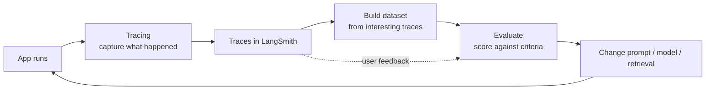
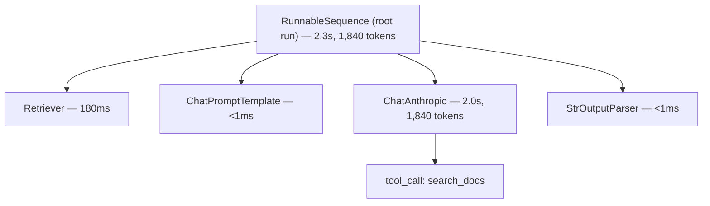
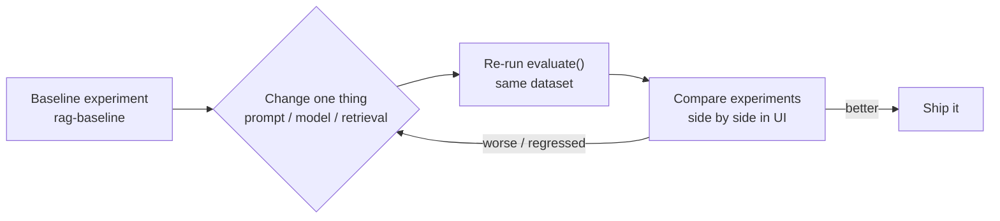

# Module 10 — Observability & Evaluation (LangSmith)

You can build a chain in an afternoon. Knowing whether it actually *works* — reliably, cheaply, and fast — is the hard part, and it never ends. This module is about the discipline that separates a demo from a production system: **observability** (seeing exactly what your app did) and **evaluation** (measuring whether it did the right thing).

LangSmith is LangChain's first-party platform for both. It is not required to *run* LangChain — but it is the path of least resistance for tracing, datasets, and evals, and it plugs into everything you've built in earlier modules with near-zero code change. We'll use it as the concrete tool, while calling out the vendor-neutral alternatives (OpenTelemetry, custom callbacks, self-hosting) so you're not locked in.

> **Note:** As of early 2026 the LangSmith docs live at `docs.langchain.com/langsmith` (older `docs.smith.langchain.com` links 308-redirect there). The Python SDK package is `langsmith`. Install with `pip install langsmith`.

---

## 10.1 Why observability is non-negotiable

Traditional software is mostly deterministic: same input, same output, same code path. You can reason about it by reading the code. LLM applications break every one of those assumptions:

- **Nondeterminism.** The same prompt can produce different outputs across calls (and across model versions). A bug might reproduce 1 time in 20. You cannot debug what you cannot see.
- **Latency is structural, not incidental.** A single agent turn may fan out into a dozen model calls, tool invocations, and retrieval round-trips. End-to-end latency is the *sum* of a tree of operations, and the slow one is rarely obvious from the outside.
- **Cost scales with tokens, invisibly.** Every retrieved document, every retry, every verbose system prompt is tokens you pay for. Without per-run token accounting you discover cost problems on the invoice.
- **Deep chains and agents are opaque.** When a [LangGraph agent](08-agents-with-langgraph.md) returns a wrong answer, the failure could be in the retriever, the tool, the prompt, the model's reasoning, or the parsing. A flat log line tells you nothing; you need the *tree*.

Observability gives you the tree. Evaluation gives you the score. Together they let you change something and *know* whether you made the system better or worse — instead of guessing.



This loop — observe, dataset, evaluate, change, repeat — is the backbone of the module.

---

## 10.2 Tracing: see every run

### Turning it on

Automatic tracing of any LangChain or LangGraph run requires **zero code changes** — just environment variables:

```bash
export LANGSMITH_TRACING=true
export LANGSMITH_API_KEY="lsv2_pt_..."        # from smith.langchain.com → Settings → API Keys
export LANGSMITH_PROJECT="my-app-dev"          # optional; groups traces. Defaults to "default"
# export LANGSMITH_ENDPOINT="https://eu.api.smith.langchain.com"  # only if not in the US region
export ANTHROPIC_API_KEY="sk-ant-..."          # your model provider key
```

> **Note:** These are the modern names. The older `LANGCHAIN_TRACING_V2` / `LANGCHAIN_API_KEY` / `LANGCHAIN_PROJECT` variables still work as aliases, but prefer the `LANGSMITH_*` forms in new code.

With those set, just run your code as normal — every `invoke`, `stream`, and `batch` on any Runnable is captured and sent to your project:

```python
from langchain.chat_models import init_chat_model
from langchain_core.prompts import ChatPromptTemplate

model = init_chat_model("anthropic:claude-sonnet-4-6")
prompt = ChatPromptTemplate.from_messages([
    ("system", "You are a concise assistant."),
    ("human", "{question}"),
])
chain = prompt | model

chain.invoke({"question": "What is a vector database in one sentence?"})
# A trace now appears under the "my-app-dev" project in LangSmith — no other code needed.
```

> **✅ Best practice:** Use a different `LANGSMITH_PROJECT` per environment (`my-app-dev`, `my-app-staging`, `my-app-prod`). It keeps noisy local experimentation out of your production monitoring views.

### What a trace shows

Click any trace and you get a hierarchical tree of **runs**. For a RAG chain or an agent it looks like this:



Each run node exposes:

- **Inputs and outputs** — the exact data in and out of that step (the rendered prompt, the model's raw response, the parsed result).
- **Token usage** — prompt tokens, completion tokens, and totals, rolled up to the root.
- **Latency** — wall-clock time per node, so you can spot the slow step instantly.
- **Errors** — exceptions and stack traces, attached to the run that failed.
- **Metadata & tags** — anything you attached (see below), plus model name, temperature, and provider.

> **🔧 Try it:** Run the chain above, open the trace, and find the rendered system+human messages on the `ChatAnthropic` node. Seeing the *actual* string sent to the model — after all templating — is the single most useful debugging habit in this course.

### Tracing arbitrary functions with `@traceable`

LangChain Runnables trace themselves. But real apps have plain Python in between — a preprocessing step, a custom retrieval call, a business-logic function. Wrap those with `@traceable` from the `langsmith` SDK and they become first-class nodes in the same trace tree:

```python
from langsmith import traceable
from langchain.chat_models import init_chat_model

model = init_chat_model("anthropic:claude-sonnet-4-6")

@traceable(run_type="retriever")  # run_type drives the icon/visualization in the UI
def fetch_context(query: str) -> list[str]:
    # ... your custom retrieval, DB query, API call, etc.
    return ["LangSmith traces nested runs.", "Datasets hold golden examples."]

@traceable  # defaults to run_type="chain"
def answer(query: str) -> str:
    docs = fetch_context(query)                      # appears as a child run
    context = "\n".join(docs)
    resp = model.invoke(                             # also a child run — same tree
        f"Answer using only this context:\n{context}\n\nQ: {query}"
    )
    return resp.content

answer("What does LangSmith trace?")
# One trace: answer → fetch_context, answer → ChatAnthropic. The decorator and the
# Runnable share the same run tree automatically — no manual plumbing.
```

> **Note:** `@traceable` works even with *no* LangChain in the function at all — it's how you trace a raw Anthropic SDK call, an OpenAI call, or pure Python. Child Runnables invoked inside a `@traceable` function inherit its run context.

### Tags, metadata, and run names via `.with_config`

Attach searchable, filterable annotations to any Runnable with `.with_config(...)`. This is how you slice traces later ("show me all prod traces for tenant X on the v3 prompt"):

```python
chain = (prompt | model).with_config({
    "run_name": "FaqAnswerer",                 # friendly name in the UI instead of "RunnableSequence"
    "tags": ["prod", "faq", "prompt-v3"],
    "metadata": {"tenant_id": "acme", "prompt_version": "v3"},
})

# Or per-invocation (overrides/merges with the above):
chain.invoke(
    {"question": "How do I reset my password?"},
    config={"tags": ["experiment-A"], "metadata": {"user_id": "u_123"}},
)
```

> **✅ Best practice:** Put anything you'll want to *filter or group by* in `metadata` (tenant, user, prompt version, model id, request id). Put coarse boolean-ish labels in `tags`. Use `run_name` so your traces read like a story, not a wall of `RunnableSequence`.

---

## 10.3 Datasets: your golden examples

A **dataset** is a versioned collection of **examples**, where each example has `inputs` (what you feed the app) and optional `outputs` — the *reference* / expected answer (often called the "golden" or ground-truth label). Datasets are what you evaluate *against*.

There are two main ways to build one.

### From production traces

The highest-signal datasets come from real traffic. In the LangSmith UI you select interesting traces — failures, edge cases, expensive runs — and "Add to Dataset," optionally correcting the output to make it the reference. This turns every production surprise into a permanent regression test.

### In code

For seed datasets and fixtures, create them programmatically with the `Client`:

```python
from langsmith import Client

client = Client()

dataset = client.create_dataset(
    dataset_name="faq-golden-v1",
    description="Hand-labeled FAQ questions with reference answers.",
)

client.create_examples(
    dataset_id=dataset.id,
    examples=[
        {
            "inputs":  {"question": "How do I reset my password?"},
            "outputs": {"answer": "Go to Settings → Security → Reset password."},
        },
        {
            "inputs":  {"question": "What's the refund window?"},
            "outputs": {"answer": "Refunds are available within 30 days of purchase."},
        },
    ],
)
```

> **⚠️ Gotcha:** `inputs` and `outputs` are **dictionaries**, and the keys matter — your target function reads `inputs[...]` and your evaluators read `outputs[...]` / `reference_outputs[...]` by those keys. Keep them consistent across the dataset.

> **Note:** The newer SDK also exposes `client.create_examples(dataset_id=..., inputs=[...], outputs=[...])` (parallel lists) and supports a `splits` field for train/test partitions. The list-of-dicts form shown above is the most readable and is what we use throughout.

---

## 10.4 Evaluation with `evaluate()`

`evaluate()` is the workhorse. You give it three things:

1. A **target** — a function (or Runnable) that takes an example's `inputs` dict and returns an `outputs` dict.
2. **data** — the dataset name (or UUID, or an iterator of examples).
3. **evaluators** — a list of scoring functions.

It runs the target over every example, runs every evaluator over every result, and records the whole thing as an **experiment** you can browse and compare in the UI.

### The shape of an evaluator

A modern evaluator is a plain function whose **parameter names are significant** — LangSmith injects the right values by name. The available parameters are `inputs`, `outputs`, and `reference_outputs` (plus `run` and `example` for advanced use). Return a `bool`, a number, or a dict like `{"key": ..., "score": ..., "comment": ...}`:

```python
# Boolean evaluator — exact-match style. Param names drive what gets injected.
def is_correct(outputs: dict, reference_outputs: dict) -> bool:
    return outputs["answer"].strip() == reference_outputs["answer"].strip()

# Richer evaluator — returns key/score/comment so the UI shows a labeled metric + rationale.
def answer_length_ok(outputs: dict) -> dict:
    n = len(outputs["answer"])
    return {
        "key": "length_ok",
        "score": 1.0 if n <= 280 else 0.0,
        "comment": f"answer was {n} chars",
    }
```

> **Note:** This name-based signature (`inputs`/`outputs`/`reference_outputs`) is the current style. You may still see older examples taking `(run, example)` objects and returning `EvaluationResult` — that form still works, but prefer the simpler dict-return functions for new code.

### A complete example: evaluating a RAG chain

Let's evaluate the kind of RAG chain you built in [Module 6 — Retrieval & RAG](06-retrieval-and-rag.md) on two axes: **correctness** (does the answer match the reference?) and **faithfulness** (is the answer grounded in the retrieved context, i.e. not hallucinated?). Both use **LLM-as-judge**.

```python
from langsmith import Client, evaluate
from langchain.chat_models import init_chat_model
from langchain_core.prompts import ChatPromptTemplate
from langchain_core.output_parsers import StrOutputParser
from pydantic import BaseModel, Field

client = Client()
model = init_chat_model("anthropic:claude-sonnet-4-6", temperature=0)

# --- 1. The system under test: a tiny RAG chain ----------------------------
# In a real app `retrieve` hits your vector store (see Module 6). Stubbed here.
KB = {
    "refund": "Refunds are available within 30 days of purchase.",
    "password": "Reset your password under Settings → Security.",
}

def retrieve(question: str) -> str:
    key = "refund" if "refund" in question.lower() else "password"
    return KB[key]

rag_prompt = ChatPromptTemplate.from_messages([
    ("system", "Answer ONLY from the context. If unknown, say you don't know.\n\nContext:\n{context}"),
    ("human", "{question}"),
])
rag_chain = rag_prompt | model | StrOutputParser()

# --- 2. The target function: inputs dict -> outputs dict -------------------
def rag_target(inputs: dict) -> dict:
    context = retrieve(inputs["question"])
    answer = rag_chain.invoke({"question": inputs["question"], "context": context})
    # Return context too, so the faithfulness judge can see what was retrieved.
    return {"answer": answer, "context": context}

# --- 3a. LLM-as-judge: correctness vs. the reference answer ----------------
class CorrectnessGrade(BaseModel):
    score: bool = Field(description="True if the answer matches the reference in meaning.")
    reasoning: str = Field(description="Brief justification.")

correctness_judge = (
    ChatPromptTemplate.from_messages([
        ("system", "Grade whether the STUDENT answer is semantically correct given the REFERENCE. "
                   "Ignore wording differences."),
        ("human", "QUESTION: {q}\nREFERENCE: {ref}\nSTUDENT: {ans}"),
    ])
    | model.with_structured_output(CorrectnessGrade)
)

def correctness(inputs: dict, outputs: dict, reference_outputs: dict) -> dict:
    grade = correctness_judge.invoke({
        "q": inputs["question"],
        "ref": reference_outputs["answer"],
        "ans": outputs["answer"],
    })
    return {"key": "correctness", "score": grade.score, "comment": grade.reasoning}

# --- 3b. LLM-as-judge: faithfulness (grounded in retrieved context) --------
class FaithfulnessGrade(BaseModel):
    score: bool = Field(description="True if every claim is supported by the context.")
    reasoning: str = Field(description="Brief justification.")

faithfulness_judge = (
    ChatPromptTemplate.from_messages([
        ("system", "Is the ANSWER fully supported by the CONTEXT? "
                   "If it adds unsupported claims, it is NOT faithful."),
        ("human", "CONTEXT: {ctx}\nANSWER: {ans}"),
    ])
    | model.with_structured_output(FaithfulnessGrade)
)

def faithfulness(outputs: dict) -> dict:
    grade = faithfulness_judge.invoke({"ctx": outputs["context"], "ans": outputs["answer"]})
    return {"key": "faithfulness", "score": grade.score, "comment": grade.reasoning}

# --- 4. Run the experiment -------------------------------------------------
results = evaluate(
    rag_target,
    data="faq-golden-v1",
    evaluators=[correctness, faithfulness],
    experiment_prefix="rag-baseline",
    metadata={"model": "claude-sonnet-4-6", "prompt": "v1"},
    max_concurrency=4,
)
# Open the printed experiment URL: a table of every example with correctness &
# faithfulness scores, the judge's comments, latency, and token usage per row.
```

> **✅ Best practice:** Set `temperature=0` for judge models so grading is as stable as possible, and use `with_structured_output` (see [Module 3 — Output Parsers & Structured Output](03-output-parsers-structured-output.md)) so the judge returns a parseable verdict + reasoning instead of free text you have to scrape.

### Off-the-shelf evaluators

You don't have to hand-write every judge. The companion package **`openevals`** ships ready-made LLM-as-judge prebuilts (correctness, hallucination/faithfulness, conciseness, RAG groundedness, and more) plus exact-match and structured-match helpers:

```python
# pip install openevals
from openevals.llm import create_llm_as_judge
from openevals.prompts import CORRECTNESS_PROMPT

correctness_evaluator = create_llm_as_judge(
    prompt=CORRECTNESS_PROMPT,
    feedback_key="correctness",
    judge=init_chat_model("anthropic:claude-sonnet-4-6", temperature=0),
)
# Use directly in evaluate(evaluators=[correctness_evaluator, ...]).
```

> **⚠️ Verify:** The exact prebuilt names/imports in `openevals` evolve. Check `github.com/langchain-ai/openevals` for the current catalog before pinning to a specific prompt constant.

### Summary evaluators

Per-example evaluators score each row. A **summary evaluator** scores the experiment *as a whole* — for metrics that only make sense in aggregate, like precision/recall or pass-rate. It receives all outputs and references at once:

```python
def pass_rate(outputs: list[dict], reference_outputs: list[dict]) -> dict:
    hits = sum(o["answer"].strip() == r["answer"].strip()
               for o, r in zip(outputs, reference_outputs))
    return {"key": "pass_rate", "score": hits / len(outputs)}

evaluate(rag_target, data="faq-golden-v1", summary_evaluators=[pass_rate])
```

### Pairwise / comparative evaluation

When "is it good?" is too absolute, ask "is A better than B?" Use `evaluate` with comparative judges (the `evaluate_comparative` / pairwise flow) to have a judge pick a winner between two experiments' outputs — ideal for ranking prompt variants where absolute scores are noisy.

```python
from langsmith import evaluate

def prefer_shorter(inputs: dict, outputs: list[dict]) -> dict:
    # outputs is a list of the two experiments' outputs for the same example.
    a, b = outputs
    winner = 0 if len(a["answer"]) <= len(b["answer"]) else 1
    return {"key": "ranked_preference", "scores": [1 if i == winner else 0 for i in (0, 1)]}

evaluate(
    ("rag-baseline-...", "rag-experiment-..."),  # two existing experiment names
    evaluators=[prefer_shorter],
)
```

> **⚠️ Verify:** Pairwise APIs (`evaluate` with a tuple of experiments vs. a dedicated `evaluate_comparative`) have shifted across `langsmith` versions. Confirm the signature for your installed version at `docs.langchain.com/langsmith`.

---

## 10.5 Eval-driven development

The payoff of all this machinery is a tight, *evidence-based* iteration loop. Treat prompt and model changes like code changes: never merge one without a green eval.



1. **Baseline.** Run `evaluate(...)` on your dataset and record the experiment. This is your reference point.
2. **Change exactly one variable.** Swap the model (`claude-sonnet-4-6` → `claude-opus-4-8`), edit the prompt, or change `k` in retrieval. Changing one thing at a time is what makes the comparison meaningful.

   ```python
   # Same dataset, same evaluators, different model. New experiment, fair comparison.
   model = init_chat_model("openai:gpt-4.1", temperature=0)  # cross-provider swap
   evaluate(rag_target, data="faq-golden-v1",
            evaluators=[correctness, faithfulness],
            experiment_prefix="rag-gpt41")
   ```
3. **Compare.** In the LangSmith UI, select two or more experiments on the same dataset and view them side by side: per-metric deltas, regressions highlighted, cost and latency diffed. You see *exactly* which examples got better and which got worse.

> **✅ Best practice:** A change that improves correctness by 3% but doubles latency or cost is not obviously a win. Always read the cost and latency columns alongside quality. The "best" model is the cheapest one that clears your quality bar.

---

## 10.6 Online evaluation & user feedback

Offline evals run on your golden dataset. **Online** evaluation happens on live traffic — and the richest signal there is your users themselves.

### Logging feedback to a run

Every traced run has a UUID. Attach feedback to it with `client.create_feedback`:

```python
from langsmith import Client

client = Client()

client.create_feedback(
    run_id="<the run uuid>",
    key="user_thumbs",     # the feedback dimension
    score=1,               # 1 = 👍, 0 = 👎 (your convention)
    comment="Exactly what I needed.",
)
```

The hard part is usually getting the `run_id` from a live request so your `/feedback` endpoint can reference it. Capture it as the request runs:

```python
from langsmith.run_helpers import get_current_run_tree

@traceable
def handle_request(question: str) -> dict:
    rt = get_current_run_tree()       # the current run, inside a traced context
    answer = rag_chain.invoke({"question": question, "context": retrieve(question)})
    return {"answer": answer, "run_id": str(rt.id)}  # return id to the client

# Later, the client POSTs {run_id, thumbs} to your feedback endpoint, which calls create_feedback.
```

For pure-LangChain chains (no `@traceable` wrapper), capture the run id with the `collect_runs` callback:

```python
from langchain_core.tracers.context import collect_runs

with collect_runs() as cb:
    answer = rag_chain.invoke({"question": "refund window?", "context": retrieve("refund window?")})
    run_id = cb.traced_runs[0].id     # store this with the response
```

> **🔧 Try it:** Wire a thumbs-up/down into any small UI you have. Filter LangSmith by `key=user_thumbs, score=0` to get a live, self-updating list of failures — instant dataset fodder (§10.3).

### Monitoring (conceptual)

Beyond individual feedback, LangSmith provides **monitoring dashboards**: traces-over-time, p50/p99 latency, token and cost trends, error rate, and feedback-score trends per project. You can also configure **online evaluators** (an LLM-as-judge that runs automatically on a sample of production traffic) and alert on regressions. Conceptually this is your APM/observability layer, specialized for LLM apps.

---

## 10.7 Prompt management: LangChain Hub

Prompts are the part of your app that changes most often and is hardest to version in plain code. **LangChain Hub** gives prompts their own versioned home you can pull at runtime and push to from code:

```python
from langsmith import Client

client = Client()

# Pull a prompt (optionally a pinned commit) — returns a Runnable prompt template.
prompt = client.pull_prompt("my-org/faq-system-prompt:abc123")  # :commit for reproducibility
chain = prompt | model

# Push an updated version; LangSmith stores it as a new commit.
from langchain_core.prompts import ChatPromptTemplate
new_prompt = ChatPromptTemplate.from_messages([
    ("system", "You are a precise, citation-first FAQ assistant."),
    ("human", "{question}"),
])
client.push_prompt("my-org/faq-system-prompt", object=new_prompt)
```

> **✅ Best practice:** In production, **pin prompts to a commit hash** (`:abc123`), not the floating latest. Otherwise a Hub edit silently changes prod behavior — and your last eval no longer describes what's running.

> **Note:** The older `langchainhub` package and `langchain.hub.pull/push` helpers are superseded by the `Client.pull_prompt` / `push_prompt` methods on the `langsmith` client. Prefer the client methods.

---

## 10.8 Evaluations as CI gates

Evals are most valuable when they run automatically and *block bad changes*. The `langsmith` SDK ships a **pytest integration** so you can express evals as ordinary tests and run them in CI:

```python
# test_rag.py  —  run with: pytest --langsmith-output
import pytest
from langsmith import testing as t

@pytest.mark.langsmith
def test_refund_answer():
    question = "What's the refund window?"
    t.log_inputs({"question": question})

    answer = rag_chain.invoke({"question": question, "context": retrieve(question)})
    t.log_outputs({"answer": answer})

    # A normal assertion is the gate; results also stream to LangSmith as an experiment.
    assert "30 days" in answer
```

> **✅ Best practice:** Gate merges on an eval *threshold*, not perfection — e.g. "correctness ≥ 0.9 on the golden set AND no faithfulness regression vs. main." Run the full `evaluate()` suite nightly or on prompt/model-touching PRs; run a fast smoke subset on every PR.

> **⚠️ Verify:** The pytest plugin's exact decorators/flags (`@pytest.mark.langsmith`, `--langsmith-output`, the `langsmith.testing` helpers) are evolving. Check `docs.langchain.com/langsmith` for the version you've installed.

---

## 10.9 Vendor-neutral observability

LangSmith is convenient but not the only option, and you shouldn't feel locked in:

- **Callbacks.** All of LangChain's tracing rides on the [callback system](11-production-and-deployment.md) — `BaseCallbackHandler` with `on_llm_start`, `on_chain_end`, `on_tool_error`, etc. You can write a handler that ships events to *any* backend (your logs, Prometheus, a database). LangSmith's tracer is itself just a callback handler.
- **OpenTelemetry.** LangChain/LangGraph can export traces via OpenTelemetry (OTel), so spans flow into Datadog, Honeycomb, Grafana Tempo, Arize, or any OTLP-compatible collector. LangSmith can also *ingest* OTel and *emit* OTel, letting it coexist with an existing observability stack.
- **Self-hosting.** LangSmith offers a self-hosted / enterprise deployment for teams that cannot send data to the managed cloud (set `LANGSMITH_ENDPOINT` to your instance). The SDK and APIs are identical.

> **Note:** Even without LangSmith, *do* instrument. A handful of well-placed callbacks logging token counts, latency, and errors per step beats flying blind. LangSmith just gives you that for free plus a UI and datasets.

---

## 10.10 Best practices

- **Trace everything in dev.** It costs nothing and the first time a deep agent misbehaves you'll be grateful for the full tree.
- **Build a dataset early — and grow it from failures.** Every production bug becomes one new example. Your golden set is the most valuable artifact you own; it outlives prompts and models.
- **Never ship a prompt or model change without an eval.** "It looks better" is not data. Run the baseline, run the change, compare experiments.
- **Watch cost and latency as first-class metrics**, not afterthoughts. Quality, cost, and speed are a three-way trade-off; evaluate all three.
- **Use structured, low-temperature LLM judges**, and spot-check the judge against human labels occasionally — an unvalidated judge is just a confident guess.
- **Pin prompts and model ids** in production so your evals describe reality.

---

## Recap

- **Observability is mandatory** for LLM apps because of nondeterminism, tree-structured latency, token-based cost, and opaque deep chains/agents.
- **Tracing turns on with env vars alone** (`LANGSMITH_TRACING`, `LANGSMITH_API_KEY`, `LANGSMITH_PROJECT`); every Runnable traces automatically. Use `@traceable` for arbitrary functions and `.with_config` for `run_name`, `tags`, and `metadata`.
- A **trace** is a tree of runs exposing inputs/outputs, tokens, latency, and errors at every node.
- **Datasets** (`Client.create_dataset` + `create_examples`) hold `inputs`/`outputs` golden examples, built in code or harvested from production traces.
- **`evaluate(target, data=..., evaluators=[...])`** runs a target over a dataset and scores it. Evaluators are name-based functions returning `bool`/number/`{key, score, comment}`. Use LLM-as-judge for correctness/faithfulness/relevance, summary evaluators for aggregate metrics, and pairwise for ranking.
- **Eval-driven development**: baseline → change one variable → re-run → compare experiments (quality *and* cost/latency).
- **Online eval & feedback**: capture run ids (`get_current_run_tree`, `collect_runs`) and log `Client.create_feedback`; monitor trends in dashboards.
- **Prompt management** via Hub `pull_prompt`/`push_prompt` (pin commits in prod).
- **CI gates** via the LangSmith pytest integration; **vendor-neutral** paths via callbacks, OpenTelemetry, and self-hosting.

---

## Exercises

1. **Zero-code tracing.** Set the `LANGSMITH_*` env vars, run any chain from [Module 4 — LCEL & Runnables](04-lcel-and-runnables.md), open the trace, and locate the fully-rendered prompt and the per-node token counts. Add `run_name`, two `tags`, and a `metadata` field via `.with_config`, re-run, and filter for your tag in the UI.

2. **Trace custom code.** Take a function that mixes plain Python with a model call and decorate the wrapper plus an inner helper with `@traceable`. Confirm both appear as nested runs in one trace. Give the inner one `run_type="retriever"`.

3. **Build a golden dataset.** Create a dataset with `Client.create_dataset` and at least 8 `create_examples`, each with `inputs` and reference `outputs`. Then add one more example by selecting a trace in the UI and correcting its output.

4. **Evaluate a RAG chain.** Using the §10.4 example as a template against your dataset from #3, run `evaluate()` with a custom **correctness** judge and a **faithfulness** judge. Inspect the judges' `comment`s on any failing rows. (See [Module 6 — Retrieval & RAG](06-retrieval-and-rag.md) for the chain.)

5. **Eval-driven change.** Establish a baseline experiment, then swap the model (try `claude-opus-4-8` and `gpt-4.1`), re-run on the same dataset, and compare experiments side by side. Write one sentence on the quality-vs-cost-vs-latency trade-off you observed.

6. **Close the feedback loop.** Capture a run id with `collect_runs` (or `get_current_run_tree`), log `create_feedback` with a 👍/👎 score, then filter LangSmith for the negative scores and add the worst one to your dataset as a new regression example.

---

> Continue to [Module 11 — Production & Deployment](11-production-and-deployment.md) to wire callbacks, streaming, and serving around everything you've now learned to measure — or revisit [Module 6 — Retrieval & RAG](06-retrieval-and-rag.md) for the retrieval quality metrics these evals build on. See also [Appendix B — Common Errors & Fixes](../appendix/B-common-errors.md) and [Appendix A — Cheat Sheets](../appendix/A-cheatsheets.md). • [Course home](../README.md)
