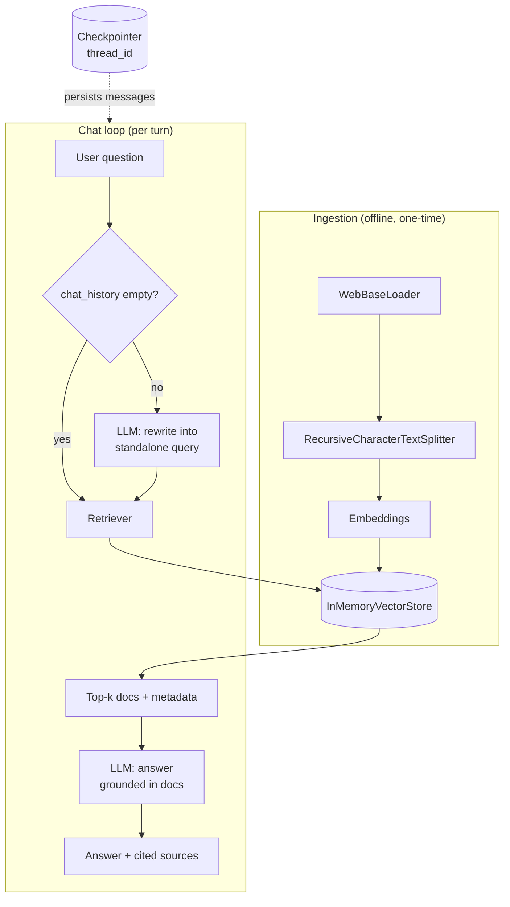
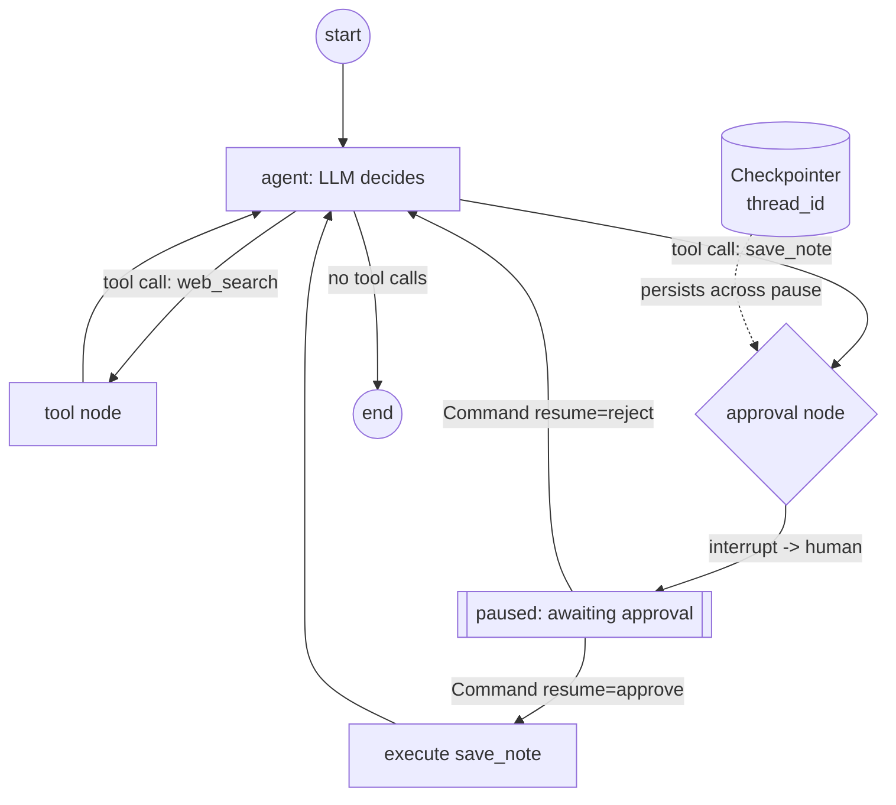
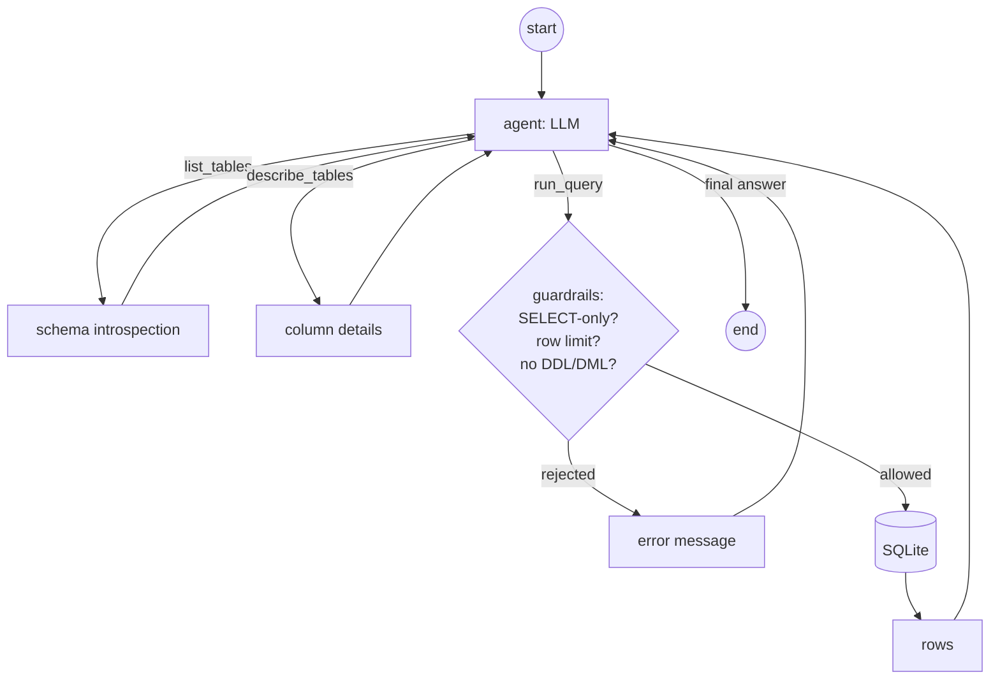

# Module 12 — Capstone Projects

This is where the course stops being a tour and becomes a build. The previous eleven modules each isolated one slab of the stack — [models](01-models-chat-and-llms.md), [prompts](02-prompts.md), [structured output](03-output-parsers-structured-output.md), [LCEL](04-lcel-and-runnables.md), [tools](05-tools-and-tool-calling.md), [retrieval](06-retrieval-and-rag.md), [memory](07-memory-and-state.md), [agents](08-agents-with-langgraph.md), [LangGraph internals](09-langgraph-deep-dive.md), [LangSmith](10-observability-and-eval-langsmith.md), and [production concerns](11-production-and-deployment.md). Real systems compose all of them at once. The three projects below are complete, runnable, and deliberately small enough to read in one sitting, but each is wired the way a production system would be: explicit package boundaries, persistence, observability, and guardrails.

Each project follows the same template: a **goal**, an **architecture diagram**, **full runnable code** broken into clear steps, **how to run it**, **what to watch in LangSmith**, and **extension exercises**.

> **Note:** Every project assumes you have an Anthropic API key in your environment (`ANTHROPIC_API_KEY`). LangSmith tracing is optional but strongly recommended — set `LANGSMITH_TRACING=true` and `LANGSMITH_API_KEY=...` and every run in this module is automatically traced with zero code changes (see [Module 10](10-observability-and-eval-langsmith.md)).

A single dependency install covers all three projects:

```bash
pip install -U \
  langchain langchain-core langchain-anthropic langchain-community \
  langchain-text-splitters langgraph langsmith \
  beautifulsoup4 duckduckgo-search
```

---

## Project A — Documentation RAG chatbot with citations + memory

### Goal

Build a conversational chatbot that answers questions about a corpus of documents, **cites the exact sources** it used, and **remembers the conversation** so follow-up questions ("what about the second one?") resolve correctly. We ingest docs, store them in a vector store, use a **history-aware retriever** so the retrieval query accounts for prior turns, and run the whole loop inside a **LangGraph graph with a checkpointer** for memory. We finish with a tiny LangSmith evaluation hook.

This project integrates Modules 1–7 and 10.

### Architecture



### Step 1 — Ingest: load, split, embed

We load a couple of real documentation pages, split them into overlapping chunks, and embed them. We use `InMemoryVectorStore` so the project runs with zero external services; swapping to Chroma is a two-line change shown in the gotcha below.

```python
# project_a_rag.py — Step 1: ingestion
from langchain_community.document_loaders import WebBaseLoader
from langchain_text_splitters import RecursiveCharacterTextSplitter
from langchain_core.vectorstores import InMemoryVectorStore
from langchain_anthropic import ChatAnthropic
# Embeddings: Anthropic does not (yet) ship a first-party embeddings model,
# so we use a local/open embedding via langchain_community, OR OpenAI.
# Here we use a fast local model to keep the project self-contained.
from langchain_community.embeddings import FastEmbedEmbeddings

URLS = [
    "https://python.langchain.com/docs/concepts/lcel/",
    "https://python.langchain.com/docs/concepts/runnables/",
]

def build_vector_store() -> InMemoryVectorStore:
    loader = WebBaseLoader(URLS)
    raw_docs = loader.load()  # one Document per URL

    splitter = RecursiveCharacterTextSplitter(
        chunk_size=1000,
        chunk_overlap=150,
        add_start_index=True,  # records char offset in metadata -> precise citations
    )
    chunks = splitter.split_documents(raw_docs)

    embeddings = FastEmbedEmbeddings()  # downloads a small ONNX model on first run
    store = InMemoryVectorStore(embeddings)
    store.add_documents(chunks)
    print(f"Indexed {len(chunks)} chunks from {len(raw_docs)} documents.")
    return store
```

> **🔧 Try it:** To persist across runs, swap `InMemoryVectorStore` for Chroma:
> ```python
> from langchain_chroma import Chroma  # pip install langchain-chroma
> store = Chroma(embedding_function=embeddings, persist_directory="./chroma_db")
> store.add_documents(chunks)
> ```
> Now subsequent runs reuse the on-disk index instead of re-embedding.

> **Note:** We use `FastEmbedEmbeddings` to keep the project free of a second API key. To use OpenAI embeddings instead: `from langchain_openai import OpenAIEmbeddings; embeddings = OpenAIEmbeddings(model="text-embedding-3-small")`. The rest of the code is identical — that interchangeability is the whole point of the `Embeddings` interface ([Module 6](06-retrieval-and-rag.md)).

### Step 2 — The history-aware retriever

A naive RAG chain embeds the raw user message. That breaks on follow-ups: "what about the second one?" has no retrievable content on its own. The fix is a **query-rewriting step** — given the chat history plus the new question, the LLM produces a *standalone* search query, which is what we actually embed and retrieve with.

We build this explicitly with [LCEL](04-lcel-and-runnables.md) rather than the legacy `create_history_aware_retriever` helper, so you can see every moving part.

```python
# project_a_rag.py — Step 2: history-aware retrieval
from langchain_core.prompts import ChatPromptTemplate, MessagesPlaceholder
from langchain_core.output_parsers import StrOutputParser
from langchain_core.runnables import RunnableBranch
from langchain_core.messages import BaseMessage

REWRITE_PROMPT = ChatPromptTemplate.from_messages([
    ("system",
     "Given the conversation so far and a follow-up question, rephrase the "
     "follow-up into a STANDALONE search query. Do not answer it. "
     "If it is already standalone, return it unchanged."),
    MessagesPlaceholder("chat_history"),
    ("human", "{question}"),
])

def build_retriever(store, llm):
    base_retriever = store.as_retriever(search_kwargs={"k": 4})

    rewrite_query = REWRITE_PROMPT | llm | StrOutputParser()

    # If there is no history, retrieve on the raw question; otherwise rewrite first.
    history_aware_retriever = RunnableBranch(
        (
            lambda x: not x.get("chat_history"),
            (lambda x: x["question"]) | base_retriever,
        ),
        rewrite_query | base_retriever,
    )
    return history_aware_retriever
```

> **⚠️ Gotcha:** The query rewriter must be told *not to answer* — otherwise it tends to produce a full answer that then gets embedded as the search query, polluting retrieval. The explicit "Do not answer it" instruction matters.

### Step 3 — The RAG answer chain with citations

Citations are only trustworthy if they come from metadata you control, not from the model's prose. We format each retrieved chunk with an explicit `[n]` marker and its source URL, instruct the model to cite using those markers, and return the source list as structured data alongside the answer.

```python
# project_a_rag.py — Step 3: grounded answer + citations
from langchain_core.documents import Document

ANSWER_PROMPT = ChatPromptTemplate.from_messages([
    ("system",
     "You are a documentation assistant. Answer the question using ONLY the "
     "numbered sources below. Cite sources inline with bracketed numbers like "
     "[1], [2]. If the sources do not contain the answer, say so plainly.\n\n"
     "Sources:\n{context}"),
    MessagesPlaceholder("chat_history"),
    ("human", "{question}"),
])

def format_sources(docs: list[Document]) -> str:
    lines = []
    for i, d in enumerate(docs, start=1):
        src = d.metadata.get("source", "unknown")
        start = d.metadata.get("start_index", "?")
        lines.append(f"[{i}] (source={src}, offset={start})\n{d.page_content}")
    return "\n\n".join(lines)

def source_list(docs: list[Document]) -> list[dict]:
    seen, out = set(), []
    for i, d in enumerate(docs, start=1):
        src = d.metadata.get("source", "unknown")
        key = (src, d.metadata.get("start_index"))
        if key not in seen:
            seen.add(key)
            out.append({"marker": f"[{i}]", "source": src})
    return out
```

### Step 4 — Wire it into a LangGraph with a checkpointer (memory)

We could use `RunnableWithMessageHistory`, but the modern, durable choice is a **LangGraph graph with a checkpointer**. The checkpointer persists the full message list keyed by `thread_id`, which means memory survives process restarts (with a SQLite checkpointer) and gives us a clean place to extend toward [Project B](#project-b--multi-tool-assistant-agent-with-human-in-the-loop)'s human-in-the-loop patterns.

```python
# project_a_rag.py — Step 4: the graph
from typing import Annotated, TypedDict
from langchain_core.messages import HumanMessage, AIMessage
from langgraph.graph import StateGraph, START, END
from langgraph.graph.message import add_messages
from langgraph.checkpoint.memory import InMemorySaver


class RAGState(TypedDict):
    messages: Annotated[list, add_messages]  # full conversation, auto-appended
    question: str
    sources: list[dict]


def build_app():
    store = build_vector_store()
    llm = ChatAnthropic(model="claude-sonnet-4-6", temperature=0)
    retriever = build_retriever(store, llm)
    answer_chain = ANSWER_PROMPT | llm | StrOutputParser()

    def respond(state: RAGState) -> dict:
        question = state["question"]
        # chat_history is every message EXCEPT the one we're answering now.
        chat_history = state["messages"]
        docs = retriever.invoke({"question": question, "chat_history": chat_history})
        answer = answer_chain.invoke({
            "question": question,
            "chat_history": chat_history,
            "context": format_sources(docs),
        })
        return {
            "messages": [HumanMessage(question), AIMessage(answer)],
            "sources": source_list(docs),
        }

    graph = StateGraph(RAGState)
    graph.add_node("respond", respond)
    graph.add_edge(START, "respond")
    graph.add_edge("respond", END)
    return graph.compile(checkpointer=InMemorySaver())
```

> **✅ Best practice:** For real deployments swap `InMemorySaver` for a durable checkpointer:
> ```python
> from langgraph.checkpoint.sqlite import SqliteSaver  # pip install langgraph-checkpoint-sqlite
> with SqliteSaver.from_conn_string("checkpoints.db") as saver:
>     app = graph.compile(checkpointer=saver)
> ```
> See [Module 7](07-memory-and-state.md) and [Module 11](11-production-and-deployment.md).

### Step 5 — The REPL

```python
# project_a_rag.py — Step 5: run loop
def main():
    app = build_app()
    thread = {"configurable": {"thread_id": "demo-session-1"}}
    print("RAG chatbot ready. Ask about LCEL / Runnables. Ctrl-C to quit.\n")
    while True:
        try:
            q = input("you> ").strip()
        except (EOFError, KeyboardInterrupt):
            break
        if not q:
            continue
        result = app.invoke({"question": q, "messages": [], "sources": []}, thread)
        answer = result["messages"][-1].content
        print(f"\nbot> {answer}\n")
        print("sources:")
        for s in result["sources"]:
            print(f"  {s['marker']} {s['source']}")
        print()

if __name__ == "__main__":
    main()
```

### How to run it

```bash
export ANTHROPIC_API_KEY=sk-ant-...
export LANGSMITH_TRACING=true          # optional but recommended
export LANGSMITH_API_KEY=lsv2_...      # optional
python project_a_rag.py
```

Example session:

```text
you> What problem does LCEL solve?
bot> LCEL is a declarative way to compose Runnables into chains [1]. It gives
     you streaming, batching, and async for free without rewriting code [2].
sources:
  [1] https://python.langchain.com/docs/concepts/lcel/
  [2] https://python.langchain.com/docs/concepts/runnables/

you> What about the second thing you mentioned?
bot> Streaming means tokens are emitted incrementally as the model produces
     them, so you can show partial output to users [1]...
```

Notice the second turn: "the second thing" only resolves because the history-aware retriever rewrote it into a standalone query using the stored conversation.

### A tiny LangSmith eval hook

A RAG system you can't measure is a RAG system you can't improve. Here is a minimal offline eval that checks **groundedness** (did the answer cite a real source?) using an LLM-as-judge. See [Module 10](10-observability-and-eval-langsmith.md) for the full treatment.

```python
# project_a_eval.py
from langsmith import Client
from langsmith.evaluation import evaluate

client = Client()

# 1. Create a tiny dataset (run once).
dataset = client.create_dataset("rag-doc-qa")
client.create_examples(
    dataset_id=dataset.id,
    examples=[
        {"inputs": {"question": "What problem does LCEL solve?"},
         "outputs": {"must_mention": "compose"}},
        {"inputs": {"question": "What does streaming mean for Runnables?"},
         "outputs": {"must_mention": "incremental"}},
    ],
)

# 2. Target: wrap the app so evaluate() can call it.
from project_a_rag import build_app
app = build_app()

def target(inputs: dict) -> dict:
    thread = {"configurable": {"thread_id": "eval"}}
    result = app.invoke({"question": inputs["question"], "messages": [], "sources": []}, thread)
    return {"answer": result["messages"][-1].content, "sources": result["sources"]}

# 3. Evaluators.
def has_citation(outputs: dict) -> bool:
    return len(outputs["sources"]) > 0

def mentions_keyword(outputs: dict, reference_outputs: dict) -> bool:
    return reference_outputs["must_mention"].lower() in outputs["answer"].lower()

evaluate(
    target,
    data="rag-doc-qa",
    evaluators=[has_citation, mentions_keyword],
    experiment_prefix="rag-baseline",
)
```

> **What to watch in LangSmith:** Open the trace for a chat turn and expand the run tree. You will see the **query-rewrite LLM call**, the **retriever** node (inspect the retrieved chunks and their similarity scores), and the **answer LLM call** with the exact formatted `context` it received. When an answer is wrong, this tree tells you *which stage* failed — bad retrieval vs. bad generation — which is the single most useful debugging signal in RAG.

### How to extend Project A

- **Add reranking:** retrieve `k=20`, then rerank to the top 4 with a cross-encoder (`from langchain_community.document_compressors import FlashrankRerank`) wrapped in a `ContextualCompressionRetriever`. Cheap, large quality win.
- **Add an eval dataset:** expand `rag-doc-qa` with 20–50 real questions and a faithfulness LLM-judge; gate prompt changes on the experiment score.
- **Deploy behind FastAPI streaming:** expose the graph via `app.astream(...)` over an SSE endpoint (see Project C's FastAPI sketch and [Module 11](11-production-and-deployment.md)).

---

## Project B — Multi-tool assistant agent with human-in-the-loop

### Goal

Build a LangGraph agent with two tools: a **read-only web search** that the agent may call freely, and a **side-effecting tool** (`save_note`) that is **gated behind a human-approval interrupt**. The agent runs in a [ReAct](08-agents-with-langgraph.md) loop, persists state by `thread_id`, and streams its progress. This is the canonical pattern for "let the agent do research autonomously, but make me approve anything that touches the outside world."

This project integrates Modules 5, 8, and 9.

### Architecture



The key idea: a write-action tool calls `interrupt()` *inside its own body*. The graph pauses, surfaces the proposed action to the caller, and only resumes — re-running the tool from the top — when the caller sends `Command(resume=...)`. This requires a checkpointer.

### Step 1 — Define the tools

```python
# project_b_agent.py — Step 1: tools
from langchain_core.tools import tool
from langgraph.types import interrupt
from langchain_community.tools import DuckDuckGoSearchResults

# A read-only tool the agent may call without approval.
web_search = DuckDuckGoSearchResults(name="web_search", num_results=4)

# An in-memory "datastore" standing in for a real side effect.
NOTES: list[str] = []

@tool
def save_note(content: str) -> str:
    """Persist a note to the user's notebook. This is a WRITE action."""
    # Pause and ask a human BEFORE doing the side effect.
    decision = interrupt({
        "action": "save_note",
        "proposed_content": content,
        "prompt": "Approve saving this note? Reply 'approve' or 'reject'.",
    })
    if decision != "approve":
        return f"Note was NOT saved (human said: {decision!r})."
    NOTES.append(content)
    return f"Note saved. Notebook now has {len(NOTES)} note(s)."

TOOLS = [web_search, save_note]
```

> **⚠️ Gotcha:** `interrupt()` works by raising a special exception that the LangGraph runtime catches; when you resume, **the entire tool function runs again from the top**, and `interrupt()` returns the resume value the second time. Therefore do not perform irreversible work *before* the `interrupt()` call — only after. Here, `NOTES.append` happens strictly after approval, which is correct.

### Step 2 — Build the agent

We use the prebuilt `create_react_agent`, which gives us the full ReAct loop, a tools node, and proper message handling out of the box. We attach a checkpointer so interrupts can persist.

```python
# project_b_agent.py — Step 2: the agent
from langchain_anthropic import ChatAnthropic
from langgraph.prebuilt import create_react_agent
from langgraph.checkpoint.memory import InMemorySaver

SYSTEM = (
    "You are a research assistant. Use web_search to find current information. "
    "When the user asks you to remember or record something, call save_note. "
    "Be concise."
)

def build_agent():
    llm = ChatAnthropic(model="claude-sonnet-4-6", temperature=0)
    return create_react_agent(
        model=llm,
        tools=TOOLS,
        prompt=SYSTEM,                 # system message
        checkpointer=InMemorySaver(),  # REQUIRED for interrupt() to work
    )
```

> **Note:** `create_react_agent` lives in `langgraph.prebuilt` and takes `model`, `tools`, `prompt`, and `checkpointer`. The legacy `initialize_agent` / `AgentExecutor` API from `langchain` is **deprecated** — see [Module 8](08-agents-with-langgraph.md). Use LangGraph.

### Step 3 — Stream, detect the interrupt, and resume

The driver streams the agent's steps. When a `save_note` call fires, the stream yields an `__interrupt__` payload and the graph parks. We surface the proposed action, collect a human decision, and resume with `Command(resume=...)`.

```python
# project_b_agent.py — Step 3: run loop with HITL
from langgraph.types import Command
from langchain_core.messages import HumanMessage

def stream_until_done(agent, payload, thread):
    """Stream agent steps; return the interrupt payload if one fires, else None."""
    for chunk in agent.stream(payload, thread, stream_mode="values"):
        if "__interrupt__" in chunk:
            return chunk["__interrupt__"][0].value
        msgs = chunk.get("messages", [])
        if msgs:
            last = msgs[-1]
            if last.content and last.type == "ai":
                print(f"\nassistant> {last.content}\n")
    return None

def main():
    agent = build_agent()
    thread = {"configurable": {"thread_id": "agent-session-1"}}
    print("Agent ready. Try: 'Search for the latest LangGraph release and save a note about it.'\n")
    while True:
        try:
            user = input("you> ").strip()
        except (EOFError, KeyboardInterrupt):
            break
        if not user:
            continue

        payload = {"messages": [HumanMessage(user)]}
        interrupt_value = stream_until_done(agent, payload, thread)

        # Handle (possibly repeated) approval gates.
        while interrupt_value is not None:
            print(f"\n[APPROVAL NEEDED] {interrupt_value['prompt']}")
            print(f"  proposed: {interrupt_value['proposed_content']}")
            decision = input("approve/reject> ").strip() or "reject"
            interrupt_value = stream_until_done(agent, Command(resume=decision), thread)

if __name__ == "__main__":
    main()
```

### How to run it

```bash
export ANTHROPIC_API_KEY=sk-ant-...
export LANGSMITH_TRACING=true
python project_b_agent.py
```

Example session:

```text
you> Find the latest LangGraph version and save a note summarizing it.

assistant> I found that the latest LangGraph release adds durable execution
           improvements. Let me save a note.

[APPROVAL NEEDED] Approve saving this note? Reply 'approve' or 'reject'.
  proposed: LangGraph latest release: durable execution and checkpointer improvements.
approve/reject> approve

assistant> Done — I saved the note. Your notebook now has 1 note.
```

> **What to watch in LangSmith:** The trace shows the ReAct loop unfold — each `agent` LLM call with its tool-call decision, the `web_search` tool run with raw results, and then the `save_note` run that **pauses**. After you resume, a *second* run of `save_note` appears (because the tool re-executes from the top). Seeing that double-run in the trace is the clearest way to internalize how `interrupt()` resumption actually works.

### How to extend Project B

- **Add more gated tools:** wrap `send_email`, `create_calendar_event`, or a shell command in the same `interrupt()` pattern; route all of them through one approval node.
- **Add an eval dataset:** build a LangSmith dataset of tasks with expected tool-call sequences; use a trajectory evaluator to check the agent calls the right tools in the right order.
- **Deploy behind FastAPI streaming:** expose `agent.astream(...)`; persist interrupts to a SQLite checkpointer so an approval can come from a different HTTP request minutes later. The `thread_id` is the resume handle.

---

## Project C — SQL agent (talk to your database)

### Goal

Build an agent that answers natural-language questions about a SQLite database. It **introspects the schema**, **writes SQL**, **runs it**, and **explains the results** — all behind hard guardrails: **read-only only**, **row limits enforced**, and **destructive statements rejected**. Letting an LLM emit SQL against a database is genuinely dangerous; this project is as much about the guardrails as the agent.

This project integrates Modules 5, 8, 9, and the security material in [Module 11](11-production-and-deployment.md).

### Architecture



### Step 1 — A sample database

```python
# project_c_sql.py — Step 1: seed a sample SQLite DB
import sqlite3, os

DB_PATH = "company.db"

def seed_db():
    if os.path.exists(DB_PATH):
        return
    con = sqlite3.connect(DB_PATH)
    con.executescript("""
        CREATE TABLE departments (id INTEGER PRIMARY KEY, name TEXT);
        CREATE TABLE employees (
            id INTEGER PRIMARY KEY, name TEXT, dept_id INTEGER,
            salary INTEGER, hired DATE,
            FOREIGN KEY (dept_id) REFERENCES departments(id)
        );
        INSERT INTO departments (id, name) VALUES
            (1,'Engineering'), (2,'Sales'), (3,'Marketing');
        INSERT INTO employees (name, dept_id, salary, hired) VALUES
            ('Ada', 1, 165000, '2021-03-01'),
            ('Linus', 1, 158000, '2020-07-15'),
            ('Grace', 2, 142000, '2019-01-20'),
            ('Hedy', 2, 138000, '2022-05-10'),
            ('Alan', 3, 121000, '2023-09-01');
    """)
    con.commit()
    con.close()
```

### Step 2 — The SQLDatabase wrapper and guardrails

We wrap the DB with `SQLDatabase` from `langchain_community`, then build **our own** read-only query tool rather than handing the agent the unrestricted toolkit. The guardrails are a defense-in-depth stack: a read-only connection *and* statement validation *and* a forced row limit.

```python
# project_c_sql.py — Step 2: DB wrapper + guardrails
import re
from langchain_community.utilities import SQLDatabase
from langchain_core.tools import tool

# read-only by URI: SQLite opened in immutable/read-only mode.
db = SQLDatabase.from_uri(f"sqlite:///file:{DB_PATH}?mode=ro&uri=true")

FORBIDDEN = re.compile(
    r"\b(INSERT|UPDATE|DELETE|DROP|ALTER|CREATE|REPLACE|TRUNCATE|"
    r"GRANT|REVOKE|ATTACH|DETACH|PRAGMA|VACUUM)\b",
    re.IGNORECASE,
)
MAX_ROWS = 50

def _validate(sql: str) -> str | None:
    """Return an error string if the query is unsafe, else None."""
    statements = [s for s in sql.strip().rstrip(";").split(";") if s.strip()]
    if len(statements) != 1:
        return "Only a single statement is allowed."
    s = statements[0].strip()
    if not s.lower().startswith("select"):
        return "Only SELECT statements are permitted."
    if FORBIDDEN.search(s):
        return "Query contains a forbidden keyword. Read-only access only."
    return None

@tool
def run_query(sql: str) -> str:
    """Run a single read-only SELECT query and return rows. Auto-limited to 50 rows."""
    err = _validate(sql)
    if err:
        return f"REJECTED: {err}"
    s = sql.strip().rstrip(";")
    if "limit" not in s.lower():
        s = f"{s} LIMIT {MAX_ROWS}"
    try:
        return db.run(s) or "(no rows)"
    except Exception as e:               # surface DB errors back to the agent
        return f"SQL error: {e}"

@tool
def list_tables() -> str:
    """List the names of all tables in the database."""
    return ", ".join(db.get_usable_table_names())

@tool
def describe_tables(tables: str) -> str:
    """Show CREATE statements and sample rows for comma-separated table names."""
    names = [t.strip() for t in tables.split(",") if t.strip()]
    return db.get_table_info(names)

SQL_TOOLS = [list_tables, describe_tables, run_query]
```

> **⚠️ Gotcha:** A keyword regex alone is **not** sufficient security — it can be defeated by comment injection, nested subqueries, or SQLite's quirks. The load-bearing guardrail is the **read-only database connection** (`mode=ro`). Treat the regex and the SELECT check as belt-and-suspenders, never as the sole defense. In production, also use a database user with `SELECT`-only grants and run queries with a statement timeout. See [Module 11 — Security](11-production-and-deployment.md).

> **✅ Best practice:** Never let an LLM-authored SQL string interpolate into a privileged connection. The same rule from web apps applies: least privilege at the connection level is your real boundary; prompt instructions are advisory.

### Step 3 — The agent

```python
# project_c_sql.py — Step 3: the SQL agent
from langchain_anthropic import ChatAnthropic
from langgraph.prebuilt import create_react_agent
from langgraph.checkpoint.memory import InMemorySaver

SQL_SYSTEM = (
    "You are a careful data analyst with READ-ONLY access to a SQL database.\n"
    "Workflow: 1) call list_tables to see what exists. 2) call describe_tables "
    "for the relevant tables to learn the columns. 3) write ONE SELECT query and "
    "call run_query. 4) Explain the result in plain English.\n"
    "Never attempt to modify data. If a query is rejected, fix it and retry. "
    "Always inspect the schema before writing SQL — do not guess column names."
)

def build_sql_agent():
    llm = ChatAnthropic(model="claude-sonnet-4-6", temperature=0)
    return create_react_agent(
        model=llm,
        tools=SQL_TOOLS,
        prompt=SQL_SYSTEM,
        checkpointer=InMemorySaver(),
    )
```

> **🔧 Try it:** Prefer the batteries-included route? Swap `SQL_TOOLS` for the official toolkit:
> ```python
> from langchain_community.agent_toolkits import SQLDatabaseToolkit
> toolkit = SQLDatabaseToolkit(db=db, llm=llm)
> tools = toolkit.get_tools()  # list/info/query/query-checker tools
> ```
> The toolkit is convenient, but note it does **not** enforce your custom read-only/row-limit rules — the hand-built tools above give you that control. Use the toolkit only over a read-only connection.

### Step 4 — Run loop with streaming

```python
# project_c_sql.py — Step 4: run
from langchain_core.messages import HumanMessage

def main():
    seed_db()
    agent = build_sql_agent()
    thread = {"configurable": {"thread_id": "sql-session-1"}}
    print("SQL agent ready. Try: 'What is the average salary per department?'\n")
    while True:
        try:
            q = input("you> ").strip()
        except (EOFError, KeyboardInterrupt):
            break
        if not q:
            continue
        for chunk in agent.stream(
            {"messages": [HumanMessage(q)]}, thread, stream_mode="values"
        ):
            msg = chunk["messages"][-1]
            if msg.type == "ai" and msg.content:
                print(f"\nanalyst> {msg.content}\n")
            elif msg.type == "tool":
                print(f"  [tool {msg.name}] {str(msg.content)[:160]}")

if __name__ == "__main__":
    main()
```

### How to run it

```bash
export ANTHROPIC_API_KEY=sk-ant-...
export LANGSMITH_TRACING=true
python project_c_sql.py
```

Example session:

```text
you> What is the average salary per department, highest first?
  [tool list_tables] departments, employees
  [tool describe_tables] CREATE TABLE employees ( id INTEGER ...
  [tool run_query] [('Engineering', 161500.0), ('Sales', 140000.0), ('Marketing', 121000.0)]

analyst> Engineering has the highest average salary at $161,500, followed by
         Sales at $140,000 and Marketing at $121,000.

you> Now delete the marketing department.
  [tool run_query] REJECTED: Only SELECT statements are permitted.

analyst> I can't do that — I have read-only access and can only run SELECT
         queries. I can show you the Marketing rows instead if that helps.
```

> **What to watch in LangSmith:** Follow the tool-call sequence in the trace — a well-behaved run always does `list_tables` -> `describe_tables` -> `run_query`. If you see the agent jump straight to `run_query` and get a "no such column" error, that's a prompt problem (it's guessing schema), and the trace shows exactly where to tighten the system prompt. Also watch for `REJECTED:` tool outputs — each one is a guardrail doing its job, and a cluster of them signals the model fighting the constraints.

### How to extend Project C

- **Add a query-checker step:** before running, route the SQL through a second LLM call (or the toolkit's `QuerySQLCheckerTool`) that critiques common SQLite mistakes; this materially reduces failed queries.
- **Add an eval dataset:** build a LangSmith dataset of question -> expected-result-shape pairs; evaluate execution accuracy (does the returned data match a known-good query's output?).
- **Deploy behind FastAPI streaming:** the sketch below applies to all three projects.

```python
# fastapi_stream.py — streaming any LangGraph app over SSE (applies to A, B, and C)
from fastapi import FastAPI
from fastapi.responses import StreamingResponse
from langchain_core.messages import HumanMessage
from project_c_sql import build_sql_agent, seed_db

seed_db()
agent = build_sql_agent()
api = FastAPI()

@api.get("/ask")
async def ask(q: str, thread_id: str = "web"):
    cfg = {"configurable": {"thread_id": thread_id}}
    async def gen():
        async for chunk in agent.astream(
            {"messages": [HumanMessage(q)]}, cfg, stream_mode="values"
        ):
            msg = chunk["messages"][-1]
            if msg.type == "ai" and msg.content:
                yield f"data: {msg.content}\n\n"
    return StreamingResponse(gen(), media_type="text/event-stream")

# uvicorn fastapi_stream:api --reload  ->  GET /ask?q=average+salary+per+department
```

> **Note:** For a turnkey deployment with built-in streaming, persistence, and a management UI, the **LangGraph Platform** (and the `langgraph dev` / `langgraph up` CLI) hosts any compiled graph as an API — see [Module 11](11-production-and-deployment.md).

---

## Where to go next

You now have the full toolkit. Three directions are worth your time, roughly in order of leverage:

- **LangGraph Platform & durable execution.** Move from `InMemorySaver` to a real checkpointer and deploy graphs as managed APIs with built-in streaming, cron, and human-in-the-loop endpoints. This is the shortest path from "script on my laptop" to "service my team uses." ([Module 11](11-production-and-deployment.md))
- **Multi-agent systems.** When one agent's prompt and toolset grow unwieldy, decompose into a supervisor routing to specialist sub-agents (a researcher, a coder, a critic). LangGraph models this as a graph of graphs — the same `StateGraph` primitives from [Module 9](09-langgraph-deep-dive.md), one level up.
- **Eval-driven prompt iteration.** This is the discipline that separates demos from products. Build a dataset, attach evaluators, and gate every prompt or model change on the experiment score in LangSmith ([Module 10](10-observability-and-eval-langsmith.md)). Treat prompts like code: never ship a change you didn't measure.

A final word. The hard part of LLM engineering is no longer the models — it's the **system around them**: retrieval that surfaces the right context, tools with the right guardrails, state that persists correctly, and evals that tell you the truth. Every module in this course was building toward that judgment. You have it now. Pick a real problem you actually care about, build the smallest version that works end-to-end, instrument it so you can see what it's doing, and iterate against measurements rather than vibes. That loop — build, observe, evaluate, improve — is the whole job. Go build.

---

## Recap

- **Project A (RAG chatbot):** load -> split -> embed -> `InMemoryVectorStore`; a **history-aware retriever** rewrites follow-ups into standalone queries; answers cite sources from controlled metadata; memory lives in a **LangGraph checkpointer** keyed by `thread_id`; groundedness is measured with a LangSmith eval hook.
- **Project B (HITL agent):** `create_react_agent` with a free **web-search** tool and a **side-effecting** tool gated by `interrupt()`; resume with `Command(resume=...)`; the gated tool **re-executes from the top** on resume, so side effects must come after the interrupt.
- **Project C (SQL agent):** `SQLDatabase` over SQLite with **defense-in-depth guardrails** — a read-only connection (the real boundary), SELECT-only validation, and a forced row limit; the agent introspects schema before writing SQL.
- **Cross-cutting:** all three are LangGraph graphs with a checkpointer, all stream, and all are observable in LangSmith — the trace tree is your primary debugging tool, telling you *which stage* failed.
- **The throughline:** the model is the easy part; the engineering is retrieval, tools, guardrails, state, and evaluation — and the operating loop is build -> observe -> evaluate -> improve.

## Exercises

1. **Citations that survive editing.** In Project A, the `[n]` markers in the answer can drift from the `source_list` order if the model reorders them. Make citations robust: change `source_list` to key off the marker the model actually emitted (parse `[\d+]` out of the answer) and only return sources that were genuinely cited. Verify in a LangSmith trace that uncited chunks are dropped.
2. **Add reranking to Project A.** Wrap the base retriever in a `ContextualCompressionRetriever` with a `FlashrankRerank` compressor, retrieve `k=20`, rerank to 4, and compare answer quality on your eval dataset before and after. Report the score delta.
3. **A second gated tool in Project B.** Add a `send_email(to, subject, body)` stub gated by the same `interrupt()` pattern, and route both `save_note` and `send_email` approvals through one place. Then trigger a task that requires *both* writes in one turn and confirm each pauses independently.
4. **Break (then fix) the SQL guardrails.** In Project C, craft a prompt that tricks the agent into a destructive statement (e.g. via a SQL comment or stacked query). Confirm the read-only connection blocks it even when your regex doesn't. Then strengthen `_validate` to catch the bypass you found.
5. **Trajectory eval for the SQL agent.** Build a LangSmith dataset of 10 questions where you know the correct tool sequence is `list_tables -> describe_tables -> run_query`. Write a trajectory evaluator that flags runs which skip schema introspection, and use it to tune the system prompt until all 10 pass.
6. **Ship one.** Pick whichever project maps to a real need you have, swap `InMemorySaver` for `SqliteSaver`, put it behind the FastAPI streaming endpoint, and run it for a week against your own data. Keep a running LangSmith dataset of every question that produced a bad answer — that dataset is your roadmap.
